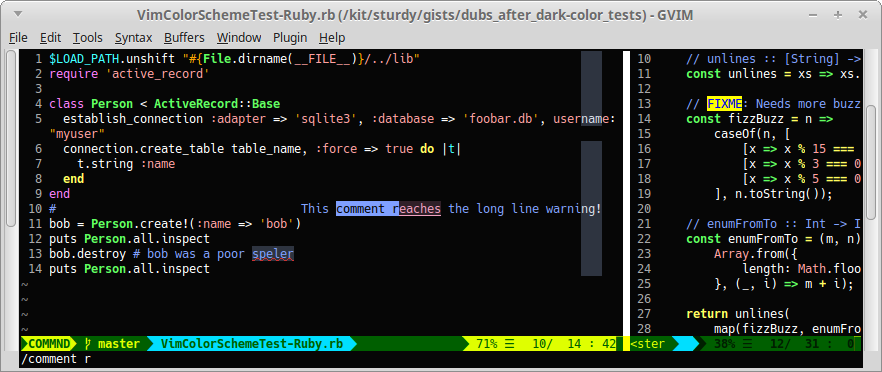

@@@@@@@@@@@@@@@@@@
Dubs Vim Reference
@@@@@@@@@@@@@@@@@@

##################
Dubs Vim Reference
##################

Dubs Vim Reference
==================

See the
`Dubs Vim installation instructions <README.rst#Installation>`__
if you want to download and install Dubs Vim.

About Dubs Vim
--------------

Dubs Vim is one developer's Vim IDE, assembled from a legion of awesome plugins.

Project page: https://github.com/landonb/dubs-vim

About this File
---------------

This document combines all the Dubs Vim plugin READMEs into one file.

You'll find links to each plugin in the following lists,
and you'll find documentation for *everything Dubs* below that!

About this Project
------------------

This project is not a Vim plugin itself, but a collection of
one developers favorite plugins, including their own plugins
and other individuals' plugins.

The plugins used to be included as git submodules, but submodules
are a chore to manage. Fortunately Vim now makes it easier to use
an external multiple repository manager (such as ``myrepos``) to
manage your Vim packages and plugins. So now the plugins are just
referenced from documentation; and it's up to you, the developer-
user, to install and manage them yourself.

tl;dr, you probably don't want to clone and install this project
(e.g., to ``~/.vim``), but you may be curious what Vim plugins I
use and recommend (and maintain).

List of Dubs Vim Plugins
^^^^^^^^^^^^^^^^^^^^^^^^

.. To generate the list of your plugs, copy-and-paste reST-ready:
    cd ~/.vim/pack && tree -d -L 3 -f | \
      grep -e '│       ├──' \
           -e '│       └──' \
           -e '│   │   ├──' \
           -e '│   │   └──' \
           -e '    │   ├──' \
           -e '    │   └──' \
           -e '        └──' \
      | sed s'#[^.]\+\./\(.*\)#\1#' \
      | sed s'#\([^/]\+\)/\([^/]\+\)/\([^/]\+\)#\2: \3: \`\3 <https://github.com/\1/\3>\`__#' \
      | sort \
      | less
.. Using a `| wc -l` instead of `less` and I see: 96 plugins.

These are plugins I've developed and continue to maintain:

.. FIXME/2021-08-15 20:25: You're missing a bunch of rebranded projects...
.. | `vim-reSTfold <https://github.com/landonb/vim-reSTfold>`__: reStructuredText power folder.
.. | `vim-reST-highdefs <https://github.com/landonb/vim-reST-highdefs>`__: ...
.. | `vim-reST-highfive <https://github.com/landonb/vim-reST-highfive>`__: ...
.. | `vim-reST-highline <https://github.com/landonb/vim-reST-highline>`__: ...

.. table::
  :widths: 25 75

  ============================================================================================  ==============================================================================================================
  `dubs_after_dark <https://github.com/landonb/dubs_after_dark>`__                              Compelling light on dark color scheme (that uses true black).
  --------------------------------------------------------------------------------------------  --------------------------------------------------------------------------------------------------------------
  `dubs_appearance <https://github.com/landonb/dubs_appearance>`__                              Configure basic Vim look n' feel (that appeals to the author).
  --------------------------------------------------------------------------------------------  --------------------------------------------------------------------------------------------------------------
  `dubs_buffer_fun <https://github.com/landonb/dubs_buffer_fun>`__                              Manage Buffers and Windows.
  --------------------------------------------------------------------------------------------  --------------------------------------------------------------------------------------------------------------
  `dubs_edit_juice <https://github.com/landonb/dubs_edit_juice>`__                              Powerful Text Editing commands.
  --------------------------------------------------------------------------------------------  --------------------------------------------------------------------------------------------------------------
  `dubs_file_finder <https://github.com/landonb/dubs_file_finder>`__                            Find and Open Files.
  --------------------------------------------------------------------------------------------  --------------------------------------------------------------------------------------------------------------
  `dubs_ftype_mess <https://github.com/landonb/dubs_ftype_mess>`__                              Filetype-specific features, like syntax highlighters, etc.
  --------------------------------------------------------------------------------------------  --------------------------------------------------------------------------------------------------------------
  `dubs_grep_steady <https://github.com/landonb/dubs_grep_steady>`__                            Clever Text Search including Replace.
  --------------------------------------------------------------------------------------------  --------------------------------------------------------------------------------------------------------------
  `dubs_html_entities <https://github.com/landonb/dubs_html_entities>`__                        HTML Entity table.
  --------------------------------------------------------------------------------------------  --------------------------------------------------------------------------------------------------------------
  `dubs_mescaline <https://github.com/landonb/dubs_mescaline>`__                                *Choice* Status Line.
  --------------------------------------------------------------------------------------------  --------------------------------------------------------------------------------------------------------------
  `dubs_project_tray <https://github.com/landonb/dubs_project_tray>`__                          Project plugin wrapper.
  --------------------------------------------------------------------------------------------  --------------------------------------------------------------------------------------------------------------
  `dubs_quickfix_wrap <https://github.com/landonb/dubs_quickfix_wrap>`__                        Elegant Quickfix wrapper.
  --------------------------------------------------------------------------------------------  --------------------------------------------------------------------------------------------------------------
  `dubs_style_guard <https://github.com/landonb/dubs_style_guard>`__                            Automatically set whitespace and line-length settings.
  --------------------------------------------------------------------------------------------  --------------------------------------------------------------------------------------------------------------
  `dubs_syntastic_wrap <https://github.com/landonb/dubs_syntastic_wrap>`__                      Syntastic wrapper.
  --------------------------------------------------------------------------------------------  --------------------------------------------------------------------------------------------------------------
  `dubs_toggle_textwrap <https://github.com/landonb/dubs_toggle_textwrap>`__                    Simple text wrapping wrapper.
  --------------------------------------------------------------------------------------------  --------------------------------------------------------------------------------------------------------------
  `dubs_web_hatch <https://github.com/landonb/dubs_web_hatch>`__                                ``sensible-browser`` mappings (cross-platform hyperlink opener).
  --------------------------------------------------------------------------------------------  --------------------------------------------------------------------------------------------------------------
  `vim-classic-taglist <https://github.com/landonb/vim-classic-taglist>`__
  --------------------------------------------------------------------------------------------  --------------------------------------------------------------------------------------------------------------
  `vim-command-line-clock <https://github.com/landonb/vim-command-line-clock>`__
  --------------------------------------------------------------------------------------------  --------------------------------------------------------------------------------------------------------------
  `vim-lcd-project-root <https://github.com/landonb/vim-lcd-project-root>`__
  --------------------------------------------------------------------------------------------  --------------------------------------------------------------------------------------------------------------
  `vim-netrw-cfg-split-explorer <https://github.com/landonb/vim-netrw-cfg-split-explorer>`__
  --------------------------------------------------------------------------------------------  --------------------------------------------------------------------------------------------------------------
  `vim-netrw-link-resolve <https://github.com/landonb/vim-netrw-link-resolve>`__
  --------------------------------------------------------------------------------------------  --------------------------------------------------------------------------------------------------------------
  `vim-nicer-file-changed-prompt <https://github.com/landonb/vim-nicer-file-changed-prompt>`__
  --------------------------------------------------------------------------------------------  --------------------------------------------------------------------------------------------------------------
  `vim-ovm-easyescape-kj-jk <https://github.com/landonb/vim-ovm-easyescape-kj-jk>`__
  --------------------------------------------------------------------------------------------  --------------------------------------------------------------------------------------------------------------
  `vim-ovm-seven-of-spines <https://github.com/landonb/vim-ovm-seven-of-spines>`__
  --------------------------------------------------------------------------------------------  --------------------------------------------------------------------------------------------------------------
  `vim-reSTfold <https://github.com/landonb/vim-reSTfold>`__                                    Innovative reStructuredText document folding (manage notes like a pro).
  --------------------------------------------------------------------------------------------  --------------------------------------------------------------------------------------------------------------
  `vim-reST-highdefs <https://github.com/landonb/vim-reST-highdefs>`__
  --------------------------------------------------------------------------------------------  --------------------------------------------------------------------------------------------------------------
  `vim-select-mode-stopped-down <https://github.com/landonb/vim-select-mode-stopped-down>`__
  --------------------------------------------------------------------------------------------  --------------------------------------------------------------------------------------------------------------
  `vim-source-reloader <https://github.com/landonb/vim-source-reloader>`__
  --------------------------------------------------------------------------------------------  --------------------------------------------------------------------------------------------------------------
  `vim-title-bar-time-of-day <https://github.com/landonb/vim-title-bar-time-of-day>`__
  --------------------------------------------------------------------------------------------  --------------------------------------------------------------------------------------------------------------
  `vim-tmux-navigator <https://github.com/landonb/vim-tmux-navigator>`__
  ============================================================================================  ==============================================================================================================

.. AWAIT/2022-09-21: Add DepoXy/waffle-batter-vim, once published: https://github.com/depoxy/???
.. SKIPD/2022-09-21: DepoXy/vim-trap is private, but worth calling out: https://github.com/YOU/vim-trap

List of Forked Plugins
^^^^^^^^^^^^^^^^^^^^^^

These are plugins I've forked to add value (but haven't bothered asking
upstream to incorporate the changes, either because it wouldn't mesh
with the upstream project's goals, or because I'm lazy):

| `ansible-vim <https://github.com/landonb/ansible-vim>`__:
    "A vim plugin for syntax highlighting Ansible's common filetypes."
      (Upstream: `ansible-vim <https://github.com/pearofducks/ansible-vim>`__)
| `QFEnter <https://github.com/landonb/QFEnter>`__:
    "Open a Quickfix item in a window you choose."
      (Upstream: `QFEnter <https://github.com/yssl/QFEnter>`__)
| `vim-buffer-ring <https://github.com/landonb/vim-buffer-ring>`__:
    "Surf through buffers based on viewing history per window."
      (Upstream: `vim-bufsurf <https://github.com/ton/vim-bufsurf>`__)
| `vim-jsx <https://github.com/landonb/vim-jsx>`__:
    "React JSX syntax highlighting and indenting for Vim."
      (Upstream: `vim-jsx <https://github.com/mxw/vim-jsx>`__)
| `vim-markdown <https://github.com/landonb/vim-markdown>`__:
    "Markdown for Vim."
      (Upstream: `vim-markdown <https://github.com/gabrielelana/vim-markdown>`__)
| `vim-surround <https://github.com/landonb/vim-surround>`__:
    "Quoting and parenthesizing made simple."
      (Upstream: `vim script <http://www.vim.org/scripts/script.php?script_id=1697>`__,
                 `vim-surround <https://github.com/tpope/vim-surround>`__)
| `vim-unimpaired <https://github.com/landonb/vim-unimpaired>`__:
    "Pairs of handy bracket mappings."
      (Upstream: `vim script <http://www.vim.org/scripts/script.php?script_id=1590>`__,
                 `vim-unimpaired <https://github.com/tpope/vim-unimpaired>`__)

List of Third-party Plugins
^^^^^^^^^^^^^^^^^^^^^^^^^^^

The are awesome third-party plugins I find useful or otherwise curious:

| `AutoAdapt <https://github.com/vim-scripts/AutoAdapt>`__:
    "Automatically adapt timestamps, copyright notices, etc."
      [`vim script <http://www.vim.org/scripts/script.php?script_id=4654>`__]
| `coc-json <https://github.com/neoclide/coc-json>`__
| `coc.nvim <https://github.com/neoclide/coc.nvim>`__
| `coc-tsserver <https://github.com/neoclide/coc-tsserver>`__
| `command-t <https://github.com/wincent/command-t>`__:
    "Fast file navigation for VIM"
| `ctrlp.vim <https://github.com/kien/ctrlp.vim>`__:
    "Fuzzy file, buffer, mru, tag, etc finder."
      [`deets <https://kien.github.io/ctrlp.vim/>`__]
| `editorconfig-vim <https://github.com/editorconfig/editorconfig-vim>`__:
    "EditorConfig plugin for Vim"
      [`more <http://editorconfig.org/>`__]
| `fzf.vim <https://github.com/junegunn/fzf.vim>`__
| `goyo.vim <https://github.com/junegunn/goyo.vim>`__:
    "Distraction-free writing in Vim"
| `improvedft <https://github.com/chrisbra/improvedft>`__
| `ingo-library <https://github.com/vim-scripts/ingo-library>`__:
    "Vimscript library of common functions."
      [`vim script <http://www.vim.org/scripts/script.php?script_id=4433>`__]
| `limelight.vim <https://github.com/junegunn/limelight.vim>`__:
    "|flashlight| All the world's indeed a stage and we are merely players"
| `matchit <https://github.com/chrisbra/matchit>`__
| `nerdcommenter <https://github.com/preservim/nerdcommenter>`__
| `syntastic <https://github.com/scrooloose/syntastic>`__:
    "Syntax checking hacks for vim"
| `tagbar <https://github.com/majutsushi/tagbar>`__
| `tcomment_vim <https://github.com/tomtom/tcomment_vim>`__:
    "An extensible & universal comment plugin"
      [`vim script <http://www.vim.org/scripts/script.php?script_id=1173>`__,
       see also: `vim-commentary <https://github.com/tpope/vim-commentary>`__]
| `tlib_vim <https://github.com/tomtom/tlib_vim>`__:
    "Some utility functions for VIM"
      [`vim script <http://www.vim.org/scripts/script.php?script_id=1863>`__]
| `typescript-vim <https://github.com/leafgarland/typescript-vim>`__
| `vim-colorschemes <https://github.com/flazz/vim-colorschemes>`__
| `vim-easyescape <https://github.com/zhou13/vim-easyescape>`__
| `vim-gnupg <https://github.com/jamessan/vim-gnupg>`__:
    "transparent editing of gpg encrypted files."
  [`vim script <http://www.vim.org/scripts/script.php?script_id=3645>`__]
| `vim-istanbul <https://github.com/juanpabloaj/vim-istanbul>`__
| `vim-javascript <https://github.com/pangloss/vim-javascript>`__:
    "Vastly improved Javascript indentation and syntax support in Vim.
      [`vim script <http://www.vim.org/scripts/script.php?script_id=4452>`__]
| `vim-js <https://github.com/yuezk/vim-js>`__
| `vim-jsx-pretty <https://github.com/MaxMEllon/vim-jsx-pretty>`__
| `vim-mergetool <https://github.com/samoshkin/vim-mergetool>`__
| `vim-misc <https://github.com/xolox/vim-misc>`__:
    "Miscellaneous auto-load Vim scripts"
      [`more <https://peterodding.com/code/vim/misc/>`__]
| `vim-python-matchit <https://github.com/voithos/vim-python-matchit>`__
| `vim-toml <https://github.com/cespare/vim-toml>`__
| `yats.vim <https://github.com/HerringtonDarkholme/yats.vim>`__
| `ZoomWin <https://github.com/vim-scripts/ZoomWin>`__

.. |flashlight| unicode:: 0x1F526 .. flashlight

List of Tim Pope Plugins
^^^^^^^^^^^^^^^^^^^^^^^^

These plugins are maintained by the venerable `Tim Pope <https://github.com/tpope>`__:

| `vim-abolish <https://github.com/tpope/vim-abolish>`__
| `vim-fugitive <https://github.com/tpope/vim-fugitive>`__:
    "fugitive.vim: a Git wrapper so awesome, it should be illegal"
  [`vim script <http://www.vim.org/scripts/script.php?script_id=2975>`__]
| `vim-jdaddy <https://github.com/tpope/vim-jdaddy>`__
| `vim-speeddating <https://github.com/tpope/vim-speeddating>`__:
    "speeddating.vim: use CTRL-A/CTRL-X to increment dates, times, and more"
      [`vim script <http://www.vim.org/scripts/script.php?script_id=2120>`__]
| `vim-vinegar <https://github.com/tpope/vim-vinegar>`__:
    "vinegar.vim: combine with netrw to create a delicious salad dressing"

List of Less-used Plugins
^^^^^^^^^^^^^^^^^^^^^^^^^

These plugins that I no longer use (or rarely use) but that I still have installed:

| `jellybeans.vim <https://github.com/nanotech/jellybeans.vim>`__:
    "A colorful, dark color scheme for Vim."
      [`vim.org <http://www.vim.org/scripts/script.php?script_id=2555>`__]
| `nord-vim <https://github.com/arcticicestudio/nord-vim>`__:
    "An arctic, north-bluish clean and elegant Vim theme."
| `TeTrIs.vim <https://github.com/vim-scripts/TeTrIs.vim>`__:
    "A tetris game in pure vim"
| `viki_vim <https://github.com/tomtom/viki_vim>`__:
    "A personal wiki for Vim"
      [`vim script <http://www.vim.org/scripts/script.php?script_id=861>`__]
| `vim-rails <https://github.com/tpope/vim-rails>`__:
    "rails.vim: Ruby on Rails power tools"
      [`vim script <http://www.vim.org/scripts/script.php?script_id=1567>`__]

List of Retired Plugins
^^^^^^^^^^^^^^^^^^^^^^^

For posterity, here are plugins that I used to use, but that I've since stopped using
(this is not a judgement on their merits: sometimes I use certain plugins with certain
technologies that I no longer use, or I maybe some functionality has since been 
incorporated into Vim itself, or maybe I found a different plugin, who knows):

| `asyncomplete-lsp.vim <https://github.com/prabirshrestha/asyncomplete-lsp.vim>`__
| `asyncomplete.vim <https://github.com/prabirshrestha/asyncomplete.vim>`__
| `async.vim <https://github.com/prabirshrestha/async.vim>`__
| `nerdtree <https://github.com/scrooloose/nerdtree>`__:
    "A tree explorer plugin for vim."
| `vim-commentary <https://github.com/tpope/vim-commentary>`__
| `vim-endwise <https://github.com/tpope/vim-endwise>`__:
    "endwise.vim: wisely add "end" in ruby, endfunction/endif/more in vim script, etc"
  [`vim script <http://www.vim.org/scripts/script.php?script_id=2386>`__]
| `vim-go <https://github.com/editorconfig/vim-go>`__
| `vim-lsp-javascript <https://github.com/ryanolsonx/vim-lsp-javascript>`__
| `vim-lsp-settings <https://github.com/mattn/vim-lsp-settings>`__
| `vim-lsp-typescript <https://github.com/ryanolsonx/vim-lsp-typescript>`__
| `vim-lsp <https://github.com/prabirshrestha/vim-lsp>`__
| `vim-pathogen <https://github.com/tpope/vim-pathogen>`__
| `vim-restructuredtext <https://github.com/marshallward/vim-restructuredtext>`__
| `vim-scriptease <https://github.com/tpope/vim-scriptease>`__:
    "scriptease.vim: A Vim plugin for Vim plugins"
      [`vim script <http://www.vim.org/scripts/script.php?script_id=4394>`__]
| `vim-vividchalk <https://github.com/tpope/vim-vividchalk>`__:
    "vividchalk.vim: a colorscheme strangely reminiscent of Vibrant Ink for a certain OS X editor"
      [`vim script <http://www.vim.org/scripts/script.php?script_id=1891>`__]

Plugins that I used to develop or that I forked, but no longer use:

| `dubs_cycloplan <https://github.com/landonb/dubs_cycloplan>`__
| `vim-jsx <https://github.com/landonb/vim-jsx>`__

Comprehensive Feature List
--------------------------

Each plugin's README.rst is reproduced herein to give a nice,
comprehensive (albeit lengthy) list of all the features.

Most of the features and key mappings are specific to Dubs Vim,
but a few commonly-used (or commonly-forgotten) Vim commands are
also included.

Features are grouped into categories and are identified by
their keyboard mapping or ``:command`` name, followed by a
brief description of the feature and then more detailed notes.

.. NOTE: For security reasons, the include directive does not
..       work on GitHub. E.g., we cannot simply
..
..        .. include:: https://github.com/landonb/dubs_after_dark/README.rst
..        .. include:: ...
..
..       so instead we'll assemble this file from a script, readme-using.make.sh,
..       which appends all the package docs to this file.

##################################
Dubs Vim |em_dash| Dubs After Dark
##################################

.. |em_dash| unicode:: 0x2014 .. em dash

Vibrant white and light text on a black background.



*The Dubs After Dark color scheme and* `Dubs Mescaline <https://github.com/landonb/dubs_mescaline>`__ *status line.*

About This Plugin
=================

This plugin provides an opinionated negative polarity color scheme.

The highlights are mostly Vim defaults, with a few tweaks to
improve contrast, provoke vibrancy, and increase readability.

Basically, if you clear highlights and start fresh, e.g.,:

.. code-block:: vim

  highlight clear
  set background=dark
  set termguicolors
  highlight Normal gui=NONE guifg=White guibg=#060606 ctermfg=White ctermbg=none

This plugin makes the following tweaks:

- Searches (i.e., started with ``/``, ``*``, or Dubs' ``<F1>``)
  are highlighted with a light pink background and underline.

- Spelling mistakes are highlighted with a light grey background
  and a red undercurl.

- The ``ColorColumn`` is set to light grey.

- The background is set to almost black, #060606, which you can
  easily override by setting ``g:dubs_after_dark_background``
  before loading the color.

- Less distracting dark grey line numbers (Vim's default is deep red)
  that work well either a light background or a dark background.

- Remove the distracting vertical bar between split windows.

- And more! Your best bet is to install the plugin, load the color,
  and see if you like it.::

  :color after-dark

The Dubs After Dark color works well the compelling
`Dubs Appearance <https://github.com/landonb/dubs_appearance>`__
plugin, which adjusts other parts of the look and feel of Vim.
<Shameless self-plug.>

For another excellent light-on-dark (though not black) color scheme,
check out
`jellybeans.vim <https://github.com/nanotech/jellybeans.vim>`__.

Installation
============

Installation is easy using the packages feature (see ``:help packages``).

To install the package so that it will automatically load on Vim startup,
use a ``start`` directory, e.g.,

.. code-block:: bash

    mkdir -p ~/.vim/pack/landonb/start
    cd ~/.vim/pack/landonb/start

If you want to test the package first, make it optional instead
(see ``:help pack-add``):

.. code-block:: bash

    mkdir -p ~/.vim/pack/landonb/opt
    cd ~/.vim/pack/landonb/opt

Clone the project to the desired path:

.. code-block:: bash

    git clone https://github.com/landonb/dubs_after_dark.git

If you installed to the optional path, tell Vim to load the package:

.. code-block:: vim

   :packadd! dubs_after_dark

Just once, tell Vim to build the online help:

.. code-block:: vim

   :Helptags

Then whenever you want to reference the help from Vim, run:

.. code-block:: vim

   :help dubs-after-dark

####################################
Dubs Vim |em_dash| Appearance Plugin
####################################

.. |em_dash| unicode:: 0x2014 .. em dash

About This Plugin
=================

This plugin configures the appearance of Vim.

- The beautiful `Hack
  <https://github.com/chrissimpkins/Hack>`__
  Regular 9 font, falling back to Courier New 9.

- A 3-Column wide grey vertical long-line indicator over columns 78-80.

  - See `dubs_edit_juice's <https://github.com/landonb/dubs_edit_juice>`__
    ``<F2>`` mappings for paragraph formatting.

- Use ``<Ctrl-c>`` to exit Insert mode, and to enter Command mode, same as ``<ESC>``.

- Use ``<Ctrl-c>`` to copy text in the command-line window.

- Enable syntax highlighting.

- Show line numbers.

- Show new buffers with all folds open.

  (Hint: Use ``<zR>`` and ``<zM>`` to open and close all folds,
  respectively, and ``<zA>`` to toggle a single fold).

- Better search defaults:

  - Case-insensitive searching and matching (``:smartcase``).

  - Enable search term highlighting (``:hlsearch``).

  - Highlight search results as the keyword is typed (``:incsearch``).

- Enable ``modeline``: Vim will read modelines at the head or tail,
  like ``vim:tw=78:ts=8:ft=help:norl:``, and set itself accordingly.

- Enable ``:autoindent`` and ``:smartindent``.

  - And enable loading ``indent/`` files.

- Enable ``:wildmenu``, a/k/a, Vim command line tab completion.

- Show the status line and rule.

- Break longs lines on word boundaries.

- Make a close a close. The default Gvim menu behavior for File < Close
  (``<Alt-f>`` ``<c>``) just hides the buffer. Close the file in addition.

- Rewire File > Close (``<Alt-f>`` ``<c>``) so that it closes the buffer, too.

- Rewire File > Save All (``<Alt-f>`` ``<l>``) to save all files.

  - To allow us, File > Split-Open is remapped (to ``<Alt-f>`` ``<t>``).

- Use Window > New V-Split (``<Alt-w>`` ``<s>``) to open a new buffer
  in a new window to the right of the current window.

- Add File > Close All (``<Alt-f>`` ``<e>``) to close all files / delete
  all buffers.

 - If you Close All and then Exit (``<Alt-f>`` ``<x>``), because there's
   only one, empty buffer, Vim will delete ``Session.vim``. This is useful
   if you've edited a ``~/.vim/*`` script and want to reload it; otherwise,
   if a Session file exists, Vim will just read it and ignore other stuff.

- Save the current Session on exit; restore it on open.

  To clear the session -- e.g., after editing any Vim file -- type

    ``<Alt-f>`` ``<e>``, and then
    ``<Alt-f>`` ``<x>``.

  - The first command
      closes all files,
      deletes all buffers, and
      removes the Session file.

  - The second command quits Vim.

  When you restart Vim, it'll start with a fresh
  Session file and load any Vim edits you made.

- Set the ``*.swp`` file ``:directory`` to ``$HOME/.vim_backups/``

- Disable backups (set ``:nobackup``).

  You should use ``<Ctrl-s>`` or ``<Alt-f>`` ``<Alt-l>`` frequently.

  And commit to Git often. Do other things often.

..  Just don't manage a bunch of Gvim backup files.

.. - Also set the ``:backupdir`` to ``$HOME/.vim_backups/``

- Disable the frakking bell.

The plugin also improves upon the default color scheme.

- White background with black text, and non-distracting grey line numbers.

- Slash ``/`` and Star ``*`` Searches are highlighted with a green background.

- Change line numbers color from deep red (default) to dark grey.

- Remove distracting vertical split line between adjacent windows.

- Or, if you have `Dubs After Dark <https://github.com/landonb/dubs_after_dark>`__
  installed, this plugin will load the ``after-dark`` color scheme.

See the source for a few other settings and more comments.

Installation
============

Installation is easy using the packages feature (see ``:help packages``).

To install the package so that it will automatically load on Vim startup,
use a ``start`` directory, e.g.,

.. code-block:: bash

    mkdir -p ~/.vim/pack/landonb/start
    cd ~/.vim/pack/landonb/start

If you want to test the package first, make it optional instead
(see ``:help pack-add``):

.. code-block:: bash

    mkdir -p ~/.vim/pack/landonb/opt
    cd ~/.vim/pack/landonb/opt

Clone the project to the desired path:

.. code-block:: bash

    git clone https://github.com/landonb/dubs_appearance.git

If you installed to the optional path, tell Vim to load the package:

.. code-block:: vim

   :packadd! dubs_appearance

Just once, tell Vim to build the online help:

.. code-block:: vim

   :Helptags

Then whenever you want to reference the help from Vim, run:

.. code-block:: vim

   :help dubs-appearance

Appearance Commands
===================

This script does not define any commands.

#############################
Dubs Vim |em_dash| Buffer Fun
#############################

.. |em_dash| unicode:: 0x2014 .. em dash

About This Plugin
=================

Buffer and window navigation features, and ctags!

This plugin defines a few automatic commands:

- Automatically jump to last known cursor position when
  opening a file.

- Enable ``hidden`` so buffers are not unloaded when abandoned.

Installation
============

Installation is easy using the packages feature (see ``:help packages``).

To install the package so that it will automatically load on Vim startup,
use a ``start`` directory, e.g.,

.. code-block:: bash

    mkdir -p ~/.vim/pack/landonb/start
    cd ~/.vim/pack/landonb/start

If you want to test the package first, make it optional instead
(see ``:help pack-add``):

.. code-block:: bash

    mkdir -p ~/.vim/pack/landonb/opt
    cd ~/.vim/pack/landonb/opt

Clone the project to the desired path:

.. code-block:: bash

    git clone https://github.com/landonb/dubs_buffer_fun.git

If you installed to the optional path, tell Vim to load the package:

.. code-block:: vim

   :packadd! dubs_buffer_fun

Just once, tell Vim to build the online help:

.. code-block:: vim

   :Helptags

Then whenever you want to reference the help from Vim, run:

.. code-block:: vim

   :help dubs-buffer-fun

Buffer and Window Commands
==========================

Note: Some useful, similar Vim commands are listed alongside
the Dubs Vim functions, just to remind us of all the commands
available.

Changing Buffers
----------------

It's easy to switch between buffers, especially the
most-recently-used buffer, or the next or last buffer
in the history stack.

===========================  ============================  ==============================================================================
 Key Mapping                  Description                   Notes
===========================  ============================  ==============================================================================
 ``<F2>``                     Toggle MRU Buffer             Jump to the most recently used buffer:
                                                            Loads the last loaded buffer in the current window (think ``:e #``).
                                                            I.e., if you hit ``<F2>`` twice, you'll be looking at the same buffer.
---------------------------  ----------------------------  ------------------------------------------------------------------------------
 ``<Ctrl-J>``                 Traverse Buffer History       Traverses the buffer history backwards.
                                                            Hint: If you find yourself down a rabbit hole, opening file after file,
                                                            and you can't remember what you were doing, hit ``<Ctrl-J>`` to crawl out of it.
                                                            Caveat: Splitting and Closing windows can mess up the buffer history, 'natch.
---------------------------  ----------------------------  ------------------------------------------------------------------------------
 ``<Ctrl-K>``                 Forward Traverse History      Traverses the buffer history forwards; opposite of ``<Ctrl-J>``.
---------------------------  ----------------------------  ------------------------------------------------------------------------------
 ``<Ctrl-Tab>``               Traverse BufList              ``<Ctrl-Tab>`` and ``<Ctrl-Shift-Tab>``
                                                            are similar to ``<Ctrl-J>`` and ``<Ctrl-K>``
                                                            but traverse the list of buffers in the order
                                                            that they were originally loaded.
                                                            Note: In default Vim, these commands
                                                            move the cursor between windows,
                                                            i.e., like ``<Alt-Shift-Up>`` and ``<Alt-Shift-Down>`` now do.
                                                            ([lb] admits that Ctrl-Tab switches tabs in a lot of apps
                                                            (vis-à-vis web browsers) but I've never found tabs to be
                                                            useful in Vim, other than to run the ``:TabMessage`` command;
                                                            I switch windows and buffers, not tabs.)
---------------------------  ----------------------------  ------------------------------------------------------------------------------
 ``<Ctrl-Shift-Tab>``         Reverse Traverse BufList      See previous notes.
===========================  ============================  ==============================================================================

You can also easily switch buffers by filename,
but you might find it easier to always use a
more general file-open command, like ``:CommandT``,
which is mapped to ``<Ctrl-D>`` (see later section).

===========================  ============================  ==============================================================================
 Key Mapping                  Description                   Notes
===========================  ============================  ==============================================================================
 ``:b filena<CR>``            Switch to Buffer
                              by (partial) Name
---------------------------  ----------------------------  ------------------------------------------------------------------------------
 ``:ls``                      List buffer numbers           Hint: ``map <S-F2> :ls<CR>:b<Space>`` is a nifty switcheroo.
                              and names
---------------------------  ----------------------------  ------------------------------------------------------------------------------
 ``<Shift-F2>``               Show buffer list and          Calls ``:ls<CR>:b<Space>`` so you can see the list of buffers and
                              prompt for number             then either type a buffer name or type (part of) a filename
                              or (partial) name             followed by <enter> to switch buffers.
---------------------------  ----------------------------  ------------------------------------------------------------------------------
 ``__``                       Show buffer list prompt       Similar to ``<Shift-F2>``, but simpler.
---------------------------  ----------------------------  ------------------------------------------------------------------------------
 ``<Shift-Alt-2>``            Toggle                        This toggles the MiniBuf Explorer window, but this buffer explorer
                              MiniBufExplorer               loses its utility as the number of open buffers grows.
                                                            You might find something like :CommandT
                                                            (mapped to ``<Ctrl-D>`` in
                                                            `dubs_file_finder <https://github.com/landonb/dubs_buffer_fun>`__)
                                                            more useful.
===========================  ============================  ==============================================================================

Dubs Vim Window Commands
------------------------

These are window commands custom to Dubs Vim.

===========================  ============================  ==============================================================================
 Key Mapping                  Description                   Notes
===========================  ============================  ==============================================================================
 ``<Ctrl-Shift-Up>``          Move Cursor to Window         Moves the cursor to the window above the current window,
                              Above or Leftward             or the window to the left.
---------------------------  ----------------------------  ------------------------------------------------------------------------------
 ``<Ctrl-Shift-Down>``        Move Cursor to Window         Moves the cursor to the window to the right of
                              to Right or Below             or below the current window.
===========================  ============================  ==============================================================================

Common Window Commands
----------------------

These are commonly-used window commands that are part of Vim
(that is, these commands are not specific to Dubs Vim).
This is just a refresher...

===========================  ============================  ==============================================================================
 Key Mapping                  Description                   Notes
===========================  ============================  ==============================================================================
 ``<Alt-w>c``                 Close Window                  Closes the window that the cursor is in.
---------------------------  ----------------------------  ------------------------------------------------------------------------------
 ``<Alt-w>o``                 "Only" Window                 Closes all window except the one containing the cursor.
---------------------------  ----------------------------  ------------------------------------------------------------------------------
 ``<Alt-w>p``                 Horizontal Split              Creates a new window by splitting the current window in half along the horizon.
---------------------------  ----------------------------  ------------------------------------------------------------------------------
 ``<Alt-w>s``                 Vertical Split                Creates a new window by splitting the current window in half along the vertical
                                                            axis. Hint: If you want to compare two files side-by-side, open one file and
                                                            then then other file, hit ``<Alt-w>s`` to split the window, and then hit
                                                            ``<F2>`` to jump to the first buffer; now you're looking at both buffers.
---------------------------  ----------------------------  ------------------------------------------------------------------------------
 ``<Ctrl-w><Shift-L>``        Move Window to the Left       Hint: If you have two windows split horizontally and the cursor is in the
                                                            right window, use ``<Ctrl-W><Shift-L>`` to essentially swap windows, so the
                                                            left-side window and buffer will now be on the right, and vice versa.
---------------------------  ----------------------------  ------------------------------------------------------------------------------
 ``<Ctrl-w><Shift-R>``        Move Window to the Right      Opposite of ``<Ctrl-W><Shift-L>``: If you have the cursor in the left-most window,
                                                            swap positions with the right-most window, if you've got two horizontally
                                                            split windows showing.
---------------------------  ----------------------------  ------------------------------------------------------------------------------
 ``<Ctrl-w><Shift-J/-K>``     Move Window Down or Up        Like the last two commands but useful when the two windows are split vertically.
===========================  ============================  ==============================================================================

Dubs Vim Tab Commands
---------------------

These are tab commands custom to Dubs Vim.

===========================  ============================  ==============================================================================
 Key Mapping                  Description                   Notes
===========================  ============================  ==============================================================================
 ``<Alt-PageUp>``             Switch Tabs                   Changes to the next tab.
                                                            I [lb] almost never uses tabs in Vim -- the exception being ``:TabMessage``.
                                                            But if you use tabs, ``<Alt-PageUp>`` and ``<Alt-PageDown>``
                                                            can be used to iterate through the list of tabs.
---------------------------  ----------------------------  ------------------------------------------------------------------------------
 ``<Alt-PageDown>``           Switch Tabs                   The opposite of ``<Alt-PageUp>``; changes to previous tab.
===========================  ============================  ==============================================================================

#############################
Dubs Vim |em_dash| Edit Juice
#############################

.. |em_dash| unicode:: 0x2014 .. em dash

About This Plugin
=================

This plugin maps a bunch of editing-related features
to key combinations to help delete text, select text,
edit text, move the cursor around the buffer, and
perform single-key text searches within the buffer.

This script originally started to make Vim emulate
`EditPlus <https://www.editplus.com/>`__,
but it's grown considerably since then to
just make Vim a more comfortable editor all around.

Installation
============

Installation is easy using the packages feature (see ``:help packages``).

To install the package so that it will automatically load on Vim startup,
use a ``start`` directory, e.g.,

.. code-block:: bash

    mkdir -p ~/.vim/pack/landonb/start
    cd ~/.vim/pack/landonb/start

If you want to test the package first, make it optional instead
(see ``:help pack-add``):

.. code-block:: bash

    mkdir -p ~/.vim/pack/landonb/opt
    cd ~/.vim/pack/landonb/opt

Clone the project to the desired path:

.. code-block:: bash

    git clone https://github.com/landonb/dubs_edit_juice.git

If you installed to the optional path, tell Vim to load the package:

.. code-block:: vim

   :packadd! dubs_edit_juice

Just once, tell Vim to build the online help:

.. code-block:: vim

   :Helptags

Then whenever you want to reference the help from Vim, run:

.. code-block:: vim

   :help dubs-edit-juice

Optional Vendor Plugins
=======================

You can enable additional functionality by
installing the third-party plugins.

AutoAdapt
---------

`AutoAdapt <http://www.vim.org/scripts/script.php?script_id=4654>`__
will "automatically adapt timestamps, copyright notices, etc."

- When you save a file, it'll check the header and footer and
  update any "Last Modified"-like lines, and it'll update the
  copyright years, too.

  - The Dubs Vim code tweaks the match algorithm to recognize
    and use commas in the copyright, e.g., "2009, 2011-2014" might
    become "2009, 2011-2015" or "2009, 2001-2014, 2016" depending
    on if the current year is 2015 or 2016. This might seem a little
    pretentious, but if you don't publish something some year, you
    can't claim a copyright on it that year. ALTMLU.

  - The match is also tightened so that it'll only occur if it
    matches at the beginning of the line, optionally after the
    start of a comment.

To install AutoAdapt and also a necessary support library,
`ingo-library <http://www.vim.org/scripts/script.php?script_id=4433>`__,
grab the latest Vimballs and let 'em loose. Be sure to specify
an install directory so we can install to the Pathogen directory.

Download the support library to the appropriate ``packages`` directory.

.. code-block:: bash

   mkdir -p ~/.vim/pack/vim-scripts/start/ingo-library
   cd ~/.vim/pack/vim-scripts/start/ingo-library
   wget -O ingo-library-1.022.vmb.gz \
      http://www.vim.org/scripts/download_script.php?src_id=22460
   gvim ingo-library-1.022.vmb.gz

Install from Vim.

.. code-block:: vim

   :UseVimball ~/.vim/pack/vim-scripts/start/ingo-library

Download AutoAdapt to a new Pathogen location.

.. code-block:: bash

   mkdir ~/.vim/pack/vim-scripts/start/AutoAdapt
   cd ~/.vim/pack/vim-scripts/start/AutoAdapt
   wget -O AutoAdapt-1.10.vmb.gz \
      http://www.vim.org/scripts/download_script.php?src_id=21327
   # You can run gunzip first, or you can just run gvim.
   gvim AutoAdapt-1.10.vmb.gz

Install from Vim.

.. code-block:: vim

   :UseVimball ~/.vim/pack/vim-scripts/start/AutoAdapt

Cleanup.

.. code-block:: bash

   rm ~/.vim/pack/vim-scripts/start/AutoAdapt/AutoAdapt-1.10.vmb.gz
   rm ~/.vim/pack/vim-scripts/start/ingo-library/ingo-library-1.022.vmb.gz

taglist
-------

To unlock the tag list feature, install the `taglist` plugin.

.. code-block:: bash

   mkdir ~/.vim/pack/vim-scripts/start/taglist
   cd ~/.vim/pack/vim-scripts/start/taglist
   wget -N http://downloads.sourceforge.net/project/vim-taglist/vim-taglist/4.6/taglist_46.zip
   unzip taglist_46.zip
   /bin/rm taglist_46.zip

Always-On Features (Not Mapped to Any Keys)
===========================================

Smart Tabs
----------

- The
  `Smart Tabs
  <https://github.com/vim-scripts/Smart-Tabs/blob/master/plugin/ctab.vim>`__
  feature, located in ``dubs_edit_juice/plugin/ctab.vim``,
  translates tabs to spaces if you're tabbing but not indenting, i.e.,
  if only spaces precede the cursor to the start of the line, then tabs
  are added when <tab> is pressed, otherwise <spaces> are inserted instead.
  (See also, `Indent with tabs, align with spaces
  <http://vim.wikia.com/wiki/Indent_with_tabs,_align_with_spaces>`__.)

Recover from accidental Ctrl-U
------------------------------

Basically, break the undo block (`<Ctrl-g>u`) before undoing so
insertions consist of more than a single modification. This avoids
a problem where undoing in insert mode and then undoing in command
mode loses deleted text that cannot be recovered (i.e., isn't
part of any undo block).

- See: http://vim.wikia.com/wiki/Recover_from_accidental_Ctrl-U

Features Bound to Key Commands
==============================

Searching Buffers
-----------------

Commands for searching for text within a file.

=================================  ==================================  ==============================================================================
 Key Mapping                        Description                         Notes
=================================  ==================================  ==============================================================================
 ``/``                              Start a buffer search               Press the forward slash key to start a buffer search in the window
                                                                        wherein your cursor lies. The cursor will jump to matches as you type;
                                                                        hit Enter when you're done typing the search command.

                                                                        Hint: If you type lowercase characters only, the search is
                                                                        case-insensitive, but if you use one or more uppercase characters,
                                                                        the search is case sensitive.
---------------------------------  ----------------------------------  ------------------------------------------------------------------------------
 ``<F3>``                           Forward and Backward                After you've started a buffer search, use ``<F3>`` or ``n``
                                    Search Matches                      to search forward through the buffer,
                                                                        and use ``<Shift-F3>`` and ``N`` (i.e., Shift-'n')
                                                                        to search backwards through the buffer.

                                                                        Hint: The search wraps at the end of the buffer;
                                                                        when it wraps, you'll see the scroll bar elevator jump and
                                                                        you'll see a message highlighted in red in the status window
                                                                        that reads, "search hit TOP, continuing at BOTTOM", or,
                                                                        conversely, "search hit BOTTOM, continuing at TOP".
---------------------------------  ----------------------------------  ------------------------------------------------------------------------------
 ``<Shift-F3>``                     Backward Search Match               Like ``<F3>``, but go to the previous result,
                                                                        possibly wrapping at the start of the file and continuing from
                                                                        the end, back up to the cursor.
---------------------------------  ----------------------------------  ------------------------------------------------------------------------------
 ``n`` and ``N``                    Forward and Backward                Same as ``<F3>`` and ``<Shift-F3>``, respectively.
                                    Search Matches
---------------------------------  ----------------------------------  ------------------------------------------------------------------------------
 ``<F1>``                           Search Buffer for                   If there's a selection, searches the buffer for that,
                                    Word Under Cursor                   otherwise selects the word under the cursor and searches for that.
                                                                        This is a shortcut to ``/`` in a sense.

                                                                        Hint: To start searching a buffer for a term,
                                                                        put the cursor on that term,
                                                                        hit ``<F1>`` and then use ``<F3>`` to continue searching the file.

                                                                        Caveat: If the search term is lowercase,
                                                                        you'll get case-insensitive matches,
                                                                        but if the search term is mixed- or upper-case,
                                                                        you'll get case-sensitive matches.
---------------------------------  ----------------------------------  ------------------------------------------------------------------------------
 ``<Shift-F1>``                     Highlight Word Under                Like ``<F1>`` -- starts a search for the word under the cursor -- but
                                    Cursor on Start Search              doesn't jump to the next match, but rather the cursor stays put.
---------------------------------  ----------------------------------  ------------------------------------------------------------------------------
 ``*``                              Restrictive Search                  The star-search is a Vim builtin.
                                    Selected                            It does a case-insensitive "word-search"
                                    or Under Cursor                     for the word under the cursor, that is,
                                                                        it only matches exact words.
                                                                        It also excludes special characters, like hyphens,
                                                                        but it combines words across underscores.
                                                                        It does not match supersets
                                                                        (unlike ``<F1>`` where, e.g., 'ord' matches 'word').
                                                                        So, e.g., starting a \*-search on 'john\_doe' would
                                                                        match 'John\_doe' but not 'john-doe', and starting
                                                                        a \*-search on the reverse,
                                                                        i.e., on the first half of 'john-doe',
                                                                        would match just 'john' or 'John' or 'JOHN', etc.).
                                                                        The set of word delimiters is obviously customizable.
---------------------------------  ----------------------------------  ------------------------------------------------------------------------------
 ``#``                              Restrictive Search                  Like ``*`` search, but backward through the buffer.
                                    in Reverse
---------------------------------  ----------------------------------  ------------------------------------------------------------------------------
 ``<Ctrl-H>``                       Hide Search Highlights              After you initiate a search,
                                                                        the matching words in the buffers are highlighted.
                                                                        To disable the highlight, type ``<Ctrl-H>``
---------------------------------  ----------------------------------  ------------------------------------------------------------------------------
 ``\vl``                            Toggle ``*`` Whitespace             ``VeryLiteral`` defaults to off, such that selecting text with trailing
                                    Behavior                            whitespace and then pressing ``*`` to start a match matches the same text
                                                                        but ignores whitespace, e.g., "it " (with a space) matches "it" (without a space).
                                                                        You probably won't ever use this command, since you'll normally use ``*``
                                                                        in insert or command mode for the word under the cursor, rather than
                                                                        selecting text first and using ``*`` in visual mode.
---------------------------------  ----------------------------------  ------------------------------------------------------------------------------
 ``\s``                             Search and Replace                  To substitute matching text throughout a file, select the text you want to
                                    in Buffer                           replace and hit backslash and then 's'. You'll see a partially-completed
                                                                        command ready for you to type the replacement text. Hit return,
                                                                        and then hit 'y' to confirm each replacement or hit 'a' to do 'em all.

                                                                        Caveat: the search-and-replace starts at the cursor and continues until the
                                                                        end of the file but it doesn't wrap around.

                                                                        Hint: You'll notice that you are completing a builtin Vim search-n-replace command;
                                                                        if you'd like to do case-sensitive matching, add an 'I' to the end of the search,
                                                                        i.e., ``:.,$s/Find_Me/Replace_Me/gcI``
---------------------------------  ----------------------------------  ------------------------------------------------------------------------------
 ``\S``                             Search and Replace                  This is similar to ``\s`` but it searches and replaces text in all of the files
                                    in All Files                        listed in the quickfix window.
                                    Listed in Quickfix
                                                                        - Hint: Do an ``<F4>`` or ``\g`` search to populate the Quickfix window
                                                                          (these two commands are part of
                                                                          `dubs_grep_steady <https://github.com/landonb/dubs_grep_steady>`__).

                                                                        - Double-click the first entry in the Quickfix search results to open that buffer.

                                                                        - Highlight the text you want to replace and then hit ``\`` and then ``S``.

                                                                        - Type the replacement text and hit return, and the plugin will find and replace
                                                                          in all of the files in the Quickfix list.

                                                                        Caveat: If you are not happy with the results, you'll have to ``<Ctrl-Z>``
                                                                        each file that was edited; fortunately, a single Ctrl-Z undoes all of the
                                                                        changes in each buffer.

                                                                        (FIXME: We could make a :bufdo to run Ctrl-Z once in each open buffer.)

                                                                        Caveat: If a substring of your replacement text matches the original text,
                                                                        the function will endlessly recurse, oops!
                                                                        Just type ``<Ctrl-C>`` to stop it.
=================================  ==================================  ==============================================================================

Editing and Formatting Text
---------------------------

=================================  ==================================  ==============================================================================
 Key Mapping                        Description                         Notes
=================================  ==================================  ==============================================================================
 ``<F2>``                           'Paragraphize'                      Formats the selected text to be 80-characters wide or less.
                                    Selected text                       Uses the 'par' program.
---------------------------------  ----------------------------------  ------------------------------------------------------------------------------
 ``<Shift-F2>``                     Narrow 'Paragraphize'               Same as ``<F2>`` but formats the selected text to be 60-characters wide or less.
                                    Selected text
---------------------------------  ----------------------------------  ------------------------------------------------------------------------------
 ``<Ctrl-Shift-F2>``                Mediumish 'Paragraphize'            Same as ``<F2>`` but formats the selected text to be 70-characters wide or less.
                                    Selected text
---------------------------------  ----------------------------------  ------------------------------------------------------------------------------
 ``<Alt-Shift-F2>``                 Adaptive 'Paragraphize'             Same as ``<F2>`` but formats the selected text to be as wide as first selected line.
                                    Selected text
---------------------------------  ----------------------------------  ------------------------------------------------------------------------------
 ``<Ctrl-Q><Shift-Click>``          Block Select                        When you select text normally, you select a sequence of characters.
                                                                        But if your text file is pretty-printed (with well-formatted columns
                                                                        and whatnot) you can select text as a "block".

                                                                        First, enter command mode, then hit ``<Ctrl-Q>`` and then ``<Shift-Click>``
                                                                        elsewhere to make a block selection.
                                                                        You can copy, paste and cut block selections like you can normal sequence selections.

                                                                        (Note: In default Vim, this command is mapped to Ctrl-V, but Ctrl-V is paste, yo! =)
                                                                        so we've remapped Vim's Ctrl-V to Ctrl-Q so we can use Ctrl-V for paste
                                                                        (and since we're using Ctrl-Q for block select, if you want to quit, try ``<Alt-f>x``).)
---------------------------------  ----------------------------------  ------------------------------------------------------------------------------
 Quadruple-Click                    Block Select                        Uber-secret block select motion. Click four times fast!
---------------------------------  ----------------------------------  ------------------------------------------------------------------------------
 ``<Ctrl-Enter>``                   New Line without                    Normally, Vim is super smart and starts your new lines with the previous line's
                                    Comment Leader                      comment leader. I.e., in Python, if you're typing a comment, when you hit return,
                                                                        you'll get a new octothorpe at the correctly tabbed column so you can continue
                                                                        typing your comment. But if you're done typing your comment and want to start
                                                                        typing code, hit ``<Ctrl-Enter>`` to start a new line with the comment leader.
---------------------------------  ----------------------------------  ------------------------------------------------------------------------------
 ``<Ctrl-Z>`` and ``<Ctrl-Y>``      Undo and Redo                       ``<Ctrl-Z>`` and ``<Ctrl-Y>`` work like most apps, undoing and redoing.
                                                                        This would not be so special if the plugin had not had to change Vim's default:
                                                                        in default Vim, when in select mode, Ctrl-Z lowercases what's selected.
                                                                        But with this plugin, even when text is selected, Ctrl-Z just undoes what was dud.

                                                                        Hint: If you pine for the lowercase operation, select text and then type ``<Ctrl-o>gu<DOWN>``
---------------------------------  ----------------------------------  ------------------------------------------------------------------------------
 ``f/`` and ``f\``                  Change Slashes                      Use ``f/`` and ``f\`` to change the direction of slashes.

                                                                        Press ``f/`` to change every backslash to a forward slash in the current line;
                                                                        use ``f \`` to do the opposite.

                                                                        Hint: This is useful for converting Windows OS directory paths to Linux/Mac, and vice versa.
---------------------------------  ----------------------------------  ------------------------------------------------------------------------------
 ``qq`` and ``q`` and ``Q``         Record and Playback                 This is a shortcut to playback the recording in the q register.
                                    Keystrokes
                                                                        1. Start recording with ``qq``.

                                                                        2. End recording with ``q`` (or with ``<Ctrl-o>q`` if in Insert mode).

                                                                        3. Playback with ``Q``.
---------------------------------  ----------------------------------  ------------------------------------------------------------------------------
 ``<Ctrl-C>``                       Copy                                ``<Ctrl-Insert>`` and ``<Shift-Insert>`` are aliases
                                                                        for ``<Ctrl-C>`` and ``<Ctrl-V>``, which are aliases
                                                                        for copy and paste, respectively and respectively.
---------------------------------  ----------------------------------  ------------------------------------------------------------------------------
 ``<Shift-Insert>``                 Copy
---------------------------------  ----------------------------------  ------------------------------------------------------------------------------
 ``<Ctrl-V>``                       Paste
---------------------------------  ----------------------------------  ------------------------------------------------------------------------------
 ``<Shift-Insert>``                 Paste
---------------------------------  ----------------------------------  ------------------------------------------------------------------------------
 ``<Ctrl-T>``                       Transpose Characters                Swaps the two characters on either side of the cursor.
---------------------------------  ----------------------------------  ------------------------------------------------------------------------------
 ``r``                              Replace Character                   When in command mode, move the blocky cursor over a character,
                                                                        type 'r', and then type a character to replace the character under the cursor.
---------------------------------  ----------------------------------  ------------------------------------------------------------------------------
 ``<Ctrl-Shift-Backspace>``         Delete to Start of Line
---------------------------------  ----------------------------------  ------------------------------------------------------------------------------
 ``<Ctrl-Backspace>``               Delete to Start of Word
---------------------------------  ----------------------------------  ------------------------------------------------------------------------------
 ``<Ctrl-Shift-Delete>``            Delete to End of Line
---------------------------------  ----------------------------------  ------------------------------------------------------------------------------
 ``<Alt-Delete>``                   Delete to End of Line
---------------------------------  ----------------------------------  ------------------------------------------------------------------------------
 ``<Ctrl-Delete>``                  Delete to End of Word
---------------------------------  ----------------------------------  ------------------------------------------------------------------------------
 ``<Shift-Alt-Delete>``             Remove Line
---------------------------------  ----------------------------------  ------------------------------------------------------------------------------
 ``<Ctrl-Shift-Left>``              Select to Cursor-Left
---------------------------------  ----------------------------------  ------------------------------------------------------------------------------
 ``<Ctrl-Shift-Right>``             Select to Cursor-Right
---------------------------------  ----------------------------------  ------------------------------------------------------------------------------
 ``<Alt-Shift-Left>``               Select from Cursor                  Same as ``<Shift-Home>``, or ``v0``.
                                    to Start of Line
---------------------------------  ----------------------------------  ------------------------------------------------------------------------------
 ``<Alt-Shift-Right>``              Select from Cursor                  Same as ``<Shift-End>``, or ``v$``.
                                    to End of Line
---------------------------------  ----------------------------------  ------------------------------------------------------------------------------
 ``<Ctrl-Shift-PageUp>``            Select from Cursor                  Executes ``vH``; same as ``<Alt-Shift-Up>``.
                                    to First Line of Window
---------------------------------  ----------------------------------  ------------------------------------------------------------------------------
 ``<Ctrl-Shift-PageDown>``          Select from Cursor                  Executes ``vL``; same as ``<Alt-Shift-Down>``.
                                    to Last Line of Window
---------------------------------  ----------------------------------  ------------------------------------------------------------------------------
 ``<Alt-Shift-Up>``                 Select from Cursor                  Executes ``vH``; same as ``<Ctrl-Shift-PageUp>``.
                                    to First Line of Window
---------------------------------  ----------------------------------  ------------------------------------------------------------------------------
 ``<Alt-Shift-Down>``               Select from Cursor                  Executes ``vL``; same as ``<Ctrl-Shift-PageDown>``.
                                    to Last Line of Window
---------------------------------  ----------------------------------  ------------------------------------------------------------------------------
 ``<Tab>`` and ``<Shift-Tab>``      Indent and Undent                   Select some text in one or more lines and use ``<Tab>`` and ``<Shift-Tab>``
                                    Selected Text                       to indent and undent the text according to the current tab width
                                                                        (and using tabs or spaces as appropriate).

                                                                        Caveat: Cindent is too smart and won't shift octothorpes
                                                                        that are in the first column
                                                                        (because it thinks they're pre-compilation macros);
                                                                        [lb] has tried but failed to find a way around this,
                                                                        but he likes the other things that Cindent is good for.
---------------------------------  ----------------------------------  ------------------------------------------------------------------------------
 ``<Ctrl-P>`` and ``<Ctrl-L>``      Swap Paragraphs                     ``<Ctrl-P>`` swaps the paragraph under the cursor with the paragraph above.

                                                                        ``<Ctrl-L>`` swaps in with the paragraph below.
---------------------------------  ----------------------------------  ------------------------------------------------------------------------------
 ``\O``                             Open hyperlink under cursor
                                    or selected.
=================================  ==================================  ==============================================================================

Common Buffer Commands
----------------------

Some cursor-, scrolling-, and selecting-related
standard Vim and custom Dubs Vim commands.

=====================================  ==================================  ==============================================================================
Key Mapping                            Description                         Notes
=====================================  ==================================  ==============================================================================
``gg``                                 First Line                          Move the cursor and scroll to the top of the buffer.
-------------------------------------  ----------------------------------  ------------------------------------------------------------------------------
``G``                                  Last Line                           Move the cursor and scroll to the bottom of the buffer.
-------------------------------------  ----------------------------------  ------------------------------------------------------------------------------
``[0-9]+ G``                           Specific Line                       Type a line number and then ``G`` to jump the cursor to that line number.
-------------------------------------  ----------------------------------  ------------------------------------------------------------------------------
``<Ctrl-PageUp>``                      Move Cursor                         Moves the cursor to the first line of the window (not the buffer) without scrolling the buffer.
                                       to Window Top
-------------------------------------  ----------------------------------  ------------------------------------------------------------------------------
``<Ctrl-PageDown>``                    Move Cursor                         Moves the cursor to the bottom of the window without scrolling the buffer.
                                       to Window Bottom
-------------------------------------  ----------------------------------  ------------------------------------------------------------------------------
``<Alt-Up>`` and ``<Alt-Down>``        Move Cursor                         Same as ``<Ctrl-PageUp>`` and ``<Ctrl-PageDown>``, respectively.
                                       to Window Top/Bottom
-------------------------------------  ----------------------------------  ------------------------------------------------------------------------------
``M``                                  Move Cursor                         Moves the cursor to the middle of the window without scrolling the buffer.
                                       to Window Middle
-------------------------------------  ----------------------------------  ------------------------------------------------------------------------------
``<Alt-F12>``                          Start Editing                       This is an obscure command: Moves the cursor to the middle of the window
                                       at Window Middle                    without scrolling the buffer and starts an edit session.
-------------------------------------  ----------------------------------  ------------------------------------------------------------------------------
``<Alt-Left>`` and ``<Alt-Right>``     Move Cursor                         These do the same thing as ``<HOME>`` and ``<END>``:
                                       to Line Start/End                   it moves the cursor to the first column of the current line or to the last column.
-------------------------------------  ----------------------------------  ------------------------------------------------------------------------------
``<Ctrl-Left>`` and ``<Ctrl-Right>``   Move Cursor                         Moves the cursor one word at a time either left or right; moves across newline boundaries.
                                       to Word Start/End
-------------------------------------  ----------------------------------  ------------------------------------------------------------------------------
``<Ctrl-Up>`` and ``<Ctrl-Down>``      Cursorless Scroll                   Scrolls the buffer without moving the cursor.
                                                                           Not quite the same as a simple ``<PageUp>`` or ``<PageDown>``
                                                                           because this command moves the cursor to the first or last line
                                                                           in the window the first time you use it,
                                                                           and it only scrolls the buffer if the cursor is already at the top or bottom of the window
                                                                           (i.e., the second and subsequent times you use it).
                                                                           Note: In Vim-ease, this action is called scrolling the window "in the buffer".
-------------------------------------  ----------------------------------  ------------------------------------------------------------------------------
``<Shift>``-*other keys*               Select text motion                  Shift can be combined with most of the cursor movement commands above
                                                                           to select the text that the cursor flies over.
=====================================  ==================================  ==============================================================================

Developer Commands
------------------

Mostly built-in command reference, but a few Dubs Vim commands, too.

Highlights:

- Map ``<Ctlr-]>`` to work in Insert and Visual modes (by default,
  jumping to the tag under the cursor or selected text only
  works in Normal mode).

  - Also map ``<Alt-]>`` to jump back to the last tag, since
    another Dubs Vim plugin overrides the built-in ``<Ctrl-t>``
    to be transpose.

- Enable wildmode. In Insert mode, use ``<Ctrl-N>`` to cycle
  through an auto-completion list from your tags file.
  Completion happens according to wildmode.
  See also ``:help cmdline-completion``.

=================================  ==================================  ==============================================================================
 Key Mapping                        Description                         Notes
=================================  ==================================  ==============================================================================
 ``<Ctrl-]>``                       Jump to Definition                  Jumps to the definition of the function named under the cursor.

                                                                        Hint: You can return to the tag from which you jumped using ``<Alt-]>``.
---------------------------------  ----------------------------------  ------------------------------------------------------------------------------
 ``<Alt-]>``                        Jump to Last Tag                    Jumps to the tag used by the last ``<Ctrl-]>`` command.
                                                                        Dubs Vim adds the ``<Alt-]>`` mapping because it remaps the built-in
                                                                        ``<Ctrl-T>`` to be transpose (also, it feels weird that
                                                                        the opposite of ``<Ctrl-]>`` is ``<Ctrl-t>``, two combinations
                                                                        that seem unrelated; at least ``<Ctrl-]>`` and ``<Alt-]>``
                                                                        share one of the same keys).
---------------------------------  ----------------------------------  ------------------------------------------------------------------------------
 ``<Ctrl-N>``                       Auto-Complete Using Tags            After typing the first characters of a keyword, type ``<Ctrl-n>``
                                                                        to bring up an inline list of matching tags. It's not the smartest
                                                                        auto-complete -- the command doesn't suss out object types or anything --
                                                                        but it's at least something.
                                                                        You can also type ``<Ctrl-X><Ctrl-]>`` to start autocomplete.
                                                                        See ``:help ins-completion`` for complete deets.
---------------------------------  ----------------------------------  ------------------------------------------------------------------------------
 ``%``                              Jump Between                        Jumps from an open brace, bracket, #if, parenthesis, etc.,
                                    Parentheses/Braces/Brackets         to the corresponding closing brace, bracket, #endif, parenthesis, etc.
---------------------------------  ----------------------------------  ------------------------------------------------------------------------------
 ``[{``                             Jump Back to the ``{``              Jumps back to the ``{`` at the start of the current code block.
---------------------------------  ----------------------------------  ------------------------------------------------------------------------------
 ``gd``                             Jump to a Declaration               Jumps from the use of a variable to its local definition.
---------------------------------  ----------------------------------  ------------------------------------------------------------------------------
 ``\tab``                           Toggle Tab Highlighting             Type backslash and then ``t`` ``a`` ``b`` to enable or disable
                                                                        tab highlighting. When enabled, tabs will be shown with a solid blue underline.
=================================  ==================================  ==============================================================================

.. note:: FIXME: ``<Ctrl-P>`` should be the opposite of ``<Ctrl-N>``
          (it should reverse one item at a time through the tag list)
          but it doesn't work. It might be conflicting with ``MoveParagraphUp()``.

Obscure (Rarely Used) But Useful Commands
-----------------------------------------

===========================  ============================  ==============================================================================
 Key Mapping                  Description                   Notes
===========================  ============================  ==============================================================================
 ``:TabMessage [cmd]``        Send Vim output to New Tab    Vim commands sometimes have output and sometimes that output is very long
                                                            but Vim forces you to view it through a 'less'-ish lens, and sometimes you
                                                            cannot easily copy the output data.
                                                            Use ``:TabMessage`` to execute a command and copy the output
                                                            to a new Tab window, where you can peruse and copy it freely.
---------------------------  ----------------------------  ------------------------------------------------------------------------------
 ``::``                       Run Highlighted Text          Starts the highlighted text as a Vim command,
                              as Vim Command                i.e., type 'help', highlight it, hit ':', hit Enter, and you'll see the Vim help window.
---------------------------  ----------------------------  ------------------------------------------------------------------------------
 ``:Lorem``                   Lorum Ipsum Dump              Pastes the first paragraph of Lorum Ipsum at the prompt.
---------------------------  ----------------------------  ------------------------------------------------------------------------------
 ``<Ctrl-o>g<Ctrl-g>``        Count Selected Characters
---------------------------  ----------------------------  ------------------------------------------------------------------------------
 ``m{char}`` / ``'{char}``    Set a / Return to Bookmark    Sets and Jumps to virtual line marks.
---------------------------  ----------------------------  ------------------------------------------------------------------------------
 ``:DiffOrig``                Diff Buffer Against File      See the difference between the current buffer and the file it was loaded from,
                                                            thus the changes you've made since you last saved.
===========================  ============================  ==============================================================================

The Alt-Shift Mappings
----------------------

The alt-shift commands show and hide special windows.

===========================  ============================  ==============================================================================
 Key Mapping                  Description                   Notes
===========================  ============================  ==============================================================================
 ``<Shift-Alt-1>``            Toggle ASCII                  Decimal and Hexadecimal 8-bit character set
                              Character Table               (based on `CharTab <http://www.vim.org/scripts/script.php?script_id=898>`__).

                                                            *Hint:* Hit ``b`` to toggle between bases (radices).
                                                            To return to the previous buffer, hit ``q``, ``<ESC>`` or ``<Shift-Alt-1>``.
---------------------------  ----------------------------  ------------------------------------------------------------------------------
 ``<Shift-Alt-6>``            Toggle Tag list               Show/Hide the
                                                            `Tag List <http://www.vim.org/scripts/script.php?script_id=273>`__
                                                            window.

                                                            Calls ``:TlistToggle``. See ``:help taglist``.

                                                            *Hint:* Run ``ctags`` on your code to make a ``tags`` file first,
                                                            and then ``:set tags=<path,path,...>`` in Vim to point to the ``tags`` file.
                                                            You can setup different tags for different file types and projects;
                                                            see ``dubs_file_finder/dubs_projects.vim``, which you can customize.
===========================  ============================  ==============================================================================

Hints, Tricks, and Step Throughs
================================

Vim Duplicate Line
------------------

Use ``yy`` or ``Y`` to copy the line.
Use ``dd`` to delete (cut) the line.

Use ``p`` to paste the copied or deleted text after the current line.

Use ``P`` to paste the copied or deleted text before the current line.

Use ``Vp`` to overwrite the target line.

HINT: ``yyp`` will copy and paste the current line.

BONUS HINT: You cannot use period ``.`` to repeat the previous ``yyp``.

E.g., to find all occurrences of a variable and duplicate
each line, because you want to add a new, similar variable:

- Press ``<ESC>`` to enter command mode.

- Press ``<F1>`` over a word to start the find.

- Press ``<HOME>`` to get ready.

- Press ``qq`` to start recording.

- Press ``<F3>`` to find the next match.

- Press ``yyp`` to duplicate the line.

- Pree ``<DOWN>`` to move the cursor down a line.

- Press ``q`` to stop recording.

- Press ``Q`` to repeat the operation -- find
  the next match and duplicate the line.

Digraphs -- "A combination of two letters representing one sound, as in ph and ey"
----------------------------------------------------------------------------------

Digraphs let you type Unicode characters.

E.g., type the three keys, ``<Ctrl-l>`` ``e`` ``'``
(control-l, e, apostrophe) to produce the symbol ``é``.

NOTE: Vim normally maps the digraph function to ``<Ctrl-k>``,
but Dubs Vim maps it to ``<Ctrl-l>``. Dubs Vim uses
``<Ctrl-j>`` and ``<Ctrl-k>`` for traversing buffers
backwards and forwards.

Useful Digraphs
^^^^^^^^^^^^^^^

A few examples.

Type ``<Ctrl-l>`` followed by the two characters in the left column.

Civics::

    O K   ✓     Check Mark
    X X   ✗     Ballot X

Mathematics::

    D G   °     DeGree
    + -   ±     Plus-Minus [So obvious!]
    M y   µ     Micro sign [For spelling µziq]

Slices::

    1 4   ¼     Quarter! ["Vulgar Fraction One Quarter"]
    1 2   ½     Half! ["Vulgar Fraction One Half"]
    3 4   ¾     Trips! ["Vulgar Fraction Three Quarters"]

Diacritics::

    e '   é     L’accent aigu
    e `   è     L’accent grave

Astrological::

    * 2   ★     Black Star [David Bowie]
    * 1   ☆     White Star

Edicts::

    C o   ©     Copyright
    R g   ®     Registered sign

Quadratic::

    f S   ■     Black Square ("fS": think, "Full Square")
    O S   □     White Square ("OS": think, "Open Square")

You can also find emojis online to copy-paste, e.g.,::

    🏄 🏊 👕 🍹 🌠 🃏 🚴 🔥 🌲 🚬 🌿 👎 👍 👌 👻 🍍 💀 🍆 🐚

Punctuation and Symbols::

    • · ߷ ๏ ‣ ․ ‥ … ※ ⁂ ⁕ ⁖ ⁓ ⸮ ⸰ ︙ ︰ ･ 𐬼 𐬽

Footnote Symbology Typography::

    § ∆ ∇ ♪ ♫ ∫ ← ┼ ◊ † ‡ ° ※ ¶

And you can dig into your own font file, e.g.,::

  charmap --font="Hack Regular 9"

See ``:help digraph`` for the list of defined digraphs.

##############################
Dubs Vim |em_dash| File Finder
##############################

.. |em_dash| unicode:: 0x2014 .. em dash

**Or, Just a Command-T Wrapper**

About This Plugin
=================

This script wraps
`Command-T <https://github.com/wincent/Command-T>`__
so it's available from ``<Leader>t`` and so you can
invoke Command-T without needing to supply any
directory paths.

Installation
============

Installation is easy using the packages feature (see ``:help packages``).

To install the package so that it will automatically load on Vim startup,
use a ``start`` directory, e.g.,

.. code-block:: bash

    mkdir -p ~/.vim/pack/landonb/start
    cd ~/.vim/pack/landonb/start

If you want to test the package first, make it optional instead
(see ``:help pack-add``):

.. code-block:: bash

    mkdir -p ~/.vim/pack/landonb/opt
    cd ~/.vim/pack/landonb/opt

Clone the project to the desired path:

.. code-block:: bash

    git clone https://github.com/landonb/dubs_file_finder.git

If you installed to the optional path, tell Vim to load the package:

.. code-block:: vim

   :packadd! dubs_file_finder

Just once, tell Vim to build the online help:

.. code-block:: vim

   :Helptags

Then whenever you want to reference the help from Vim, run:

.. code-block:: vim

   :help dubs-file-finder

Install Command-T
-----------------

After installing the Command-T plugin, you'll have to build it.

.. code-block:: bash

   mkdir -p ~/.vim/pack/wincent/start
   cd ~/.vim/pack/wincent/start
   git clone https://github.com/wincent/command-t.git

   cd ~/.vim/pack/wincent/start/command-t/ruby/command-t
   sudo apt-get install -y ruby-dev
   ruby extconf.rb
   make

File Finder Commands
====================

The short of it:

1. Find the ``cmdt_paths`` directory in your Vim folder.
| It'll be under ``dubs_file_finder``.

2. Populate the directory with symlinks.

3. Press ``<Ctrl-D>``.

The long of it:

This script doesn't require you to enter a
target directory when invoking the file finder.
It'll search all the projects linked to from a
special folder.

- The plugin will automatically create the ``cmdt_paths``
  directory for you. Check under this
  project's directory, ``dubs_file_finder``.

In this manner, it's just one key-combo to invoke Command-T,
and you don't have to specify the directory to scan. You might
be concerned that listing all projects' files together will make
it harder to find the file you want, but Command-T is such a great
tool that even with thousands of source files, it's still a cinch to
find and open files.

You can instead access Command-T directly
using ``:CommandT {some_dir}``.

Compare to `CtrlP <https://github.com/kien/ctrlp.vim>`__
and `NERDTree <https://github.com/scrooloose/nerdtree>`__,
two other plugins that help you find files.

Key Mappings
============

Finding and Opening Files (Trendy Methods)
------------------------------------------

===========================  ============================  ==============================================================================
 Key Mapping                  Description                   Notes
===========================  ============================  ==============================================================================
 ``Ctrl-D``                   Calls Command-T to            Calls ``:CommandT dubs_file_finder/cmdt_paths`` so you can use a fuzzy autocomplete
                              Fuzzy-find by filename        algorithm to type part of a filename and open it.
                                                            The ``cmdt_paths`` directory is just a collection of symlinks
                                                            to project folders whose files you want Command-T to list for you.
---------------------------  ----------------------------  ------------------------------------------------------------------------------
 ``:CtrlP <somedir>``         Use CtrlP to find files       The `CtrlP <https://kien.github.io/ctrlp.vim/>`__
                                                            plugin is nifty, but I like Command-T better,
                                                            so I didn't bind this command to an easy key combination.
                                                            It's included anyway so you can try different find-and-open-file
                                                            techniques and decide which one you like best.
===========================  ============================  ==============================================================================

Finding and Opening Files (Other Methods)
-----------------------------------------

In addition to using the methods described above to find and open
files or using the Project plugin, there are obviously other
methods of finding and opening files, including:

===========================  ============================  ==============================================================================
 Key Mapping                  Description                   Notes
===========================  ============================  ==============================================================================
 ``:NERDTreeToggle``          Toggle NERD Tree tray         `The NERD Tree <https://github.com/scrooloose/nerdtree>`__
                                                            is similar to the Project tray, but it shows your whole filesystem
                                                            (so you don't have to prime it, e.g., edit ``.vimprojects``, to use it).
                                                            It's a nice plugin, but if you use the Command-T or the Project tray,
                                                            you probably won't ever use NERDTree.
                                                            Dubs Vim includes this plugin.
---------------------------  ----------------------------  ------------------------------------------------------------------------------
 ``:Explore``                 Vim command similar           See ``:help explore``.
                              to NERD Tree
---------------------------  ----------------------------  ------------------------------------------------------------------------------
 ``:tabedit``, etc.           Vim built-ins                 Vim has a lot of ways to open new or existing files,
                                                            and to specify whether to open them in the current
                                                            window, a new window, or a new tab.
                                                            See ``:help`` for such commands as
                                                            ``:edit``, ``:new``, ``:tabedit``, and ``:tabnew``.
                                                            See also the Wikia article,
                                                            `Open file under cursor <http://vim.wikia.com/wiki/Open_file_under_cursor>`__.
---------------------------  ----------------------------  ------------------------------------------------------------------------------
 ``$ gvim ...``               From the terminal             Use, e.g., ``$ gvim --servername ABC --remote-silent <filename>``
                                                            to open files in the same gVim instance
                                                            by specifying the ``servername`` switch.
---------------------------  ----------------------------  ------------------------------------------------------------------------------
 Quickfix window              Search and error output       You can search files using ``\g`` and double-click or <enter> on entries
                                                            in the quickfix window to open files.
                                                            Other commands that show log and error files can also be loaded into
                                                            the quickfix window so you can easily jump to specific lines of files.
===========================  ============================  ==============================================================================

#################################
Dubs Vim |em_dash| Filetype Hacks
#################################

.. |em_dash| unicode:: 0x2014 .. em dash

About This Plugin
=================

This plugin customizes filetype-specific behavior,
mostly by adding syntax highlighting for non-standard
filetypes.

Installation
============

Installation is easy using the packages feature (see ``:help packages``).

To install the package so that it will automatically load on Vim startup,
use a ``start`` directory, e.g.,

.. code-block:: bash

    mkdir -p ~/.vim/pack/landonb/start
    cd ~/.vim/pack/landonb/start

If you want to test the package first, make it optional instead
(see ``:help pack-add``):

.. code-block:: bash

    mkdir -p ~/.vim/pack/landonb/opt
    cd ~/.vim/pack/landonb/opt

Clone the project to the desired path:

.. code-block:: bash

    git clone https://github.com/landonb/dubs_ftype_mess.git

If you installed to the optional path, tell Vim to load the package:

.. code-block:: vim

   :packadd! dubs_ftype_mess

Just once, tell Vim to build the online help:

.. code-block:: vim

   :Helptags

Then whenever you want to reference the help from Vim, run:

.. code-block:: vim

   :help dubs-ftype-mess

Key Mappings
============

Filetype-Specific Commands
--------------------------

reStructured Text
^^^^^^^^^^^^^^^^^

==================================  ==================================  ==============================================================================
Key Mapping                         Description                         Notes
==================================  ==================================  ==============================================================================
\```                                Start hyperlink                     Type three backticks in a row to insert hyperlink boilerplate.
==================================  ==================================  ==============================================================================

Other Features
==============

- Fix syntax highlighting bug:

  - Sometimes -- especially with the ActionScript syntax
    highlighter -- files look like all-comments or all-text
    (e.g., the text is all pink) because the syntax parser started
    from the top of the window or thereabouts and not from the
    start of the buffer, and it encountered the end of a quote
    or comment but interpreted the ending as a new beginning.

  - The fix is to have the syntax highlighter always parse
    from the start of the file.

- Tell Vim to automatically load ``ftplugin/*.vim`` files
  (by specifying ``filetype plugin on``).

  - By default, Vim doesn't load filetype plugins.

- Enhance comments formatting (auto-indenting) to recognize
  special keywords, like ``NOTE`` and ``FIXME``, and to indent
  specially (so the note or todo comments are columnized).

  - Also set ``formatoptions+=croql`` and customize
    ``indentexpr`` and ``indentkeys``.

  - Applies to the following filetypes:
    Vim, Python, Shell (Bash), SQL, ActionScript, and MXML.

- Fix smartindent's handling of octothorpes in Python files:
  by default, smartindent assumes ``#`` is used just for C-style macros,
  so when you type a pound sign, it removes all whitespace between it
  and the start of the line (effectively removing all indentation).
  For Python files, we want to be able to write comments wherever.

  - Also, for shell files, ``smartindent`` is completely
    disabled, otherwise Vim won't tab your octothorpes.
    E.g., select multiple lines, hit Tab, and pounded lines stay put.

- Miscellaneous features:

  - Recognize ``*.wp`` and ``*.wiki`` files as
    ``filetype=mediawiki`` and ``syntax=mediawiki``.

  - Various Markdown and Textile formatting tweaks.

  - Recognize ``*.nsh`` files as ``nsis`` filetype
    (Nullsoft Scriptable Installer System).

- Changes specific to reStructured Text files:

  - Customize reST filetype ``iskeyword`` so colons are not picked up
    when doing a search for the word under cursor (e.g., if the word
    under the cursor is ``some_word:``, the search should ignore the
    colon and instead just search ``some_word``).

  - Enable ``spell`` checking for reST files, but unset ``spellcapcheck``.

  - Extend ``.rst`` syntax ``.. code-block:: <language>`` mappings to
    recognize additional languages,
    including ActionScript, Bash, HTML, JavaScript, and MXML.

- Includes specialized syntax highlighters for the following languages:

..  - JavaScript
..    (extends Vim's built-in JavaScript syntax file with support
..    for ECMA Script 6-style ```interpolation of ${var}s```)

  - JavaScript (the same as the stock Vim file
    but adds grave accent (`) string recognition,
    as proposed in ECMAScript 6)

  - ActionScript and MXML (Adobe® Flash languages)

  - DTD (Document Type Definition for XML)

  - Mkd (Markdown)

  - Textile (Markup language)

  - Wikipedia

##############################
Dubs Vim |em_dash| Grep Steady
##############################

.. |em_dash| unicode:: 0x2014 .. em dash

About This Plugin
=================

This plugin sets up a powerful text search utility.

Installation
============

Installation is easy using the packages feature (see ``:help packages``).

To install the package so that it will automatically load on Vim startup,
use a ``start`` directory, e.g.,

.. code-block:: bash

    mkdir -p ~/.vim/pack/landonb/start
    cd ~/.vim/pack/landonb/start

If you want to test the package first, make it optional instead
(see ``:help pack-add``):

.. code-block:: bash

    mkdir -p ~/.vim/pack/landonb/opt
    cd ~/.vim/pack/landonb/opt

Clone the project to the desired path:

.. code-block:: bash

    git clone https://github.com/landonb/dubs_grep_steady.git

If you installed to the optional path, tell Vim to load the package:

.. code-block:: vim

   :packadd! dubs_grep_steady

Just once, tell Vim to build the online help:

.. code-block:: vim

   :Helptags

Then whenever you want to reference the help from Vim, run:

.. code-block:: vim

   :help dubs-grep-steady

Prerequisites
-------------

This script uses an external grep utility.

The author prefers
`ripgrep <https://github.com/BurntSushi/ripgrep>`__
(``rg``),
but you can also use
`The Silver Searcher <http://geoff.greer.fm/ag/>`__
(``ag``),
or, alternatively, if neither of those is installed,
the plugin falls back on ``egrep``.

Why ripgrep? It's blazing fast
and does a good job honoring ``.ignore`` files.

You can download and install ripgrep from the list of
`ripgrep releases <https://github.com/BurntSushi/ripgrep/releases>`__
(just add its binary to your ``$PATH``, or symlink it from a directory
already on your user's path).

This plugin also requires
`Pathogen <https://github.com/tpope/vim-pathogen>`__
(but just for the simple ``pathogen#split`` command;
you're not expected to manage this plugin with Pathogen).

Plugin Setup
------------

You can search like normal, e.g.,::

  :grep "search-phrase" "path/to/search"

And you can also wire frequently-searched locations,
to make searching frequently-accessed projects quicker.

- After installing this plugin and first running Vim,
  Dubs Vim will copy the ``dubs_projects.vim.template``
  file to ``dubs_grep_steady/dubs_projects.vim``.

- Find and open the file and follow the instructions therein.
  Basically, add your project paths to the file, and when you
  search, you'll be asked to choose one of the project paths
  you defined as the base of the search.

You can still search any arbitrary directory when grepping,
but if you find yourself searching the same project folders
often, setting up the ``dubs_projects.vim`` file can save you
from repeating yourself anytime you search.

Searching Files
===============

===========================  ============================  ==============================================================================================
Key Mapping                  Description                   Notes
===========================  ============================  ==============================================================================================
``\g``                       Search in Project Files       Press backslash and then 'g' to start a new egrep search.
                                                           If you've selected text, that'll be used for the search, otherwise,
                                                           you'll be asked for the term you want to search.
                                                           Next, you'll be asked which project folders to search.
                                                           Finally, you'll see the results of your search in the Quickfix window.
                                                           Hint: The search uses regular expressions, so you might have to escape certain symbols.
                                                           Double hint: If you're using ``ag``, The Silver Searcher, then the search is
                                                           case-insensitive if your search term is all lowercase; otherwise, if the
                                                           search term contains one or more uppercase characters, the search is case-sensitive.
---------------------------  ----------------------------  ----------------------------------------------------------------------------------------------
``\g {up and down}``         Peruse-Iterate                Cycles through your search history so you can re-search a previously-searched term.
                             Search History
---------------------------  ----------------------------  ----------------------------------------------------------------------------------------------
``<Shift-F4>``               Search Selected               If there's a selection, searches that, otherwise selects the word under the
                             or Under Cursor               cursor and searches that; prompts you for the project location to search.
                             w/ Location Prompt
---------------------------  ----------------------------  ----------------------------------------------------------------------------------------------
``<F4>``                     Fast Search Selected          If there's a selection, searches that, otherwise selects the word under the
                             or Under Cursor               cursor and searches that; does not prompt you for the project location to
                                                           search but uses the last-searched location (or prompts you for the location
                                                           if you haven't done a project search yet since you started Vim).
---------------------------  ----------------------------  ----------------------------------------------------------------------------------------------
``<Ctrl-F4>``                Search New without            Asks you for the search term and then searches the last-searched project location.
                             Location Prompt               Caveat: You'll probably find yourself using ``\g`` more often than this command.
---------------------------  ----------------------------  ----------------------------------------------------------------------------------------------
``:gr! "<regex>" "<dir>"``   Search in Any Location        To search locations that are not in the project list, use the raw grep command.
---------------------------  ----------------------------  ----------------------------------------------------------------------------------------------
``\c``                       Toggle Alternative Casing     When enabled, searches alternative casings, e.g., a search for a camelCase
                                                           word, such as ``fooBar``, would also includes results for that word in train-case,
                                                           ``foo-bar``, as well as snake_case, ``foo_bar``.
===========================  ============================  ==============================================================================================

Tips 'n Tricks
==============

Find Non-Ascii Characters
-------------------------

To exclude ASCII values when searching, use the search query:

.. code-block:: vim

    /[^\x00-\x7F]

Find Whole Words
----------------

When using The Silver Searcher to search multiple documents,
e.g., after typing ``\g``, use the boundary identifer, ``\b``.

For example, ``\bthing\b`` finds instances of 'thing' but not 'things'
or 'something', etc.

However, when searching within a file, e.g., after typing ``/``,
use the boundary identifiers, ``\<`` and ``\>.``

For example, ``\<thing\>`` finds uses of the whole word, 'thing'.

Find Alternative Casings
------------------------

You might find yourself working on codebases where similar
constructs might be named the same except for casing,

You can use ``\c`` to toggle between searching for exactly your search phrase,
and searching on case mutations of the phrase (camelCase, snake_case, and train-case).

Keeping Long Result Lines from the Quickfix
-------------------------------------------

Configure the ``DUBS_VIM_RG_MAX_COLS`` environment
in ``bin/vim-grepprg-rg-sort`` to limit the length
of search results when using ripgrep (``rg``).

It defaults to 200, so that long results lines are kept out of the quickfix
results, which this author finds makes scanning the results more difficult.

###############################################
Dubs Vim |em_dash| HTML Character Entity Lookup
###############################################

.. |em_dash| unicode:: 0x2014 .. em dash

About This Plugin
=================

This plugin helps the developer convert ASCII to
HTML Character Entities (a/k/a Special Characters)
using either an interactive table or a prompt.

This code is a reworking of Christian Habermann's awesome
chartab.vim, which displays an interactive list of ASCII
character values. Check it out here:

| http://www.vim.org/scripts/script.php?script_id=898

I lifted the list of HTML4 Character Entities from TNT Luoma:

| http://tntluoma.com/files/codes.htm (dead link)
| http://www.dwaynecasey.com/tnt-luomas-html-codes.htm (rebirth!)

.. note:: Over the past number of years, more and more software
          recognizes Unicode, so this plugin is not as useful
          as it once was. E.g., even reStructured Text says not
          to bother with entities codes but to just use the
          actual Unicode character in the source. Now if only
          we had a nice, long list of Unicode characters from
          which to copy and paste.

.. note:: Try the built-in, ``:digraph``, to list all the
          diacritical marks. See:
          http://vim.wikia.com/wiki/Entering_special_characters
          To insert a digraph, press ``<Ctrl-L>`` followed by the two
          character combination shown under ``:digraph``. You can also
          call ``:set dg``, and then you can use a backspace to make
          digraphs, e.g., ``<Ctrl-K>a:`` could inѕtead be typed ``a<BS>:``
          Be sure to ``:set nodg`` when you're done, otherwise you'll
          surprise yourself sometimes after a backspace.

          Hint: Try ``:TabMessage digraph`` to copy and paste digraphs.

Installation
============

Installation is easy using the packages feature (see ``:help packages``).

To install the package so that it will automatically load on Vim startup,
use a ``start`` directory, e.g.,

.. code-block:: bash

    mkdir -p ~/.vim/pack/landonb/start
    cd ~/.vim/pack/landonb/start

If you want to test the package first, make it optional instead
(see ``:help pack-add``):

.. code-block:: bash

    mkdir -p ~/.vim/pack/landonb/opt
    cd ~/.vim/pack/landonb/opt

Clone the project to the desired path:

.. code-block:: bash

    git clone https://github.com/landonb/dubs_html_entities.git

If you installed to the optional path, tell Vim to load the package:

.. code-block:: vim

   :packadd! dubs_html_entities

Just once, tell Vim to build the online help:

.. code-block:: vim

   :Helptags

Then whenever you want to reference the help from Vim, run:

.. code-block:: vim

   :help dubs-html-entities

Entity Table Commands
=====================

Interactive Entity Table
------------------------

``<Leader>ht`` (usually ``\ht``) displays an
interactive entity list in the current window.

You can double-click entities to copy-and-paste
them back to the buffer you were just
working on, or you can just position the cursor
over an entity and press ``r`` (or ``<Enter>``) to do
the same.

Press ``b`` or ``B`` to cycle forwards or backwards
through the set of available bases.

HTML recognizes three entity formats, e.g.,

| ``decimal:               &#928;``
| ``hexadecimal:           &#x3D6;``
| ``entity/friendly name:  &piv;``

Use ``q`` or ``<ESC>`` to quit the buffer. It will
be destroyed and the last working buffer will
be displayed instead.

Interactive Entity Lookup
-------------------------

``<Leader>hT`` (usually ``\hT``) invokes the QuickLookup,
which asks you to type an ASCII character which will be
converted to another representation and pasted in place.

In the command window, you should see:

``>> Please enter a character:``

Type just the single character you want
translated (i.e., ``&``)
and its entity reference will be inserted into
your working buffer at the cursor. And note
that you don't have to hit return after typing
the character to be translated).

Toggle Entity List Visibility
-----------------------------

You can obviously map ``<Leader>ht`` to any key
command you want, but you can also map a
toggle function, which creates or destroys
the interactive entity list depending on
whether not its already visible.

To map the toggle function to, e.g.,
``<Alt-Shift-5>`` (or ``<Alt-%>``), add the
following to your vim environment:

``nmap <M-%> <Plug>DubsHtmlEntities_ToggleLookup``

Core Dubs Vim Key Mappings
^^^^^^^^^^^^^^^^^^^^^^^^^^

If you're using all the Dubs Vim, the HTML entity table is already mapped.

===========================  ============================  ==============================================================================
 Key Mapping                  Description                   Notes
===========================  ============================  ==============================================================================
 ``<Shift-Alt-5>``            Toggle HTML                   Show special HTML character entity lookup.
                              Character Entity Table        You can switch between decimal, hexadecimal, and friendly names.
===========================  ============================  ==============================================================================

############################
Dubs Vim |em_dash| Mescaline
############################

.. |em_dash| unicode:: 0x2014 .. em dash

Clean, vibrant Vim status line.

.. image:: doc/status-line-test-ruby-and-javascript.png

*The Dubs Mescaline status line and* `Dubs After Dark <https://github.com/landonb/dubs_mescaline>`__ *color scheme.*

About This Plugin
=================

This plugin provides a simple, elegant status line:

- Shows [Vim mode] > [Git branch] > [File name + flags] > [Cursor info]

- Utilizes the awesome `Powerline font <https://github.com/powerline/fonts>`__
  to render a clean, vibrant status line.

  - If you're looking for a great font that includes the Powerline
    glyphs, check out `Hack <https://github.com/source-foundry/Hack>`__,
    "a typeface designed for source code."

- Single file plugin; easy to hack.

- Inspired by other great plugins that just didn't cut it for me:

  `Powerline
  <https://github.com/powerline/powerline>`__

  `vim-airline
  <https://github.com/vim-airline/vim-airline>`__

  `lightline
  <https://github.com/itchyny/lightline.vim>`__

Installation
============

Installation is easy using the packages feature (see ``:help packages``).

To install the package so that it will automatically load on Vim startup,
use a ``start`` directory, e.g.,

.. code-block:: bash

    mkdir -p ~/.vim/pack/landonb/start
    cd ~/.vim/pack/landonb/start

If you want to test the package first, make it optional instead
(see ``:help pack-add``):

.. code-block:: bash

    mkdir -p ~/.vim/pack/landonb/opt
    cd ~/.vim/pack/landonb/opt

Clone the project to the desired path:

.. code-block:: bash

    git clone https://github.com/landonb/dubs_mescaline.git

If you installed to the optional path, tell Vim to load the package:

.. code-block:: vim

   :packadd! dubs_mescaline

Just once, tell Vim to build the online help:

.. code-block:: vim

   :Helptags

Then whenever you want to reference the help from Vim, run:

.. code-block:: vim

   :help dubs-mescaline

###############################
Dubs Vim |em_dash| Project Tray
###############################

.. |em_dash| unicode:: 0x2014 .. em dash

A simple wrapper around the
`Project <http://www.vim.org/scripts/script.php?script_id=69>`__
plugin.

Additional features:

- Toggle the project tray easily with ``<Alt-Shift-4>``.
  (The key combo was chosen to integrate nicely with
  `Dubs Vim <http://github.com/landonb/dubs-vim>`__.)

- Put your ``.vimprojects`` file anywhere in your Vim
  folder and it'll be located.

- Watch window sizes be fixed after hiding the tray.

- Enjoy a few small usability tweaks to the original
  Project plugin.

Installation
============

Installation is easy using the packages feature (see ``:help packages``).

To install the package so that it will automatically load on Vim startup,
use a ``start`` directory, e.g.,

.. code-block:: bash

    mkdir -p ~/.vim/pack/landonb/start
    cd ~/.vim/pack/landonb/start

If you want to test the package first, make it optional instead
(see ``:help pack-add``):

.. code-block:: bash

    mkdir -p ~/.vim/pack/landonb/opt
    cd ~/.vim/pack/landonb/opt

Clone the project to the desired path:

.. code-block:: bash

    git clone https://github.com/landonb/dubs_project_tray.git

If you installed to the optional path, tell Vim to load the package:

.. code-block:: vim

   :packadd! dubs_project_tray

Just once, tell Vim to build the online help:

.. code-block:: vim

   :Helptags

Then whenever you want to reference the help from Vim, run:

.. code-block:: vim

   :help dubs-project-tray

Usage
=====

Type ``<Shift-Alt-4>`` once to open the project tray.
Type again to close the project tray. Repeat.

This project includes a starter ``.vimprojects``
file. When you open the project tray, you'll see
some comments at the top of the file. Read them.

* tl;dr, in command mode, type ``\c`` and answer two
  questions -- give your new project a name, and then
  enter its absolute path -- and project will create
  a new project for you.

Hints: If you have two or more projects and would like
to reorder them, rather than selecting, copying and
pasting, there's an easier way. First, collapse all
directories by typing ``zM``, and then move the cursor
on to the same line as the collapsed project you want
to move. Finally, type ``<Ctrl-Up>`` and ``<Ctrl-Down>``
to swap the whole project with the line above or the
line below; press the key combo multiple times to move
the project to a new position.

Key Mappings
============

===========================  ============================  ==============================================================================
 Key Mapping                  Description                   Notes
===========================  ============================  ==============================================================================
 ``Shift-Alt-4``              Toggle Project tray           As mentioned above, ``Shift-Alt-4`` toggles the project tray.
                                                            You can browse or search the project tray and double-click
                                                            or press <enter> in command mode (not insert mode) to open files.
                                                            Be sure you've edited ``~/.vim/.vimprojects`` and setup the
                                                            project hierarchies (read the instructions at the top of the
                                                            file; basically, use ``\c`` to add a new project).
===========================  ============================  ==============================================================================

Brackets in Directory Names
===========================

Bug: There's an issue handling directories with
brackets in their names, such as those used in a
`cookiecutter <https://github.com/audreyr/cookiecutter>`__
which uses the `Jinja template engine <http://jinja.pocoo.org/>`__
which uses brackets, e.g., ``cc-pyproject/{{project_name}}``.

Specifically, folding doesn't work well. If the fold
name is shorter than the project window width, e.g.,

.. code-block:: vim

   ex={{example}} {

then the built-in ``za`` command works (which toggles
folding), albeit not until after typing it at least
three times. But if the name is wider than the project
window, e.g.,

.. code-block:: vim

   long_{{example}}={{exammmmmmmmmmmmmmmmmmmmmple}} {

so the text is clipped by the Vim window, using ``za``
changes the name of the fold, e.g., from

.. code-block:: vim

   long_{{example}}={{exammmmmmmmmmmmmmmmmmmmmple}} {

to

.. code-block:: vim

       long_{example}}------

(with leading spaces, too)
but doesn't collapse the directory listing.

I wouldn't normally note a bug in a readme but this
problem seems inherent to Vim and is something I'll
probably never fix.

###################################
Dubs Vim |em_dash| Quickfix Wrapper
###################################

.. |em_dash| unicode:: 0x2014 .. em dash

About This Plugin
=================

A simple wrapper around QuickFix.

The quickfix window is nifty but has a few limitations:

- There's no easy, built-in method for toggling
  its visibility.

- When hiding the quickfix, it affects other windows'
  heights, which this script stops from happening.

Installation
============

Installation is easy using the packages feature (see ``:help packages``).

To install the package so that it will automatically load on Vim startup,
use a ``start`` directory, e.g.,

.. code-block:: bash

    mkdir -p ~/.vim/pack/landonb/start
    cd ~/.vim/pack/landonb/start

If you want to test the package first, make it optional instead
(see ``:help pack-add``):

.. code-block:: bash

    mkdir -p ~/.vim/pack/landonb/opt
    cd ~/.vim/pack/landonb/opt

Clone the project to the desired path:

.. code-block:: bash

    git clone https://github.com/landonb/dubs_quickfix_wrap.git

If you installed to the optional path, tell Vim to load the package:

.. code-block:: vim

   :packadd! dubs_quickfix_wrap

Just once, tell Vim to build the online help:

.. code-block:: vim

   :Helptags

Then whenever you want to reference the help from Vim, run:

.. code-block:: vim

   :help dubs-quickfix-wrap

Quickfix Wrapper Commands
=========================

==================================  ==================================  ==============================================================================
Key Mapping                         Description                         Notes
==================================  ==================================  ==============================================================================
``<Shift-Alt-3>``                   Toggle Quickfix window.             Show/Hide the
                                                                        `QuickFix <http://vimdoc.sourceforge.net/htmldoc/quickfix.html>`__
                                                                        window.

                                                                        The QuickFix list shows search results, stack traces, and log file output.
                                                                        It occupies the bottom part of the screen, above the command line
                                                                        (or above the MiniBufExplorer, if that's showing).
----------------------------------  ----------------------------------  ------------------------------------------------------------------------------
``\S``                              Search-Replace Text in All Files    First search and populate the quickfix window (e.g.,
                                    Listed in Quickfix Window.          type \g to call GrepPrompt_Simple and start a search).
                                                                        Next, select text and then type \S to start a
                                                                        find-replace operation that'll bufdo all the files
                                                                        listed in the quickfix window.
==================================  ==================================  ==============================================================================

##############################
Dubs Vim |em_dash| Style Guard
##############################

.. |em_dash| unicode:: 0x2014 .. em dash

About This Plugin
=================

This plugin senses a file's whitespace style and sets Vim accordingly.

.. FIXME/2021-08-16 02:05: Shouldn't you mention the modeline feature, too?
                           And what about Vim's built-in `modeline` option?

Note: The check is very basic: the script uses grep to count the
number of lines that start with spaces versus those that start with
tabs. The script does not attempt to discern how many spaces per tab
are used when space-indenting, nor how many spaces-per-tab are assumed
when tab-indenting.

This plugin makes it easy to switch between common whitespace styles:
type ``\e`` to cycle through a number of preset styles.

You can also cycle between common long-line styles:
type ``\r`` to cycle through a number of preset styles.
Some styles simply highlight long lines, while other
styles use ``textwidth`` to forcefully wrap a long line
as it's being typed.

The plugin prevents itself from running on special buffers,
like the Quickfix and Location lists.

Hint: When you first open a Vim *help* file, it'll be displayed
specially, like all help files. To edit it, just type
``set ft=text`` and start editing. To reset the style back
to help, type ``\E`` and the modeline will be re-read
(caveat: most help files use modelines, but not all of them).

Installation
============

Installation is easy using the packages feature (see ``:help packages``).

To install the package so that it will automatically load on Vim startup,
use a ``start`` directory, e.g.,

.. code-block:: bash

    mkdir -p ~/.vim/pack/landonb/start
    cd ~/.vim/pack/landonb/start

If you want to test the package first, make it optional instead
(see ``:help pack-add``):

.. code-block:: bash

    mkdir -p ~/.vim/pack/landonb/opt
    cd ~/.vim/pack/landonb/opt

Clone the project to the desired path:

.. code-block:: bash

    git clone https://github.com/landonb/dubs_style_guard.git

If you installed to the optional path, tell Vim to load the package:

.. code-block:: vim

   :packadd! dubs_style_guard

Just once, tell Vim to build the online help:

.. code-block:: vim

   :Helptags

Then whenever you want to reference the help from Vim, run:

.. code-block:: vim

   :help dubs-style-guard

Modeline and Modeline Files
===========================

Modelines are common to Vim, but they're generally only
read for help files. Dubs Vim always looks for them in
the first five or last five lines of a file.

Dubs Vim also searches up the directory hierarchy for a
special modeline file, ``.dubs_style.vim``, that can
contain a list of filetypes and modelines, so you can
easily define the style for different projects and for
different filetypes within projects.

For more help on the special modeline file, look at the
file of the same name in the source, in the same directory
as this readme.

Similar Plugins
===============

Style-enforcers:

- `EditorConfig <http://editorconfig.org/>`__
  is a robust and universal style enforcer.

  - It uses an ``.editorconfig`` file similar
    (but more expressive) than ``.dubs_style.vim``.

  - There are plugins for most IDEs, in addition to Vim.

    - For the Vim plugin, download
      `EditorConfig Vim Plugin
      <https://github.com/editorconfig/editorconfig-vim>`__
      to, e.g., ``~/.vim/pack/editorconfig/start/editorconfig-vim``.

  - I recommend using
    `EditorConfig <http://editorconfig.org/>`__
    if you have a large team and not everyone
    has grown into Vim yet.
    But the ``.dubs_style.vim`` solution is nice because
    it uses the standard modeline syntax -- whereas EditorConfig
    uses its own INI-style format -- so if you're already a Vimmer,
    it's quick 'n easy to make a ``.dubs_style.vim`` file and stuff
    a modeline in't.

    - Also, the ``dubs_style`` plugin has a few other features:
      it has a nice style sleuther
      and the ``\e`` and ``\E`` macros make it easy to cycle through and
      reset the style (based on the current modeline or sluethed answer).

Whitespace-detectors:

- `Vim-Sleuth <https://github.com/tpope/vim-sleuth>`__

- `DetectIndent <http://www.vim.org/scripts/script.php?script_id=1171>`__

Key Mappings
============

=================================  ==================================  ==============================================================================
 Key Mapping                        Description                         Notes
=================================  ==================================  ==============================================================================
 ``\e``                             Cycle Through Whitespace Styles     Cycles through the various syntax enforcement profiles.
                                                                        Currently, just two are active (spaced with 2 spaces/indent,
                                                                        and tabbed with 4 character widths/indent), though more are
                                                                        defined (six total for the combinations of tabbed or spaced
                                                                        and 2, 3, or 4 characters/indent).
---------------------------------  ----------------------------------  ------------------------------------------------------------------------------
 ``\E``                             Reset Whitespace Style              Resets the buffer's whitespace configuration to either the
                                                                        file's modeline, the project's modeline, the deduced value
                                                                        (by counting and comparing lines that start with spaces versus
                                                                        tabs), or the default value set by the user
                                                                        (using ``g:dubs_style_preferred_expand_tab``
                                                                        and ``g:dubs_style_preferred_indent``).
---------------------------------  ----------------------------------  ------------------------------------------------------------------------------
 ``\r``                             Cycle Through Long-Line Features    Cycles through the various long-line sytles.
                                                                        Currently, there are four styles -- just show a subtle column
                                                                        near the 80-character mark, also highlight long lines and
                                                                        automatically wrap long lines as they're typed, only autowrap,
                                                                        and show and do nothing with regard to long lines.
---------------------------------  ----------------------------------  ------------------------------------------------------------------------------
 ``\R``                             Reset Long-Line Feature             Resets the long-line feature to the default, which is to just show
                                                                        a subtle column near the 80-character mark but not to do anything else.
---------------------------------  ----------------------------------  ------------------------------------------------------------------------------
 ``:match none``                    Hide highlighted                    Use the command ``:match none`` to disable highlighting,
                                    too-wide text                       if you've enabled long-line highlighting.
=================================  ==================================  ==============================================================================

####################################
Dubs Vim |em_dash| Syntastic Wrapper
####################################

.. |em_dash| unicode:: 0x2014 .. em dash

About This Plugin
=================

A simple wrapper around the fantastic
`Syntastic <https://github.com/scrooloose/syntastic>`__
plugin, which checks your code for syntax and style errors
when you open and save source files, or on demand.

Install Plugin
==============

Installation is easy using the packages feature (see ``:help packages``).

To install the package so that it will automatically load on Vim startup,
use a ``start`` directory, e.g.,

.. code-block:: bash

    mkdir -p ~/.vim/pack/landonb/start
    cd ~/.vim/pack/landonb/start

If you want to test the package first, make it optional instead
(see ``:help pack-add``):

.. code-block:: bash

    mkdir -p ~/.vim/pack/landonb/opt
    cd ~/.vim/pack/landonb/opt

Clone the project to the desired path:

.. code-block:: bash

    git clone https://github.com/landonb/dubs_syntastic_wrap.git

If you installed to the optional path, tell Vim to load the package:

.. code-block:: vim

   :packadd! dubs_syntastic_wrap

Just once, tell Vim to build the online help:

.. code-block:: vim

   :Helptags

Then whenever you want to reference the help from Vim, run:

.. code-block:: vim

   :help dubs-syntastic-wrap

Install Checkers
================

You'll need to install syntax checkers to use this tool.

And you'll want to be selective about which checkers you
choose, so the following is not a recommendation of any
specific tools, it's just an example.

Example Checker Installation: Pylint
------------------------------------

Installing the Python linter,
`Pylint <http://www.pylint.org/>`__,
is simple.

.. code-block:: bash

   sudo apt-get install -y pylint

Example Checker Installation: Jshint
------------------------------------

Installing the JavaScript syntax checker,
`jshint <http://jshint.com/>`__, which runs atop
`Node.js <http://nodejs.org/>`__,
is a tad more complicated.

Start with node's package manager,
`npm <https://www.npmjs.com/>`__.

.. code-block:: bash

   sudo apt-get install -y npm

Next, download and compile ``node``.

.. code-block:: bash

   cd path/to/your/opt/.downloads/
   wget -N http://nodejs.org/dist/v0.10.35/node-v0.10.35.tar.gz
   tar -xvzf node-v0.10.35.tar.gz
   cd node-v0.10.35
   ./configure
   make

Install node.
And install from root, lest ``sudo make install`` leaves
your node files unaccessible to the general user population.

.. code-block:: bash

   sudo su -
   cd path/to/your/opt/.downloads/node-v0.10.35
   make install

Finally, use ``npm`` to install ``jshint``.

.. code-block:: bash

   sudo su -
   npm install -g jshint

Painfully Easy Usage
====================

In a Vim window, type ``<Ctrl-e>`` to run Syntastic on the buffer
and open the location list if their are errors, and type
Ctrl-e again to close the location list.

* Note that nothing happens if there are no errors,
  or if the filetype is not associated with any checkers.

* Also, if you use the quickfix window, closing it can
  cause the height of the Syntastic location list to grow.
  The Dubs Vim plugin, ``dubs_quickfix_wrap``, makes sure to
  resize the location list window when the quickfix window is
  closed, otherwise the height of the location list increases
  relative to the height of the quickfix window that was closed.

Other Configuration
-------------------

The plugin also configures Syntastic to the author's liking:

.. code-block:: vim

   " Auto-open :Error(s) window when errors are detected.
   let g:syntastic_auto_loc_list = 1
   " Stick detected errors into location-list.
   let g:syntastic_always_populate_loc_list = 1

   " Automatically check files on open and save,
   " but only in 'active' mode (set next).
   let g:syntastic_check_on_open = 1
   let g:syntastic_check_on_wq = 1

   " If you don't like files being automatically linted when opened or
   " saved, it's easy to use Ctrl-e to run the checker and then again
   " to hide its output, so we indicate all filetypes as passive.
   let g:syntastic_mode_map = {
         \ "mode": "passive",
         \ "active_filetypes": [],
         \ "passive_filetypes": ["python", "javascript", "html", "rst"] }

Note: I've only got a few checkers setup; you'll probably want to add more.

Hint: Use ``:SyntasticToggleMode`` to switch between 'active' and 'passive'.

I assume most people will like the previous setup.

However, if you feel strongly that a file should be checked whenever
it's saved, I suggest that (a) you're not saving as often
as you should (or maybe you're not used to the days
of power outages equaling data loss), (b) showing the
Syntastic error window is disruptive, and (c) alternatively
leaving the error window showing consumes valuable screen
real estate or at least is distracting.

The remaining configuration is less universal;
you may find yourself wanting to change or expand
this configuration.

- I've remapped the Python executable to use Python3.

.. code-block:: vim

   let g:syntastic_python_python_exec = "/usr/bin/python3"

(I know this isn't ideal; it's on my list to find or write
a plugin that'll set ``g:syntastic_python_python_exec``
based on the project in which a file resides.)

- I've changed a few of the default checkers.
  Mostly to use a checker that's less strict
  and to just check syntax errors,
  and to not care so much about style.

.. code-block:: vim

   let g:syntastic_python_checkers = ['python']
   let g:syntastic_javascript_checkers = ['jshint']

Features Bound to Key Commands
==============================

==================================  ==================================  ==============================================================================
Key Mapping                         Description                         Notes
==================================  ==================================  ==============================================================================
 ``<Ctrl-E>``                       Toggle Syntastic checker            Toggles the `Syntastic <https://github.com/scrooloose/syntastic>`__ plugin.
                                                                        Calls either ``:SyntasticCheck`` or ``:SyntasticReset``, depending on
                                                                        whether or not the current window has a location list or not.
==================================  ==================================  ==============================================================================

#############################
Dubs Vim |em_dash| ToggleWrap
#############################

.. |em_dash| unicode:: 0x2014 .. em dash

About This Plugin
=================

ToggleWrap is a Vim plugin to make working
with and without text wrapping more pleasant.

This plugin was inspired by
`code by Harold Giménez
<http://awesomeful.net/posts/57-small-collection-of-useful-vim-tricks>`__.
See also his
`vimrc on github
<http://github.com/hgimenez/vimfiles/blob/c07ac584cbc477a0619c435df26a590a88c3e5a2/vimrc#L72-122>`__.

Install Plugin
==============

Installation is easy using the packages feature (see ``:help packages``).

To install the package so that it will automatically load on Vim startup,
use a ``start`` directory, e.g.,

.. code-block:: bash

    mkdir -p ~/.vim/pack/landonb/start
    cd ~/.vim/pack/landonb/start

If you want to test the package first, make it optional instead
(see ``:help pack-add``):

.. code-block:: bash

    mkdir -p ~/.vim/pack/landonb/opt
    cd ~/.vim/pack/landonb/opt

Clone the project to the desired path:

.. code-block:: bash

    git clone https://github.com/landonb/dubs_toggle_textwrap.git

If you installed to the optional path, tell Vim to load the package:

.. code-block:: vim

   :packadd! dubs_toggle_textwrap

Just once, tell Vim to build the online help:

.. code-block:: vim

   :Helptags

Then whenever you want to reference the help from Vim, run:

.. code-block:: vim

   :help dubs-toggle-textwrap

Usage
=====

Type ``\w`` to toggle line wrapping on and off,
rather than using ``set wrap`` and ``set nowrap``.

In addition to being the same command for
either operation, the ``\w`` toggler configures
cursor navigation to traverse visual boundaries
when wrapping, otherwise, when not wrapping,
navigation is set to traverse only logical
boundaries.

Why ":set wrap" Isn't Enough
============================

The ``wrap`` option does exactly what it says --
it visually wraps text that otherwise would
extend past the right edge of a window.

However, setting ``wrap`` doesn't change the
behavior of the navigation keys, so you might
notice something -- using ``<Up>``, ``<Down>``,
``<Home>``, and ``<End>`` keys applies to the
logical text line, not to the visual line.

E.g., suppose a long line is wrapped and now
spans four visual lines in a window; if you
put the cursor at the start of the line of
text and then press ``<Down>``, rather than moving
the cursor down by one visual line, the
cursor instead jumps four visuals lines down
to the next actual line in the document (i.e.,
past the next newline it finds).

Another e.g., if you press ``<Home>``, the cursor
jumps to the logical start of the line, which
may be on a visual line above the current one.

Fortunately, Vim supports visual line
navigation as well as logical line navigation.
So now, when in wrap mode, we remap ``<Up>`` and
``<Down>`` to move the cursor by one visual line
rather than by one logical line, and ``<Home>``
and ``<End>`` move the cursor to the start and end
of the current visual line, respectively.

Key Mappings
============

=================================  ==================================  ==============================================================================
 Key Mapping                        Description                         Notes
=================================  ==================================  ==============================================================================
 ``\w``                             Toggle Word Wrapping                Enables and disables visual word wrapping,
                                                                        and fixes associated settings.
=================================  ==================================  ==============================================================================

############################
Dubs Vim |em_dash| Web Hatch
############################

.. |em_dash| unicode:: 0x2014 .. em dash

Simple URL opener with search and word definition options.

At its core, opens a location in the default browser.

Can also search the web or try to define something.

Usage
=====

==============    =========================================================================
Command           Description
--------------    -------------------------------------------------------------------------

``gW``            Akin to Vim's builtin ``gf`` command, but for URLs (think: Go Web).
                  Opens a new browser window with the location of the URL under the cursor.
--------------    -------------------------------------------------------------------------
``g!``            Like ``gW``, but opens location in an incognito (aka private) browser window.
--------------    -------------------------------------------------------------------------
``<Leader>W``     Opens a new browser window and searches (Google) for the word under the cursor
                  (normal or insert mode), or for the selected text (visual mode).
--------------    -------------------------------------------------------------------------
``<Leader>D``     Opens a new browser window and loads the definition of the word under the cursor
                  (normal or insert mode), or for the selected text (visual mode).
==============    =========================================================================

The ``gW`` and ``g!`` commands work from normal mode, and the
leader commands from normal and insert modes, and on selections.

Configure
=========

Default Browser
---------------

On Linux (Debian), this plugin call ``sensible-browser --version`` to
determine which browser to use.

- Use the ``$BROWSER`` environ to set your default browser.

  - E.g., include this in your ``~/.bashrc`` if you prefer Chrome::

      export BROWSER=/usr/bin/google-chrome

  - For the best documentation on ``sensible-browser``, see the source,
    which you might find at::

      /usr/bin/sensible-browser

On macOS, this plugin reads the user's ``LaunchServices`` property list
looking for the default browser to use.

- Run the browser you want to be the default, and look for an option
  within the browser to set it as the default.

Please feel free to open a pull request to add support for additional OSes.

Tab or Window
-------------

By default, each command opens a new browser tab in new window.

- To instead prefer opening a new tab in an existing window,
  set the following global variable to nonzero, e.g.,::

    g:dubs_web_hatch_use_tab = 1

User Profile
------------

By default, when Chrome is opened, the default user profile is used.

- To instead open a window using the most recently used profile,
  set the following global variable to nonzero, e.g.,::

    g:dubs_web_hatch_mru_profile = 1

Supported Browsers
------------------

This plugin works with the following browsers:

- On Debian: Google Chrome, Chromium, and Mozilla Firefox.

- On macOS: Google Chrome, Mozilla Firefox, and Apple Safari.

Note that Safari does not accept command line arguments, so it does not
respect tab vs. window, nor can it open a location in incognito mode.

Please feel free to open a pull request to add support for additional browsers.

Install
=======

Installation is easy using the packages feature (see ``:help packages``).

To install the package so that it will automatically load on Vim startup,
use a ``start`` directory, e.g.,

.. code-block:: bash

    mkdir -p ~/.vim/pack/landonb/start
    cd ~/.vim/pack/landonb/start

If you want to test the package first, make it optional instead
(see ``:help pack-add``):

.. code-block:: bash

    mkdir -p ~/.vim/pack/landonb/opt
    cd ~/.vim/pack/landonb/opt

Clone the project to the desired path:

.. code-block:: bash

    git clone https://github.com/landonb/dubs_web_hatch.git

If you installed to the optional path, tell Vim to load the package:

.. code-block:: vim

   :packadd! dubs_web_hatch

Just once, tell Vim to build the online help:

.. code-block:: vim

   :Helptags

Then whenever you want to reference the help from Vim, run:

.. code-block:: vim

   :help dubs-web-hatch

##############################################
Vim Plugin |em_dash| Nicer File Changed Prompt
##############################################

.. |em_dash| unicode:: 0x2014 .. em dash

About This Plugin
=================

This plugin makes two changes to the ``FileChangedShell`` prompt behavior:

1. The default selected button is 'Load File', so you can just press
   Return (or Space) to reload the file, which is usually the action
   you want. (And it's easy to undo — Press `Ctrl-z` and the changes
   are undone).

2. The prompt is not shown for certain types of changes that you
   shouldn't care about, like permissions changes.

USE CASE: If you rebase source code often, you'll find yourself needing
to fix conflicts, but when a file is changed outside of Vim, Vim prompts
you, asking if you want to reload it, but defaulting the selected dialog
button to not reloading the file. If you're tired of seeing this dialog,
and then pressing Tab or using the mouse to select 'Load File' instead of
'OK', then this plugin is for you!

NOTE: On Linux, pressing Space or Enter will accept the default dialog
choice ("Load File"), but on macOS (MacVim), you'll want to press Return
(as pressing Space will "OK" the dialog, which does not reload the file).

Installation
============

Installation is easy using the packages feature (see ``:help packages``).

To install the package so that it will automatically load on Vim startup,
use a ``start`` directory, e.g.,

.. code-block:: bash

    mkdir -p ~/.vim/pack/landonb/start
    cd ~/.vim/pack/landonb/start

If you want to test the package first, make it optional instead
(see ``:help pack-add``):

.. code-block:: bash

    mkdir -p ~/.vim/pack/landonb/opt
    cd ~/.vim/pack/landonb/opt

Clone the project to the desired path:

.. code-block:: bash

    git clone https://github.com/landonb/vim-nicer-file-changed-prompt.git

If you installed to the optional path (``opt``), tell Vim to load the package:

.. code-block:: vim

   :packadd! vim-nicer-file-changed-prompt

otherwise Vim will automatically load the plugin when installed to ``start``.

Just once, tell Vim to build the online help:

.. code-block:: vim

   :Helptags

Then whenever you want to reference the help from Vim, run:

.. code-block:: vim

   :help vim-nicer-file-changed-prompt

############################################################
One Vimmer's Maps |em_dash| <kj> or <jk> Escapes Insert Mode
############################################################

.. |em_dash| unicode:: 0x2014 .. em dash

About This Plugin
=================

This plugin makes it easy to escape from Insert mode to Normal mode
simply by typing ``kj`` or ``jk``.

Requirements
============

This plugin wires mappings to commands provided by another plugin,
``vim-easyescape``, which you'll want to install.

- See:

  https://github.com/zhou13/vim-easyescape

Installation
============

Installation is easy using the packages feature (see ``:help packages``).

To install the package so that it will automatically load on Vim startup,
use a ``start`` directory, e.g.,

.. code-block:: bash

    mkdir -p ~/.vim/pack/landonb/start
    cd ~/.vim/pack/landonb/start

If you want to test the package first, make it optional instead
(see ``:help pack-add``):

.. code-block:: bash

    mkdir -p ~/.vim/pack/landonb/opt
    cd ~/.vim/pack/landonb/opt

Clone the project to the desired path:

.. code-block:: bash

    git clone https://github.com/landonb/vim-ovm-easyescape-kj-jk.git

If you installed to the optional path (``opt``), tell Vim to load the package:

.. code-block:: vim

   :packadd! vim-ovm-easyescape-kj-jk

otherwise Vim will automatically load the plugin when installed to ``start``.

Just once, tell Vim to build the online help:

.. code-block:: vim

   :Helptags

Then whenever you want to reference the help from Vim, run:

.. code-block:: vim

   :help vim-ovm-easyescape-kj-jk

##################################################################
One Vimmer's Maps |em_dash| <Ctrl-Shift--> inserts ``-------\n\n``
##################################################################

.. |em_dash| unicode:: 0x2014 .. em dash

About This Plugin
=================

This plugin inserts seven dashes and two newlines when you press `Ctrl-Shift--`.

This plugin is part of a larger suite of plugins that comprise features and
mappings for maintaining notes files according to the `reSTfold` `method`.

Installation
============

Installation is easy using the packages feature (see ``:help packages``).

To install the package so that it will automatically load on Vim startup,
use a ``start`` directory, e.g.,

.. code-block:: bash

    mkdir -p ~/.vim/pack/landonb/start
    cd ~/.vim/pack/landonb/start

If you want to test the package first, make it optional instead
(see ``:help pack-add``):

.. code-block:: bash

    mkdir -p ~/.vim/pack/landonb/opt
    cd ~/.vim/pack/landonb/opt

Clone the project to the desired path:

.. code-block:: bash

    git clone https://github.com/landonb/vim-ovm-seven-of-spines.git

If you installed to the optional path (``opt``), tell Vim to load the package:

.. code-block:: vim

   :packadd! vim-ovm-seven-of-spines

otherwise Vim will automatically load the plugin when installed to ``start``.

Just once, tell Vim to build the online help:

.. code-block:: vim

   :Helptags

Then whenever you want to reference the help from Vim, run:

.. code-block:: vim

   :help vim-ovm-seven-of-spines

###############################################
``vim-reSTfold`` |em_dash| reST Document Folder
###############################################

.. |em_dash| unicode:: 0x2014 .. em dash

About This Plugin
=================

This plugin adds advanced reST document section folding.

Supercharge your notetaking and recordkeeping!

Install this plugin to make it easier to manage
notes in Vim using reStructuredText markup.

Why You Might Want to Use This Plugin
=====================================

If you like to use Vim to organize your life (I do!),
see how this plugin makes it easier to manage your notes.

Consider the following document::

  @@@@@@@@@@@@@@
  reSTfold Notes
  @@@@@@@@@@@@@@

  ####################################
  FIXME: Update reSTfold plugin README
  ####################################

  2021-07-12 21:39: Update reSTfold README with latest enhancements.

  #######################################################
  MAYBE: Publish Medium article to promote reSTfold usage
  #######################################################

  2021-07-13 12:04: Get some claps.
  - Research what makes a good tech article.
  - Devise a better example than this readme.
  - Find a copy editor to review your work.

  ######################
  NOTES: Some more notes
  ######################

  Foo bar baz bat.

This plugin lets you fold the reST headers, collapsing everything into
essentially a high-level Table of Contents. You can then open individual
sections to read or work on their contents.

E.g., press ``<F5>`` to collapse all folds, and Vim will show::

   1 @@@@@@@@@@@@@@
   2 reSTfold Notes
   3 @@@@@@@@@@@@@@
   4
   5  ┌─ FIXME: Update reSTfold plugin README                     ──┤  6 ll. ├─
  11  ├─ MAYBE: Publish Medium article to promote reSTfold usage  ──┤  8 ll. ├─
  19  └─ NOTES: Some more notes                                   ──┤  6 ll. ├─

You can then use the normal Vim fold commands to open and close folds.

For example, position the cursor over a fold title and type ``za`` to open it.

Usage: Signify Fold Levels using Specific Punctuation
=====================================================

Generally, reST lets you choose any delimiters (ASCII punctuation)
to use for the different heading levels, and the reST parser will
infer the levels from their usage order within the document.

You indicate a heading by underlining with the same punctuation
character. The reST specification also lets you add an overline.

For instance, both of these documents render the same:

Document 1::

  Level 1 Heading
  ###############

  ===============
  Level 2 Heading
  ===============

and Document 2::

  ===============
  Level 1 Heading
  ===============

  Level 2 Heading
  ---------------

But this plugin is not as flexible.

To use ``vim-reSTfold``, you'll need to follow a few guidelines.

(These rules make the plugin less complex, and probably faster.)

Rule #1: Only double-bordered headers will be folded
----------------------------------------------------

- Use a double-bordered reST heading for sections you want folded.

- E.g., this header with both an overscore and an underscore will be folded::

    ###########################
    This Section Will Be Folded
    ###########################

  but this header, with only an underscore, will not be folded::

    This Section Will Not Be Folded
    ###############################

**Use an underline and overline around the heading for each section you want folded.**

Rule #2: Use these 4 characters for your headings
-------------------------------------------------

- Use the following characters for the heading levels indicated:

  - Level 1: ``@``

  - Level 2: ``#``

  - Level 3: ``=``

  - Level 4: ``-``

(Note that characters used for the higher levels use more pixels per
character than those in lower levels. So, visually, higher level
headings appear darker.)

- Note that each document must only have one Level 1 heading, at the top.

  This section is never folded.

- Use the normal Vim fold commands to open and close folds.

  E.g., type ``zr`` (in Normal mode) to collapse one level of folds.

  Or type ``zm`` to open one level of folds, or ``za`` to toggle the
  current fold open and closed.

- As an example, this document has two Level 2 sections::

    @@@@@@@@@@@@@@
    Document Title
    @@@@@@@@@@@@@@

    ###############
    Level 2 Section
    ###############

    ===============
    Level 3 Section
    ===============

    #######################
    Another Level 2 Section
    #######################

    =======================
    Another Level 3 Section
    =======================

    Another Level 3 section, but ignored by folder
    ==============================================

    --------------------------
    A Foldable Level 4 Section
    --------------------------

**Use the 4 characters (@, #, =, and -) to signify the different heading levels.**

Usage: Press ``<F5>`` to Manually Recalculate Folds
===================================================

By default, Vim enables reST folding.

But this can cause performance issues, e.g., every time you insert or
remove a character from a buffer, Vim has to recalculate folds.

To prevent performance issues, the user must explicitly generate folds.

**Press <F5> to generate (and collapse all) folds.**

Usage: Use ``<C-Up>`` and ``<C-Down>`` to Transpose Folds
=========================================================

In normal mode, with the cursor over a folded reST section,
press ``<Ctrl-Up>`` to swap the fold under the cursor with the
fold under the line above the cursor; press ``<Ctrl-Down>`` to
swap with the fold on the line following the current fold.

**Swap reST Sections (Transpose Folds) using ``<C-Up>`` and ``<C-Down>``.**

Tip: You Can Beautify Titles When Collapsed
===========================================

The reST section title that's sandwiched between the section delimiter
lines is used for the folded view title.

Because of this, you can design section titles that look good folded, too.

For instance, consider the following, unfolded document::

  @@@@@
  NOTES
  @@@@@

  ###########################################################
  ┏━━━━━━━━━━━━━━━━━━━━━━━━━━━━━━━━━━━━━━━━━━━━━━━━━━━━━━━━━┓
  ###########################################################

  ###########################################################
  ┣━━ // * TABLE_OF_CONTENTS * // ━━━━━━━━━━━━━━━━━━━━━━━━━━┨
  ###########################################################

  ###########################################################
  ┃   ┏━━━━━━━━━━━━━┓                                       ┃
  ###########################################################

  ###########################################################
  ┃   ┃ ☼ FOO BAR ☼ ┃                                       ┃
  ###########################################################

  ###########################################################
  ┃ ┏━┻━━━━━━━━━━━━━┻━━━━━━━━━━━━━━━━━━━━━━━━━━━━━━━━━━━━━┓ ┃
  ###########################################################

  ###########################################################
  ┃ ┃ SECTION X: Blah blah blah                           ┃ ┃
  ###########################################################

  Blah blah blah

  ###########################################################
  ┃ ┃ SECTION Y: Blasé blasé blasé                        ┃ ┃
  ###########################################################

  Blasé blasé blasé

  ###########################################################
  ┃ ┃ SECTION Z: Patati Patata                            ┃ ┃
  ###########################################################

  Patati Patata

  ###########################################################
  ┃ ┗━━━━━━━━━━━━━━━━━━━━━━━━━━━━━━━━━━━━━━━━━━━━━━━━━━━━━┛ ┃
  ###########################################################

  ###########################################################
  ┗━━━━━━━━━━━━━━━━━━━━━━━━━━━━━━━━━━━━━━━━━━━━━━━━━━━━━━━━━┛
  ###########################################################

Once folded (e.g., press ``<F5>``), it'll look like this::

   1 @@@@@
   2 NOTES
   3 @@@@@
   4
   5 │  ┏━━━━━━━━━━━━━━━━━━━━━━━━━━━━━━━━━━━━━━━━━━━━━━━━━━━━━━━━━┓      │  4 ll. │
   9 │  ┣━━ // * TABLE_OF_CONTENTS * // ━━━━━━━━━━━━━━━━━━━━━━━━━━┨      │  4 ll. │
  13 │  ┃   ┏━━━━━━━━━━━━━┓                                       ┃      │  4 ll. │
  17 │  ┃   ┃ ☼ FOO BAR ☼ ┃                                       ┃      │  4 ll. │
  21 │  ┃ ┏━┻━━━━━━━━━━━━━┻━━━━━━━━━━━━━━━━━━━━━━━━━━━━━━━━━━━━━┓ ┃      │  4 ll. │
  25 ├─ ┃ ┃ SECTION X: Blah blah blah                           ┃ ┃    ──┤  6 ll. ├─
  31 ├─ ┃ ┃ SECTION Y: Blasé blasé blasé                        ┃ ┃    ──┤  6 ll. ├─
  37 ├─ ┃ ┃ SECTION Z: Patati Patata                            ┃ ┃    ──┤  6 ll. ├─
  43 │  ┃ ┗━━━━━━━━━━━━━━━━━━━━━━━━━━━━━━━━━━━━━━━━━━━━━━━━━━━━━┛ ┃      │  4 ll. │
  47 │  ┗━━━━━━━━━━━━━━━━━━━━━━━━━━━━━━━━━━━━━━━━━━━━━━━━━━━━━━━━━┛      │  4 ll. │

.. 2021-08-12: Here's what the folding used to look like, before overriding
..             Vim's default folding markup:
.. 
..    1 +-- ┏━━━━━━━━━━━━━━━━━━━━━━━━━━━━━━━━━━━━━━━━━━━━━━━━━━━━━━━━━┓ ---- |  4 lines |--
..    5 +-- ┣━━ // * TABLE_OF_CONTENTS * // ━━━━━━━━━━━━━━━━━━━━━━━━━━┨ ---- |  4 lines |--
..    9 +-- ┃   ┏━━━━━━━━━━━━━┓                                       ┃ ---- |  4 lines |--
..   13 +-- ┃   ┃ ☼ FOO BAR ☼ ┃                                       ┃ ---- |  4 lines |--
..   17 +-- ┃ ┏━┻━━━━━━━━━━━━━┻━━━━━━━━━━━━━━━━━━━━━━━━━━━━━━━━━━━━━┓ ┃ ---- |  4 lines |--
..   21 +-- ┃ ┃ SECTION X: Blah blah blah                           ┃ ┃ ---- |  6 lines |--
..   27 +-- ┃ ┃ SECTION Y: Blasé blasé blasé                        ┃ ┃ ---- |  6 lines |--
..   33 +-- ┃ ┃ SECTION Z: Patati Patata                            ┃ ┃ ---- |  6 lines |--
..   39 +-- ┃ ┗━━━━━━━━━━━━━━━━━━━━━━━━━━━━━━━━━━━━━━━━━━━━━━━━━━━━━┛ ┃ ---- |  4 lines |--
..   43 +-- ┗━━━━━━━━━━━━━━━━━━━━━━━━━━━━━━━━━━━━━━━━━━━━━━━━━━━━━━━━━┛ ---- |  4 lines |--

Tips: Change ``redrawtime`` for Very Large Documents
====================================================

Vim's default ``redrawtime`` (``:echo &rdt``) is "2000", or 2 seconds.

If Vim runs longer than this during syntax matching, it cancels the operation
and logs the message, "'redrawtime' exceeded, syntax highlighting disabled".

You can set this value larger to tell Vim to run the parser longer,
e.g., ``:set redrawtime=10000``, or, better yet, you can add a modeline
(such as one read by https://github.com/landonb/dubs_style_guard)
to any reST document that needs extra parsing time. E.g., at the top
of a reST document, you could add::

  .. vim:rdt=10000

Tips: Related supercharged reST plugins
=======================================

Consider these complementary reST highlights plugins that pair
well with this plugin to help you take notes in Vim:

- Additional syntax highlight rules.

  `https://github.com/landonb/vim-reST-highdefs#🎨
  <https://github.com/landonb/vim-reST-highdefs#🎨>`__

  Colorize email addresses and host names, and disable spell checking
  on emails, hosts, and acronyms (all-capital words).

- Special so-called *FIVER* syntax rules.

  `https://github.com/landonb/vim-reST-highfive#🖐
  <https://github.com/landonb/vim-reST-highfive#🖐>`__

  Highlight action words.

  E.g., "FIXME" is emphasized (in bright, bold yellow), and so is
  "FIXED" (crossed-out and purple), and so are "MAYBE", "LEARN",
  "ORDER", and "CHORE", and a few other choice five-letter words.

  Why five letters? So that you can use action words in section
  headers, and then the heading titles align nicely when folded.
  (Really, it's only important that each action word is the same
  width, and not necessarily that it's five long — but *FIXME* is
  the ultimate developer action word, so might as well be five.)

- Simple horizontal rule highlight.

  `https://github.com/landonb/vim-reST-highline#➖
  <https://github.com/landonb/vim-reST-highline#➖>`__

  Repeat the same punctuation character 8 or more times on
  a line, and it'll be highlighted.

  Useful for adding a visual separation to your notes without
  using a reST section heading.

Installation
============

Installation is easy using the packages feature (see ``:help packages``).

To install the package so that it will automatically load on Vim startup,
use a ``start`` directory, e.g.,

.. code-block:: bash

    mkdir -p ~/.vim/pack/landonb/start
    cd ~/.vim/pack/landonb/start

If you want to test the package first, make it optional instead
(see ``:help pack-add``):

.. code-block:: bash

    mkdir -p ~/.vim/pack/landonb/opt
    cd ~/.vim/pack/landonb/opt

Clone the project to the desired path:

.. code-block:: bash

    git clone https://github.com/landonb/vim-reSTfold.git

If you installed to the optional path, tell Vim to load the package:

.. code-block:: vim

   :packadd! vim-reSTfold

Just once, tell Vim to build the online help:

.. code-block:: vim

   :Helptags

Then whenever you want to reference the help from Vim, run:

.. code-block:: vim

   :help vim-reSTfold

###############################################################
``vim-reST-highdefs`` |em_dash| Extended reST Syntax Highlights
###############################################################

.. |em_dash| unicode:: 0x2014 .. em dash

About This Plugin
=================

This plugin extends reStructuredText file types with syntax
highlights that this author finds useful.

Install this plugin to make it easier to manage
notes in Vim using reStructuredText markup.

Why You Might Want to Use This Plugin
=====================================

If you manage (or want to manage) your notes in Vim using
reStructuredText syntax, this plugin highlights commonly
used items (like emails) and disables spell checking on
items that shouldn't be spell checked (like emails!).

Features: Extended Highlights
=============================

The following syntax is recognized by this plugin.

Highlight: Email addresses
--------------------------

Email addresses are highlighted, and spell checking is disabled. E.g.::

  foo@bar.com

The email address domain must be one of::

  .com | .org | .edu | .us | .io

Edit the ``EmailNoSpell`` syntax rule if you'd like to add additional domains.

Highlight: Host names
---------------------

I sometimes write host names in my notes, so any word that starts with
an at sign is highlighted and not spell checked. E.g.,::

  @bingo

NoSpell: Acronyms
-----------------

I got tired of adding capitalized acronyms to the Vim dictionary, so
I created a rule to disable spell checking on any all-caps alphanumeric
word that's three or more characters long. E.g.,::

  DONTSPELLCHECKMEBRO

.. We'll see if I find that ref. funny the next time I review this doc.

Highlight: Passwords
--------------------

Anything that looks like a long, strong password will be highlighted.
We're talking 16 to 24 characters long, and contains at least one each
of lowercase, uppercase, and numeric characters (I had punctuation in
there at one point, but it makes the matching a lot slower). E.g.,::

  abcdEFGH1234wxyz

Note that you definitely don't want to store passwords in your notes,
so this highlight can be used to warn you if you accidentally do.

And you might also find this highlight useful if you've |wired-pass-edit|_
to open `password store <https://www.passwordstore.org/>`__ entries in Vim.

.. |wired-pass-edit| replace:: wired ``pass edit``
.. _wired-pass-edit: https://github.com/landonb/password-store

Highlight: Browser config hyperlinks
------------------------------------

Pretty basic. The following URLs will be highlighted::

  chrome://<foo>

  about:config

Usage: Set ``redrawtime``, maybe
================================

This plugin has no configuration, but you might need to configure
Vim's ``redrawtime``.

For large reST documents, you might want to add a modeline that
sets a higher timeout than the default (2000, or 2 seconds),
otherwise highlighting is stopped when the timeout is reached.

E.g., atop each reST file, add the commented modeline::

  .. vim:rdt=10000

You could also apply the setting globally from your ``~/.vimrc``
or similar.

Usage: Use magic ``redrawtime=4999`` to disable highlights
==========================================================

If you'd like to disable the extended highlights, set the
``redrawtime`` to 4999 or below (but not the default, 2000).

E.g., atop the reST file you'd like to disable the extra
highlighting on, add the commented modeline::

  .. vim:rdt=4999

This will also disable a few of the standard reST syntax
highlights that tend to take longer to process, including
citation, footnote, and substitution references, and
inline internal targets.

Tips: Related supercharged reST plugins
=======================================

Consider these complementary reST highlights plugins that pair
well with this plugin to help you take notes in Vim:

- Advanced reST document section folder.

  `https://github.com/landonb/vim-reSTfold#🙏
  <https://github.com/landonb/vim-reSTfold#🙏>`__

  Supercharge your notetaking and recordkeeping!

  Add section folding to your reST notes so you can,
  e.g., collapse a 10,000-line-long TODO file and get a
  nice high-level view of all the things you wanna do.

- Special so-called *FIVER* syntax rules.

  `https://github.com/landonb/vim-reST-highfive#🖐
  <https://github.com/landonb/vim-reST-highfive#🖐>`__

  Highlight action words.

  E.g., "FIXME" is emphasized (in bright, bold yellow), and so is
  "FIXED" (crossed-out and purple), and so are "MAYBE", "LEARN",
  "ORDER", and "CHORE", and a few other choice five-letter words.

  Why five letters? So you can use action words in section headings,
  and then the heading titles align nicely when folded.
  (So, really, it's important that the action words are all the same
  width, and not necessarily five in length, but *FIXME* is the
  uttermost developer action word, so might as well be five.)

- Simple horizontal rule highlight.

  `https://github.com/landonb/vim-reST-highline#➖
  <https://github.com/landonb/vim-reST-highline#➖>`__

  Repeat the same punctuation character 8 or more times on
  a line, and it'll be highlighted.

  Useful for adding a visual separation to your notes without
  using a reST section heading.

Installation
============

Installation is easy using the packages feature (see ``:help packages``).

To install the package such that it automatically loads on Vim startup,
use a ``start`` directory, e.g.,
::

    mkdir -p ~/.vim/pack/landonb/start
    cd ~/.vim/pack/landonb/start

Or, if you want to test the package first, make it optional instead
(see ``:help pack-add``)::

    mkdir -p ~/.vim/pack/landonb/opt
    cd ~/.vim/pack/landonb/opt

Next, clone the project to the path you chose::

    git clone https://github.com/landonb/vim-reST-highdefs.git

If you installed to the optional path, tell Vim to load the package::

   :packadd! vim-reST-highdefs

Just once, tell Vim to build the online help::

   :Helptags

Then whenever you want to reference the help from Vim, run::

   :help vim-reST-highdefs

############################
vim-select-mode-stopped-down
############################

Tweaked ``select-mode`` Ctrl-Shift-Left and Ctrl-Shift-Right motions,
for ``behave mswin``.

About This Plugin
=================

If you like to select text with shift-arrow motions,
rather than using Vim's (admittedly more powerful)
Visual mode commands, this plugin might be for you!

When you call ``behave mswin``, Vim maps the Ctrl-Shift-Left
and Ctrl-Shift-Right keys to selecting text by the word-full.

But the default ``select-mode`` behavior |em_dash| at least in
my opinion |em_dash| is not quite perfect. I find it works well
in some situations, but for some uses, I usually need to modify
my adjustments with single-character Shift-left or Shift-right keys.

This plugin tweaks the Ctrl-Shift-Left and Ctrl-Shift-Right behavior
to make smaller selections, stopping at more column positions than
the default builtin functionality.

Install
=======

Installation is easy using the packages feature (see ``:help packages``).

To install the package so that it will automatically load on Vim startup,
use a ``start`` directory, e.g.,

.. code-block:: bash

    mkdir -p ~/.vim/pack/landonb/start
    cd ~/.vim/pack/landonb/start

If you want to test the package first, make it optional instead
(see ``:help pack-add``):

.. code-block:: bash

    mkdir -p ~/.vim/pack/landonb/opt
    cd ~/.vim/pack/landonb/opt

Clone the project to the desired path:

.. code-block:: bash

    git clone https://github.com/landonb/vim-select-mode-stopped-down.git

If you installed to the optional path, tell Vim to load the package:

.. code-block:: vim

   :packadd! vim-select-mode-stopped-down

Just once, tell Vim to build the online help:

.. code-block:: vim

   :Helptags

Then whenever you want to reference the help from Vim, run:

.. code-block:: vim

   :help vim-select-mode-stopped-down

Overview
========

This plugin overrides how ``<Ctrl-Shift-Left>`` and ``<Ctrl-Shift-Right>`` behave.

The following changes are applied to the default behavior:

- The selection will stop before and after a line break,
  whether selecting forward or selecting reverse.

- The selection will stop between line-starting whitespace and
  the first word on the line.

- The selection will stop between the penultimate column and the
  final column of the line if the second-to-last character is a
  keyword character, and the final character is punctuation.
  (Otherwise, e.g., selecting left on a line that reads like
  ``this text. And this.`` from the final column would first
  select ``this.``, then ``And this.``, then ``. And this.``, which
  just doesn't feel right. So adds initial selection of just ``.``.

- The selection handles exclusive/inclusive motions as appropriate.
  E.g., by default, select is exclusive, so if the cursor is on the
  final column of a line, selecting leftward excludes the final
  character. But this plugin will assume that if you're selecting
  leftward from the rightmost column, that you probably also want
  to include the rightmost character.

Configuration
=============

This plugin binds the ``<Ctrl-Shift-Left>`` and ``<Ctrl-Shift-Right>``
key mappings by default.

To provide your own bindings, set the no-mappings global,
and then map the key bindings from your own code, e.g.,::

  let g:vim_select_mode_stopped_down_no_mappings = 1

  nnoremap <silent> <C-S-Left> :<C-U>call <SID>extend_selection_by_word_reverse('n')<CR>
  inoremap <silent> <C-S-Left> <C-O>:<C-U>call <SID>extend_selection_by_word_reverse('i')<CR>
  vnoremap <silent> <C-S-Left> :<C-U>call <SID>extend_selection_by_word_reverse('v')<CR>

  nnoremap <silent> <C-S-Right> :<C-U>call <SID>extend_selection_by_word_forward('n')<CR>
  inoremap <silent> <C-S-Right> <C-O>:<C-U>call <SID>extend_selection_by_word_forward('i')<CR>
  vnoremap <silent> <C-S-Right> :<C-U>call <SID>extend_selection_by_word_forward('v')<CR>

################
Additional Notes
################

The Alt-Shift Mappings (Revisited)
==================================

The alt-shift commands show and hide special windows.

Most of these commands were introduced above, but they're
produced here, in one nice, cozy list.

You should be able to use your left hand to access these
commands -- with a thumb on the ``<Alt>`` key and your pinky on
the ``<Shift>`` key, you should be able to peck a number key
with your pointer or middle finger.

===========================  ============================  ==============================================================================
 Key Mapping                  Description                   Notes
===========================  ============================  ==============================================================================
 ``<Shift-Alt-1>``            Toggle ASCII                  Decimal and Hexadecimal 8-bit character set
                              Character Table               (based on `CharTab <http://www.vim.org/scripts/script.php?script_id=898>`__).
                                                            
                                                            *Hint:* Hit ``b`` to toggle between bases (radices).
                                                            To return to the previous buffer, hit ``q``, ``<ESC>`` or ``<Shift-Alt-1>``.
---------------------------  ----------------------------  ------------------------------------------------------------------------------
 ``<Shift-Alt-2>``            Toggle                        Show/Hide the
                              MiniBufExplorer               `MiniBuf Explorer <http://www.vim.org/scripts/script.php?script_id=159>`__
                                                            window.
                                                            
                                                            Shows a compact list of open buffers, highlights the unsaved buffers,
                                                            and let's you double-click (or cursor-over and hit ``ENTER``) to load
                                                            buffers. It occupies the bottom of the screen, sitting above the
                                                            command line and beneath the quickfix window.
                                                            
                                                            *Caveat:* Using the MiniBuf Explorer can be tedious, especially
                                                            if you've loaded a lot of buffers. There are easier ways to switch
                                                            buffers -- specifically, the ``Shift-F2`` command maps to the built-in
                                                            ``:ls<CR>:b`` command sequence and supports autocomplete.
                                                            You can also quickly find files (and not just loaded buffers),
                                                            using the Control-T command, mapped to ``Ctrl-D``, which also
                                                            supports autocomplete,
                                                            or by using the Project plugin, mapped to ``Alt-Shift-F4``.
---------------------------  ----------------------------  ------------------------------------------------------------------------------
 ``<Shift-Alt-3>``            Toggle                        Show/Hide the
                              Quickfix Window               `QuickFix <http://vimdoc.sourceforge.net/htmldoc/quickfix.html>`__
                                                            window.
                                                            
                                                            The QuickFix list shows search results, stack traces, and log file output.
                                                            It occupies the bottom part of the screen, above the command line
                                                            (or above the MiniBufExplorer, if that's showing).
---------------------------  ----------------------------  ------------------------------------------------------------------------------
 ``<Shift-Alt-4>``            Toggle                        Show/Hide the
                              Project Plugin Tray           `Project <http://www.vim.org/scripts/script.php?script_id=69>`__ window.
                                                            Also, position and resize side-by-side windows vertically (see below).
                                                            
                                                            The project window shows all of your source files.
                                                            See ``:help project``.
                                                            
                                                            *Hint:* If you know the name of the file you want to open, move your
                                                            cursor to the project window and type ``/`` to start a search, search
                                                            for the file, then click ``ENTER`` to open the file.
---------------------------  ----------------------------  ------------------------------------------------------------------------------
 ``<Shift-Alt-5>``            Toggle HTML                   Show special HTML character entity lookup.
                              Character Entity Table        You can switch between decimal, hexadecimal, and friendly names.
---------------------------  ----------------------------  ------------------------------------------------------------------------------
 ``<Shift-Alt-6>``            Toggle Tag list               Show/Hide the
                                                            `Tag List <http://www.vim.org/scripts/script.php?script_id=273>`__
                                                            window.
                                                            
                                                            Calls ``:TlistToggle``. See ``:help taglist``.
                                                            
                                                            *Hint:* Run ``ctags`` on your code to make a ``tags`` file first,
                                                            and then ``:set tags=<path,path,...>`` in Vim to point to the ``tags`` file.
                                                            You can setup different tags for different file types and projects;
                                                            see ``dubs_file_finder/dubs_projects.vim``, which you can customize.
===========================  ============================  ==============================================================================

Differences from Vim
====================

Note: This list is incomplete. Sorry!
(But it's probably not *that* incomplete.)

===========================  ============================  ==============================================================================
 Key Mapping                  Description                   Notes
===========================  ============================  ==============================================================================
 ``<Ctrl-Q><Shift-Click>``    Block Select                  In Vim without customization, Block Select is mapped to ``<Ctrl-V>``.
                                                            I suppose this is because Vim was coded before Ctrl-Z/-X/-C/-V became convention.
                                                            Still, you'd think they'd have let go of the past by now...
                                                            shows you how much old-skool geeks love their quirks.
---------------------------  ----------------------------  ------------------------------------------------------------------------------
 ``<Alt-f>c``                 Close Buffer                  In gVim without customization, closing a file either closes the window
                              (File > Close)                (if there are two or more open) or just creates a new buffer and shows that;
                                                            it doesn't actually unload the buffer, which is what you'd think a close should do:
                                                            Hey, I'm done with this file, get it out of my buffer list.
                                                            Oh, and load the last buffer I was viewing instead of a new one
                                                            (which is what Vim's default File > Close does,
                                                            which is to load a new buffer rather than show the most-recently-shown buffer).
---------------------------  ----------------------------  ------------------------------------------------------------------------------
 ``<Alt-f>e``                 Close All Buffers             When you quit Vim, it remembers your opened buffers,
                              (File > Close All)            which is cool the next time you open Vim.
                                                            (Though it'd be nice if it remembered your undo/redo
                                                            command history, as well).
                                                            But if you've edited anything under ~/.vim and quit Vim,
                                                            on reload, Vim just loads ~/.vim/Session.vim and
                                                            ignores ~/.vim/plugin, because Session.vim exists.
                                                            So hit Alt-f e to close all buffers **and** to delete
                                                            Session.vim. Hint: After ``<Alt-f>e`` hit ``<Alt-f>x``
                                                            to quit Vim. Restart it to reload your plugins;
                                                            hopefully Vim doesn't complain about errors.
                                                            Caveat: Sometimes when you reload Vim and the
                                                            Project window is open, double-clicking does nothing.
                                                            Hit ``<Alt-f e>`` to close all windows,
                                                            then hit ``<Shift-Alt-4>`` to re-open the
                                                            Project window, which should now respond as expected.
                                                            Uses the great
                                                            `BufOnly plugin <http://www.vim.org/scripts/script.php?script_id=1071>`__.
---------------------------  ----------------------------  ------------------------------------------------------------------------------
 ``<Alt-f>l``                  Save All Buffers             This is an EditPlus mapping: type ``<Alt-f>l`` to save all buffers
                               (File > Save All)            that have been edited.
                                                            (This could have been mapped, e.g., to ``<Alt-Shift-S>``,
                                                            but that's not a very ergonomically-happy hand position to type,
                                                            at least for six-finger typers who aren't well-versed with using
                                                            pinkies and ring-fingies to strike the 's' key;
                                                            anyway, Alt-f with the left hand followed by the 'l' key with the right hand
                                                            is a nice way of saying, "I'm saving!")
                                                            Caveat: This displaces the default gVim command for ``<Alt-f>l``
                                                            which we've mapped to ``<Alt-f>t`` which does a Split Open,
                                                            i.e., presents an Open Dialog and then creates a split window to show the new buffer.
---------------------------  ----------------------------  ------------------------------------------------------------------------------
 ``<Alt-f>n``                 Open New Buffer               Opens a new buffer in the active window.
---------------------------  ----------------------------  ------------------------------------------------------------------------------
 ``<Alt-w>n``                 Open New Buffer               Starts a new buffer in a new window above the active window.
                              in New Window Above           Caveat: [lb] nevers uses this; though it might be useful for notes;
                                                            it's just that it's tedious to save a new buffer from Vim: it's easier to
                                                            'touch' a file in a terminal and then send it to gVim (from the terminal)
                                                            than it is to create a new buffer in Vim and save that (because ``<Ctrl-s>``
                                                            complains that there's no name, so you have to type ``<Alt-f>s``
                                                            and then you're never in the directory that you want to be in,
                                                            and you have to use your mouse to find the directory where you want to save;
                                                            so it's easier to just ``<Alt-Tab>`` to a terminal and touch a blank file and go from there).
---------------------------  ----------------------------  ------------------------------------------------------------------------------
 ``<Alt-PageUp/-PageDown>``   Switch Tabs                   I [lb] almost never uses tabs in Vim
                                                            (with the exception of ``:TabMessage`` which is often the only way to copy the output of a Vim command).
                                                            But if you do, ``<Alt-PageUp>`` and ``<Alt-PageDown>`` can be used to iterate
                                                            through the list of tabs.
---------------------------  ----------------------------  ------------------------------------------------------------------------------
 ``<[Shift-]Ctrl-Tab>``       Walk Buffer List              In stock Vim, ``<Ctrl-Tab>`` and ``<Shift-Ctrl-Tab>`` move the cursor between windows.
                                                            In Dubs Vim, they walk the buffer list by order the buffers were loaded.
---------------------------  ----------------------------  ------------------------------------------------------------------------------
 ``<Ctrl-D>``                 Command-T Wrapper             In stock Vim, ``<Ctrl-D>`` scrolls the window downwards in the buffer.
                                                            In Dubs Vim, it triggers the Command-T wrapper feature.
---------------------------  ----------------------------  ------------------------------------------------------------------------------
 ``<Ctrl-E>``                 Syntastic Wrapper             In stock Vim, ``<Ctrl-E>`` scrolls the window downwards in the buffer.
                                                            In Dubs Vim, it triggers the Syntastic wrapper feature.
===========================  ============================  ==============================================================================

Customizable Features
=====================

Some plugins are customizable, as discussed above.

Also, don't forget to reload the runtime after editing sources.
You can do this in a few different ways:

   - Quit Vim and delete ``~/.vim/Session.vim``; or

   - Use the ``:runtime! {file}`` command; or

   - If you're running Dubs Vim, release all buffers and
     quit, which will delete the Session file.
     Type ``<Alt-f>e`` to close all windows and then
     type ``<Alt-f>x`` to quit,
     and Dubs Vim will destroy Session.vim on its way out.

OS Workflow Tips and Tricks
===========================

Bash Aliases
------------

If you want to open files from the command line and want them
to open in the same instance of gVim, you'll have to use the same
``--servername`` name, otherwise a new gVim is started for
each file you open.

To make it easy for me to open a file in a specific gVim
instance, I alias a number of easily-typed commands.

.. code-block:: bash

   alias fa='gvim --servername ALPHA --remote-silent'
   alias fs='gvim --servername SAMPI --remote-silent'
   # ...

I usually type ``fs <filename>`` to open files from the
command line. Rarely, I use one of the other commands
when I want to use a new instance to open a file.

Global Keyboard Shortcut
------------------------

Using the ``xdotool`` and Keyboard Shortcuts, you can
map, e.g., ``Windows-~`` to your favorite gVim instance
so you can always jump to it easily.

Install ``xdotool``.

.. code-block:: bash

   sudo yum install xdotool

Now configure your window manager.

On MATE, the Windows (``Super``) key is already mapped
to the MATE menu, so remap it.

- Right-click MATE Menu and Choose "Preferences".

- Click the button after "Keyboard shortcut"
  (probably named "Super_L") once to clear the key mapping.

- Click the same button, now named "Pick an accelerator",
  to set a new mapping.

- Press a new key combination, e.g., ``Super-Shift``
  changes the button to "<Super>Shift_L".

On MATE or Gnome, the instructions to set a shortcut to bring
gVim to the foreground are similar.

- Click the MATE or Gnome Menu and
  open "Preferences > Keyboard Shortcuts".

- Click "Add" and fill in the dialog:

 - Name: ``gVim [fs]``

 - Command: ``xdotool search --name SAMPI windowactivate``

- Click "Apply".

- Click the text entitled "Disabled" to set a key mapping.

- Press the desired key sequence, e.g., ``Windows-key+\`backtick``.

- Verify that the Shortcut column now indicates ``Mod4+\```.

Alternatively, you can use the shell to do the above,
but note that the ``custom0`` location might already
exist on your system. This example is for Linux Mint MATE.

.. code-block:: bash

   sudo apt-get install -y gconf-editor dconf-cli xdotool

   gsettings set com.linuxmint.mintmenu hot-key '<Super>Shift_L'

   dconf write /org/mate/desktop/keybindings/custom0/action \
      "'xdotool search --name SAMPI windowactivate'"
   dconf write /org/mate/desktop/keybindings/custom0/binding \
      "'<Mod4>grave'"
   dconf write /org/mate/desktop/keybindings/custom0/name \
      "'gVim [fs]'"

Influences
==========

The first Dubs Vim loosely followed popular keyboard mappings
used by the wonderful `EditPlus <https://www.editplus.com/>`__
editor for Windows.

- If you're familiar with EditPlus, you'll notice that
  ``<Alt-Shift-3>`` opens the quickfix window (where file search
  results live), ``<Alt-Shift-4>`` opens the project tray,
  and ``<Ctrl-T>`` transposes characters, among other similarities.

But that was years ago, and Dubs Vim has evolved very much since then.

More recent improvements and changes have been influenced
by projects on which the author has worked, such as
`Cyclopath <http://cyclopath.org>`__, and by finding and
incorporating more and more useful plugins into the project.

Obsolete Help/Troubleshooting Installation
==========================================

Install Par on Fedora
---------------------

These are old instructions for building an ``rpm``
installation package for ``par``, for Fedora.

- On Ubuntu, ``par`` is found in the package repository,
  and it's recommended that you install that.
  It may also be the case nowadays that ``par`` is also
  part of the ``yum`` package repository, but the author
  hasn't confirmed.

See the `par homepage <http://www.nicemice.net/par/>`__.
These steps worked for the author back in 2010.

.. code-block:: bash

   rpm --eval '%{_sourcedir}'
   /home/your_username/rpmbuild/SOURCES

   mkdir -p ~/rpmbuild/SOURCES
   pushd ~/rpmbuild/SOURCES
   wget -N http://www.nicemice.net/par/Par152.tar.gz
   wget -N http://www.nicemice.net/par/par-1.52-1.spec.gz
   gunzip -v par-1.52-1.spec.gz``

   rpmbuild -ba ~/rpmbuild/SOURCES/par-1.52-1.spec``

Look for the output:

.. code-block:: bash

   Wrote: /home/your_username/rpmbuild/SRPMS/par-1.52-1.src.rpm
   Wrote: /home/your_username/rpmbuild/RPMS/x86_64/par-1.52-1.x86_64.rpm
   Wrote: /home/your_username/rpmbuild/RPMS/x86_64/par-debuginfo-1.52-1.x86_64.rpm

Install the package:

.. code-block:: bash

   sudo rpm -Uvh ~/rpmbuild/RPMS/x86_64/par-1.52-1.x86_64.rpm

NOTE: I did not try building par directly. You could try either:

.. code-block:: bash

   make -f protoMakefile
   # or
   make -f protoMakefile \
     CC="gcc -c -ansi -pedantic -O3 -DDONTFREE" LINK1="gcc -s"

GLib-GObject Errors
-------------------

Make sure you install the correct ``vim-*`` GUI for your OS.

If you install the wrong package, you'll have problems.

E.g., this happens if you install the Gnome version of gVim
in Linux Mint MATE:

.. code-block:: bash

   $ gvim <some_file>
   (gvim:23463): GLib-GObject-WARNING **: Attempt to add property GnomeProgram::sm-connect after class was initialised
   (gvim:23463): GLib-GObject-WARNING **: Attempt to add property GnomeProgram::show-crash-dialog after class was initialised
   (gvim:23463): GLib-GObject-WARNING **: Attempt to add property GnomeProgram::display after class was initialised
   (gvim:23463): GLib-GObject-WARNING **: Attempt to add property GnomeProgram::default-icon after class was initialised

   $ dpkg --status vim-gnome
   ...
   Status: install ok installed
   ...
   $ dpkg --status vim-gtk
   dpkg-query: package 'vim-gtk' is not installed and no information is available

To solve it, install the correct gVim:

.. code-block:: bash

   sudo apt-get remove vim-gnome
   sudo apt-get install vim-gtk

Happy Hacking!
==============

Thanks for your interest in Dubs Vim and all things Vim. Good luck!

