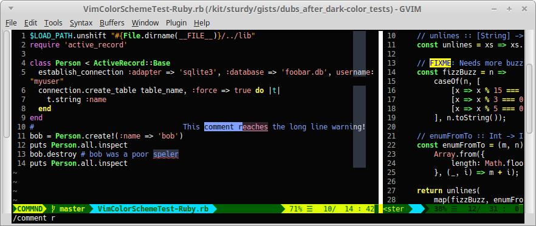
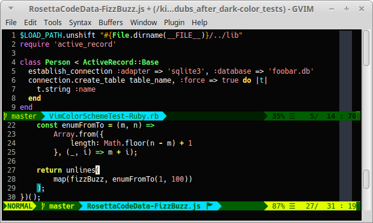

@@@@@@@@@@@@@@@@@@
Dubs Vim Reference
@@@@@@@@@@@@@@@@@@

##################
Dubs Vim Reference
##################

Dubs Vim Reference
==================

See the
`Dubs Vim installation instructions <README.rst#Installation>`__
if you want to download and install Dubs Vim.

About Dubs Vim
--------------

Dubs Vim is one developer's Vim IDE, assembled from a legion of awesome plugins.

Project page: https://github.com/landonb/dubs-vim

About this File
---------------

This document combines all the Dubs Vim plugin READMEs into one file.

You'll find links to each plugin in the following lists,
and you'll find documentation for *everything Dubs* below that!

About this Project
------------------

This project is not a Vim plugin itself, but a collection of
one developers favorite plugins, including their own plugins
and other individuals' plugins.

The plugins used to be included as git submodules, but submodules
are a chore to manage. Fortunately Vim now makes it easier to use
an external multiple repository manager (such as ``myrepos``) to
manage your Vim packages and plugins. So now the plugins are just
referenced from documentation; and it's up to you, the developer-
user, to install and manage them yourself.

tl;dr, you probably don't want to clone and install this project
(e.g., to ``~/.vim``), but you may be curious what Vim plugins I
use and recommend (and maintain).

List of Dubs Vim Plugins
^^^^^^^^^^^^^^^^^^^^^^^^

.. To generate the list of your plugs, copy-and-paste reST-ready:
    cd ~/.vim/pack && tree -d -L 3 -f | \
      grep -e '│       ├──' \
           -e '│       └──' \
           -e '│   │   ├──' \
           -e '│   │   └──' \
           -e '    │   ├──' \
           -e '    │   └──' \
           -e '        └──' \
      | sed s'#[^.]\+\./\(.*\)#\1#' \
      | sed s'#\([^/]\+\)/\([^/]\+\)/\([^/]\+\)#\2: \3: \`\3 <https://github.com/\1/\3>\`__#' \
      | sort \
      | less
.. Using a `| wc -l` instead of `less` and I see: 96 plugins.

These are plugins I've developed and continue to maintain:

.. table::
  :widths: 30 70

  ================================================================================================  ==============================================================================================================
  🌃 `dubs_after_dark <https://github.com/landonb/dubs_after_dark>`__                                Compelling light on dark color scheme (that uses true black).
  ------------------------------------------------------------------------------------------------  --------------------------------------------------------------------------------------------------------------
  💅 `dubs_appearance <https://github.com/landonb/dubs_appearance>`__                                Configure basic Vim look n' feel (that appeals to the author).
  ------------------------------------------------------------------------------------------------  --------------------------------------------------------------------------------------------------------------
  🧃 `dubs_edit_juice <https://github.com/landonb/dubs_edit_juice>`__                                Powerful Text Editing commands.
  ------------------------------------------------------------------------------------------------  --------------------------------------------------------------------------------------------------------------
  🧹 `dubs_ftype_mess <https://github.com/landonb/dubs_ftype_mess>`__                                Filetype-specific features, like syntax highlighters, etc.
  ------------------------------------------------------------------------------------------------  --------------------------------------------------------------------------------------------------------------
  🤹 `dubs_grep_steady <https://github.com/landonb/dubs_grep_steady>`__                              Clever Text Search including Replace.
  ------------------------------------------------------------------------------------------------  --------------------------------------------------------------------------------------------------------------
  👽 `dubs_html_entities <https://github.com/landonb/dubs_html_entities>`__                          HTML Entity table.
  ------------------------------------------------------------------------------------------------  --------------------------------------------------------------------------------------------------------------
  🍄 `dubs_mescaline <https://github.com/landonb/dubs_mescaline>`__                                  *Choice* Status Line.
  ------------------------------------------------------------------------------------------------  --------------------------------------------------------------------------------------------------------------
  🗂 `dubs_project_tray <https://github.com/landonb/dubs_project_tray>`__                            Project plugin wrapper.
  ------------------------------------------------------------------------------------------------  --------------------------------------------------------------------------------------------------------------
  🌯 `dubs_quickfix_wrap <https://github.com/landonb/dubs_quickfix_wrap>`__                          Elegant Quickfix wrapper.
  ------------------------------------------------------------------------------------------------  --------------------------------------------------------------------------------------------------------------
  💂 `dubs_style_guard <https://github.com/landonb/dubs_style_guard>`__                              Automatically set whitespace and line-length settings.
  ------------------------------------------------------------------------------------------------  --------------------------------------------------------------------------------------------------------------
  🔘 `dubs_toggle_textwrap <https://github.com/landonb/dubs_toggle_textwrap>`__                      Simple text wrapping wrapper.
  ------------------------------------------------------------------------------------------------  --------------------------------------------------------------------------------------------------------------
  જ⁀➴ `vim-async-map <https://github.com/embrace-vim/vim-async-map>`__                               Wire async mode maps, e.g., type ``kj`` quickly in insert mode to escape to normal mode.
  ------------------------------------------------------------------------------------------------  --------------------------------------------------------------------------------------------------------------
  🕹 `vim-blinky-search <https://github.com/embrace-vim/vim-blinky-search>`__                        Visual search enhancements.
  ------------------------------------------------------------------------------------------------  --------------------------------------------------------------------------------------------------------------
  🍧 `vim-buffer-delights <https://github.com/embrace-vim/vim-buffer-delights>`__                    Manage Buffers and Windows.
  ------------------------------------------------------------------------------------------------  --------------------------------------------------------------------------------------------------------------
  💍 `vim-buffer-ring <https://github.com/landonb/vim-buffer-ring>`__                                <Ctrl-J> and <Ctrl-K> buffer navigation — like the venerable ``vim-bufsurf`` but with a few improvements.
  ------------------------------------------------------------------------------------------------  --------------------------------------------------------------------------------------------------------------
  🏛 `vim-classic-taglist <https://github.com/landonb/vim-classic-taglist>`__                        Clone of http://vim-taglist.sourceforge.net/
  ------------------------------------------------------------------------------------------------  --------------------------------------------------------------------------------------------------------------
  👣 `vim-clip-expand-path <https://github.com/DepoXy/vim-clip-expand-path>`__                       Press ``<Leader>J`` to copy full file path to clipboard, or ``<Leader>j`` to copy relative path.
  ------------------------------------------------------------------------------------------------  --------------------------------------------------------------------------------------------------------------
  🕰 `vim-command-line-clock <https://github.com/landonb/vim-command-line-clock>`__                  Shows the date and clock time in the command line when no other output is displayed.
  ------------------------------------------------------------------------------------------------  --------------------------------------------------------------------------------------------------------------
  🥥 `vim-depoxy-coc-defaults <https://github.com/DepoXy/vim-depoxy-coc-defaults>`__                 Sensible coc.nvim defaults and maps.
  ------------------------------------------------------------------------------------------------  --------------------------------------------------------------------------------------------------------------
  💯 `vim-fullscreen-toggle <https://github.com/embrace-vim/vim-fullscreen-toggle>`__                Cycle through a few different Vim window dimensions (e.g., by pressing ``<F11>``).
  ------------------------------------------------------------------------------------------------  --------------------------------------------------------------------------------------------------------------
  🚕 `vim-goto-file <https://github.com/embrace-vim/vim-goto-file>`__                                Enables ``gf`` to resolve shell variable paths, like ``${VIM_PACK:-${HOME}/.vim/pack}``
  ------------------------------------------------------------------------------------------------  --------------------------------------------------------------------------------------------------------------
  🥔 `vim-lcd-project-root <https://github.com/landonb/vim-lcd-project-root>`__                      Sets the working directory when editing a new buffer to the file's Git project root.
  ------------------------------------------------------------------------------------------------  --------------------------------------------------------------------------------------------------------------
  🥖 `vim-mkspell-when-stale <https://github.com/landonb/vim-mkspell-when-stale>`__                  Automatically rebuild the Vim spell file on startup.
  ------------------------------------------------------------------------------------------------  --------------------------------------------------------------------------------------------------------------
  🌐 `vim-netrw-cfg-split-explorer <https://github.com/landonb/vim-netrw-cfg-split-explorer>`__      Sensible ``:netrw`` defaults.
  ------------------------------------------------------------------------------------------------  --------------------------------------------------------------------------------------------------------------
  🥾 `vim-netrw-explore-map <https://github.com/embrace-vim/vim-netrw-explore-map>`__                Wire convenient ``:Explore [dir]`` command maps.
  ------------------------------------------------------------------------------------------------  --------------------------------------------------------------------------------------------------------------
  🧩 `vim-netrw-link-resolve <https://github.com/landonb/vim-netrw-link-resolve>`__                  Reopens files opened with `netrw` at their resolved path to avoid a file-exists error on save.
  ------------------------------------------------------------------------------------------------  --------------------------------------------------------------------------------------------------------------
  🗯 `vim-nicer-file-changed-prompt <https://github.com/landonb/vim-nicer-file-changed-prompt>`__    Skip Vim alert when file modification changed but not content, useful if you git-rebase a lot.
  ------------------------------------------------------------------------------------------------  --------------------------------------------------------------------------------------------------------------
  🧼 `vim-ovm-easyescape-kj-jk <https://github.com/landonb/vim-ovm-easyescape-kj-jk>`__              Quickly ype ``jk`` or ``kj`` in Insert mode to switch to Normal mode.
  ------------------------------------------------------------------------------------------------  --------------------------------------------------------------------------------------------------------------
  🦴 `vim-ovm-seven-of-spines <https://github.com/landonb/vim-ovm-seven-of-spines>`__                Press <Ctrl-minus> to insert an hrule into reST docs.
  ------------------------------------------------------------------------------------------------  --------------------------------------------------------------------------------------------------------------
  🙏 `vim-reSTfold <https://github.com/landonb/vim-reSTfold>`__                                      Innovative reStructuredText document folding (manage notes like a pro).
  ------------------------------------------------------------------------------------------------  --------------------------------------------------------------------------------------------------------------
  🎨 `vim-reST-highdefs <https://github.com/landonb/vim-reST-highdefs>`__                            A plethora of reStructuredText syntax highlights to make maintaining reST notes files beautiful.
  ------------------------------------------------------------------------------------------------  --------------------------------------------------------------------------------------------------------------
  🖐 `vim-reST-highfive <https://github.com/landonb/vim-reST-highfive>`__                            Add *FIVER* highlighting to reStructuredText notes files.
  ------------------------------------------------------------------------------------------------  --------------------------------------------------------------------------------------------------------------
  ➖ `vim-reST-highline <https://github.com/landonb/vim-reST-highline>`__                            Highlight lines of repeated characters in reStructuredText notes files, to use as a colorful hrule.
  ------------------------------------------------------------------------------------------------  --------------------------------------------------------------------------------------------------------------
  🛑 `vim-select-mode-stopped-down <https://github.com/landonb/vim-select-mode-stopped-down>`__      Tweaked ``select-mode`` Ctrl-Shift-Left and Ctrl-Shift-Right motions, for ``behave mswin``.
  ------------------------------------------------------------------------------------------------  --------------------------------------------------------------------------------------------------------------
  🔃 `vim-source-reloader <https://github.com/embrace-vim/vim-source-reloader>`__                    Reload VimL (Vim script) source files (e.g., by pressing ``<F9>``).
  ------------------------------------------------------------------------------------------------  --------------------------------------------------------------------------------------------------------------
  ⌚ `vim-title-bar-time-of-day <https://github.com/landonb/vim-title-bar-time-of-day>`__            Shows the date and clock time in the titlebar, useful if you hide the macOS menubar.
  ------------------------------------------------------------------------------------------------  --------------------------------------------------------------------------------------------------------------
  🧭 `vim-tmux-navigator <https://github.com/landonb/vim-tmux-navigator>`__                          Fork of https://github.com/christoomey/vim-tmux-navigator adds keybindings for previous and next.
  ------------------------------------------------------------------------------------------------  --------------------------------------------------------------------------------------------------------------
  🐣 `vim-webopen <https://github.com/embrace-vim/vim-webopen>`__                                    Open URLs, search selected text/text under cursor, and lookup word definitions in your browser.
  ================================================================================================  ==============================================================================================================

.. AWAIT/2022-09-21: Add DepoXy/waffle-batter-vim, once published: https://github.com/DepoXy/depoxy/tree/release/home/.vim/pack/DepoXy/start/vim-depoxy
.. SKIPD/2022-09-21: DepoXy/vim-trap is private, but worth calling out: https://github.com/YOU/vim-trap

List of Forked Plugins
^^^^^^^^^^^^^^^^^^^^^^

These are plugins I've forked to add value (but haven't bothered asking
upstream to incorporate the changes, either because it wouldn't mesh
with the upstream project's goals, or because I'm lazy):

| `ansible-vim <https://github.com/landonb/ansible-vim>`__:
    "A vim plugin for syntax highlighting Ansible's common filetypes."
    Fork inhibits ``ansible-vim`` from changing ``isfname`` and ``path``,
    tweaks Yaml indent behavior, and disables ``indentexpr``.
      (Upstream: `ansible-vim <https://github.com/pearofducks/ansible-vim>`__)
| `QFEnter <https://github.com/landonb/QFEnter>`__:
    "Open a Quickfix item in a window you choose."
    Fork restores quickfix cursor position after opening error, and it
    avoids opening file in any window showing a special buffer.
      (Upstream: `QFEnter <https://github.com/yssl/QFEnter>`__)
| `vim-unimpaired <https://github.com/landonb/vim-unimpaired#👿>`__:
    "Pairs of handy bracket mappings."
    Fork adds ``[om`` and ``[om`` to show/hide menubar (for Linux users).
      (Upstream: `vim script <http://www.vim.org/scripts/script.php?script_id=1590>`__,
                 `vim-unimpaired <https://github.com/tpope/vim-unimpaired>`__)

List of LSP Plugins
^^^^^^^^^^^^^^^^^^^

These are `LSP <https://langserver.org/>`__ client and server plugins,
which empower Vim to be a great choice for all your development needs
(they integrate features like auto completion, go to definition, etc.).

| `coc-json <https://github.com/neoclide/coc-json>`__:
    JSON LSP server
| `coc.nvim <https://github.com/neoclide/coc.nvim>`__:
    LSP (Language Server Protocol) plugin
| `coc-tsserver <https://github.com/neoclide/coc-tsserver>`__:
    TypeScript LSP server

List of Motion Plugins
^^^^^^^^^^^^^^^^^^^^^^

Note that many of these plugins each redefine or improve upon the
built-in ``f``, ``F``, ``t``, ``T``, ``;``, and ``,`` commands,
so generally you want to choose one of these to use. (The others
you'll find under ``opt/``.)

One nicety about ``vim-easymotion`` is that all its features are *opt-in*,
so you can leave it under its ``start/`` directory and it won't wire
anything unless you add wiring from your config (as opposed to, say,
``improveft``, which adds its maps (e.g., to ``s``) when it loads).

| `improvedft <https://github.com/chrisbra/improvedft>`__
| `vim-easymotion <https://github.com/easymotion/vim-easymotion>`__
| `vim-sneak <https://github.com/justinmk/vim-sneak>`__

Motion plugins that implement two-character jumpers:

| `vim-easymotion <https://github.com/easymotion/vim-easymotion>`__:
    The pinnacle of motion plugins, it seems
| `vim-sneak <https://github.com/justinmk/vim-sneak>`__:
    Jump to any location specified by two characters;
    "minimalist alternative to *EasyMotion*"
| `hop.nvim <https://github.com/smoka7/hop.nvim>`__:
    *EasyMotion*-like plugin for Neovim
| `leap.nvim <https://github.com/ggandor/leap.nvim>`__:
    Neovim vim-sneak fork with target label previews
| `vim-seek <https://github.com/goldfeld/vim-seek>`__
| `vim-smalls <https://github.com/t9md/vim-smalls>`__:
    grays out doc to highlight cursor and matches

Motion plugins that implement single-character `f`, `F`, `t`, and `T`
improvements, e.g., multiline, smart case, repeat with `;` and `,`,
and highlighting:

| `improvedft <https://github.com/chrisbra/improvedft>`__
| `clever-f.vim <https://github.com/rhysd/clever-f.vim>`__
| `vim-extended-ft <https://github.com/svermeulen/vim-extended-ft>`__
| `vim-fanfingtastic <https://github.com/dahu/vim-fanfingtastic>`__
| `flash.nvim <https://github.com/folke/flash.nvim>`__ (Neovim)

List of Window-related Plugins
^^^^^^^^^^^^^^^^^^^^^^^^^^^^^^

| `BufOnly.vim <https://github.com/vim-scripts/BufOnly.vim>`__
| `limelight.vim <https://github.com/junegunn/limelight.vim>`__:
    "|flashlight| All the world's indeed a stage and we are merely players"
| `ZoomWin <https://github.com/vim-scripts/ZoomWin>`__

List of Programming, Language, and Markup Plugins
^^^^^^^^^^^^^^^^^^^^^^^^^^^^^^^^^^^^^^^^^^^^^^^^^

General:

| `editorconfig-vim <https://github.com/editorconfig/editorconfig-vim>`__:
    "EditorConfig plugin for Vim"
      [`more <http://editorconfig.org/>`__]
| `matchit <https://github.com/chrisbra/matchit>`__
    `matchit docs <https://github.com/chrisbra/matchit/blob/master/doc/matchit.txt>`__
| `nerdcommenter <https://github.com/preservim/nerdcommenter>`__:
    Easily add and remove comment leaders
| `tagbar <https://github.com/majutsushi/tagbar>`__

Coverage:

| `vim-istanbul <https://github.com/juanpabloaj/vim-istanbul>`__

Git:

| `vim-fugitive <https://github.com/tpope/vim-fugitive>`__:
    "fugitive.vim: a Git wrapper so awesome, it should be illegal"
  [`vim script <http://www.vim.org/scripts/script.php?script_id=2975>`__]
| `vim-mergetool <https://github.com/samoshkin/vim-mergetool>`__

JSON:

| `vim-jdaddy <https://github.com/tpope/vim-jdaddy>`__

Markdown:

| `vim-markdown <https://github.com/preservim/vim-markdown>`__

Python:

| `vim-python-matchit <https://github.com/voithos/vim-python-matchit>`__

Ruby:

| `vim-rails <https://github.com/tpope/vim-rails>`__:
    "rails.vim: Ruby on Rails power tools"
      [`vim script <http://www.vim.org/scripts/script.php?script_id=1567>`__]

TOML:

| `vim-toml <https://github.com/cespare/vim-toml>`__

TypeScript/JavaScript:

| `vim-javascript <https://github.com/pangloss/vim-javascript>`__:
    "Vastly improved JavaScript indentation and syntax support in Vim.
      [`vim script <http://www.vim.org/scripts/script.php?script_id=4452>`__]
| `vim-js <https://github.com/yuezk/vim-js>`__
| `vim-jsx-pretty <https://github.com/MaxMEllon/vim-jsx-pretty>`__
| `yats.vim <https://github.com/HerringtonDarkholme/yats.vim>`__

List of Tim Pope Plugins
^^^^^^^^^^^^^^^^^^^^^^^^

These plugins are maintained by the venerable `Tim Pope <https://github.com/tpope>`__
(and that are not included in the lists above):

| `vim-abolish <https://github.com/tpope/vim-abolish>`__
| `vim-fugitive <https://github.com/tpope/vim-fugitive>`__ (see above)
| `vim-jdaddy <https://github.com/tpope/vim-jdaddy>`__ (see above)
| `vim-rails <https://github.com/tpope/vim-rails>`__ (see above)
| `vim-repeat <https://github.com/tpope/vim-repeat>`__
| `vim-surround <https://github.com/landonb/vim-surround#🔄>`__:
    "Quoting and parenthesizing made simple."
    (Inspired by `a vim script <http://www.vim.org/scripts/script.php?script_id=1697>`__)
| `vim-speeddating <https://github.com/tpope/vim-speeddating>`__:
    "speeddating.vim: use CTRL-A/CTRL-X to increment dates, times, and more"
      [`vim script <http://www.vim.org/scripts/script.php?script_id=2120>`__]
| `vim-unimpaired <https://github.com/tpope/vim-unimpaired>`__ (see above)
| `vim-vinegar <https://github.com/tpope/vim-vinegar>`__:
    "vinegar.vim: combine with netrw to create a delicious salad dressing"

Tim Pope plugins I've tried but don't currently use:

| `vim-commentary <https://github.com/tpope/vim-commentary>`__:
    I use `NERD Commenter <https://github.com/preservim/nerdcommenter>`__;
    see also `tcomment.vim <https://github.com/tomtom/tcomment_vim>`__
| `vim-endwise <https://github.com/tpope/vim-endwise>`__:
    "endwise.vim: wisely add "end" in ruby, endfunction/endif/more in vim script, etc";
    I tried but found it disruptive (I'm not a huge fan of auto-completion...)
  [`vim script <http://www.vim.org/scripts/script.php?script_id=2386>`__]
| `vim-obsession <https://github.com/tpope/vim-obsession>`__:
    *obsession.vim: continuously updated session files*;
    see instead `my approach
    <https://github.com/landonb/dubs_appearance/blob/release/plugin/session_file_boss.vim>`__
| `vim-pathogen <https://github.com/tpope/vim-pathogen>`__:
    I use the `myrepos <https://myrepos.branchable.com/>`__ and
    `Oh, My Repos! <https://github.com/landonb/ohmyrepos>`__ to
    manage Vim plugins as a group of managed Git repositories
| `vim-scriptease <https://github.com/tpope/vim-scriptease>`__:
    "scriptease.vim: A Vim plugin for Vim plugins"
      [`vim script <http://www.vim.org/scripts/script.php?script_id=4394>`__]
| `vim-vividchalk <https://github.com/tpope/vim-vividchalk>`__:
    "vividchalk.vim: a colorscheme strangely reminiscent of Vibrant Ink for a certain OS X editor"
      [`vim script <http://www.vim.org/scripts/script.php?script_id=1891>`__]

See below for `Other Tim Pope plugins to consider`_.

List of Fuzzy-Finder Plugins
^^^^^^^^^^^^^^^^^^^^^^^^^^^^

I like ``junegunn/fzf.vim``:

| `fzf.vim <https://github.com/junegunn/fzf.vim>`__:
    Fuzzy-find plugin

See also:

| `command-t <https://github.com/wincent/command-t>`__:
    "Fast file navigation for VIM"
| `ctrlp.vim <https://github.com/kien/ctrlp.vim>`__:
    "Fuzzy file, buffer, mru, tag, etc finder."
      [`deets <https://kien.github.io/ctrlp.vim/>`__]
| `ddu.vim <https://github.com/Shougo/ddu.vim>`__:
    "Dark deno-powered UI framework for Vim/Neovim"
      [`deets <https://github.com/Shougo/ddu.vim/blob/main/doc/ddu.txt>`__]

List of Other Plugins
^^^^^^^^^^^^^^^^^^^^^

These are other awesome third-party plugins I find useful or otherwise
curious (though some I rarely use, I'll admit):

| `Tabular <https://github.com/godlygeek/tabular>`__:
    "Vim script for text filtering and alignment"
    (also required by `vim-markdown <https://github.com/tpope/vim-markdown>`__)
| `vim-gnupg <https://github.com/jamessan/vim-gnupg>`__:
    "transparent editing of gpg encrypted files."
  [`vim script <http://www.vim.org/scripts/script.php?script_id=3645>`__]

.. |flashlight| unicode:: 0x1F526 .. flashlight

List of Color Scheme Plugins
^^^^^^^^^^^^^^^^^^^^^^^^^^^^

The author created the ``dubs_after_dark`` color scheme because I wanted a true
black background and vibrant foreground colors, and most (none?) of the other
color schemes that I demoed use true black (most dark themes uses a darkish grey).

These plugins are installed under ``pack/*/opt/`` paths, so you can load them
first via ``:packadd {plugin-name}`` and then run ``colorscheme {scheme-name}``
to try out different color schemes.

| `jellybeans.vim <https://github.com/nanotech/jellybeans.vim>`__:
    "A colorful, dark color scheme for Vim."
      [`vim.org <http://www.vim.org/scripts/script.php?script_id=2555>`__]
| `nord-vim <https://github.com/arcticicestudio/nord-vim>`__:
    "An arctic, north-bluish clean and elegant Vim theme."
| `vim-colorschemes <https://github.com/flazz/vim-colorschemes>`__
| `vim-vividchalk <https://github.com/tpope/vim-vividchalk>`__ (see above)

List of Retired or Optional Plugins
^^^^^^^^^^^^^^^^^^^^^^^^^^^^^^^^^^^

For posterity, here are plugins that I used to use, but that I've since stopped using
(this is not a judgement on their merits: sometimes I use certain plugins with certain
technologies that I no longer use, or I maybe some functionality has since been 
incorporated into Vim itself, or maybe I found a different plugin, who knows).

Note that many of these plugins I simply moved under their related ``opt/``
directory, so you can load them on-demand. (E.g., there's no reason to
always load *TeTrIs*, but if you want to try it, run ``:packadd TeTrIs.vim``
and then ``\te``.)

| `asyncomplete-lsp.vim <https://github.com/prabirshrestha/asyncomplete-lsp.vim>`__
| `asyncomplete.vim <https://github.com/prabirshrestha/asyncomplete.vim>`__
| `async.vim <https://github.com/prabirshrestha/async.vim>`__
| `AutoAdapt <https://github.com/vim-scripts/AutoAdapt>`__:
    "Automatically adapt timestamps, copyright notices, etc."
      [`vim script <http://www.vim.org/scripts/script.php?script_id=4654>`__]
| `goyo.vim <https://github.com/junegunn/goyo.vim>`__:
    "Distraction-free writing in Vim"
| `ingo-library <https://github.com/vim-scripts/ingo-library>`__:
    "Vimscript library of common functions."
      [`vim script <http://www.vim.org/scripts/script.php?script_id=4433>`__]
| `nerdtree <https://github.com/scrooloose/nerdtree>`__:
    "A tree explorer plugin for vim."
| `syntastic <https://github.com/scrooloose/syntastic>`__:
    "Syntax checking hacks for vim"
| `tcomment_vim <https://github.com/tomtom/tcomment_vim>`__:
    "An extensible & universal comment plugin"
      [`vim script <http://www.vim.org/scripts/script.php?script_id=1173>`__,
       see also: `vim-commentary <https://github.com/tpope/vim-commentary>`__]
| `TeTrIs.vim <https://github.com/vim-scripts/TeTrIs.vim>`__:
    "A tetris game in pure vim"
| `tlib_vim <https://github.com/tomtom/tlib_vim>`__:
    "Some utility functions for VIM"
      [`vim script <http://www.vim.org/scripts/script.php?script_id=1863>`__]
| `typescript-vim <https://github.com/leafgarland/typescript-vim>`__:
    Circa TypeScript 1.0, since superseded by Vim's
    `typescript.vim <https://github.com/vim/vim/blob/master/runtime/syntax/typescript.vim>`__
    and `YATS <https://github.com/HerringtonDarkholme/yats.vim>`__.
| `viki_vim <https://github.com/tomtom/viki_vim>`__:
    "A personal wiki for Vim"
      [`vim script <http://www.vim.org/scripts/script.php?script_id=861>`__]
| `vim-easyescape <https://github.com/zhou13/vim-easyescape>`__
| `vim-go <https://github.com/editorconfig/vim-go>`__
| `vim-lsp-javascript <https://github.com/ryanolsonx/vim-lsp-javascript>`__
| `vim-lsp-settings <https://github.com/mattn/vim-lsp-settings>`__
| `vim-lsp-typescript <https://github.com/ryanolsonx/vim-lsp-typescript>`__
| `vim-lsp <https://github.com/prabirshrestha/vim-lsp>`__
| `vim-misc <https://github.com/xolox/vim-misc>`__:
    "Miscellaneous auto-load Vim scripts"
      [`more <https://peterodding.com/code/vim/misc/>`__]
| `vim-restructuredtext <https://github.com/marshallward/vim-restructuredtext>`__
| `vim-slash <https://github.com/junegunn/vim-slash>`__
    "Enhancing in-buffer search experience":
    "Automatically clears search highlight when cursor is moved"
    (see also `vim-evanesco <https://github.com/pgdouyon/vim-evanesco>`__)
    but also has a nifty optional match highlight blink feature
    that grifted for
    `vim-blinky-search <https://github.com/embrace-vim/vim-blinky-search>`__

Plugins that I used to develop or that I forked, but no longer use:

| `dubs_cycloplan <https://github.com/landonb/dubs_cycloplan>`__
| `dubs_file_finder <https://github.com/landonb/dubs_file_finder>`__
    Find and open files quickly using ``:CommandT`` and ``:CtrlP`` plugins.
| `dubs_syntastic_wrap <https://github.com/landonb/dubs_syntastic_wrap#🤸>`__:
    Syntastic wrapper.
| `vim-jsx <https://github.com/landonb/vim-jsx>`__:
    "React JSX syntax highlighting and indenting for Vim."
      (Upstream: `vim-jsx <https://github.com/mxw/vim-jsx>`__)
| `vim-markdown <https://github.com/landonb/vim-markdown#👇>`__:
    "Markdown for Vim."
    Fork fixes issues seeing XML tags and content being white on white
    (though might be specific to my Vim environment).
      (Upstream: `vim-markdown <https://github.com/gabrielelana/vim-markdown>`__)

Other Tim Pope plugins to consider
^^^^^^^^^^^^^^^^^^^^^^^^^^^^^^^^^^

Other Tim Pope plugins to consider (that author has not tried; listed
here just to be sure you're not missing anything useful):

| `vim-dadbod <https://github.com/tpope/vim-dadbod>`__:
    "dadbod.vim: Modern database interface for Vim",
    e.g., ``:DB postgresql:///foobar``
| `vim-eunuch <https://github.com/tpope/vim-eunuch>`__:
    "eunuch.vim: Helpers for UNIX",
    e.g., ``:Chmod``
| `vim-projectionist <https://github.com/tpope/vim-projectionist>`__:
    "projectionist.vim: Granular project configuration",
    helps work with boilerplate or similarly-configured projects
| `vim-git <https://github.com/tpope/vim-git>`__:
    "syntax, indent, and filetype plugin files for git, gitcommit, gitconfig, gitrebase, and gitsendemail",
    "earlier versions of these files are shipped with Vim"
    [`vim script <https://www.vim.org/scripts/script.php?script_id=1654>`__]
| `vim-sleuth <https://github.com/tpope/vim-sleuth>`__:
    "sleuth.vim: Heuristically set buffer options",
    "automatically adjusts ``shiftwidth`` and ``expandtab`` heuristically based on the current file",
    "Modelines and EditorConfig are also consulted"
| `vim-haml <https://github.com/tpope/vim-haml>`__:
    "Vim runtime files for Haml, Sass, and SCSS",
    "You only need it if you want the very latest updates."
| `vim-dispatch <https://github.com/tpope/vim-dispatch>`__:
    "dispatch.vim: Asynchronous build and test dispatcher"
| `vim-salve <https://github.com/tpope/vim-salve>`__:
    "salve.vim: Static Vim support for Leiningen, Boot, and the Clojure CLI"
| `vim-sensible <https://github.com/tpope/vim-sensible>`__:
    "sensible.vim: Defaults everyone can agree on"
    (`plugin/sensible.vim <https://github.com/tpope/vim-sensible/blob/master/plugin/sensible.vim>`__)
| `vim-markdown <https://github.com/tpope/vim-markdown>`__:
    "Vim Markdown runtime files",
    "you don't need to install these if you are running a recent version of Vim"
| `vim-rvm <https://github.com/tpope/vim-rvm>`__:
    "rvm.vim: Switch Ruby versions from inside Vim"
| `vim-cucumber <https://github.com/tpope/vim-cucumber>`__:
    "Vim Cucumber runtime files",
    "development version of Vim's included runtime files for the Ruby acceptance testing framework Cucumber"
| `rbenv-ctags <https://github.com/tpope/rbenv-ctags>`__:
    "Automatically generate ctags for rbenv Ruby stdlibs"
| `vim-rake <https://github.com/tpope/vim-rake>`__:
    "rake.vim: it's like rails.vim without the rails",
    leverages "projectionist.vim to enable you to use all those parts of
    rails.vim that you wish you could use on your other Ruby projects"
| `mta-settings <https://github.com/tpope/mta-settings>`__:
    "Configure ActionMailer or Mail delivery settings based on the environment",
    Ruby gem "enables transparent MTA (mail transport agent) configuration from the environment
    for both `ActionMailer <https://github.com/rails/rails/tree/main/actionmailer>`__
    and `Mail <https://github.com/mikel/mail>`__
| `vim-bundler <https://github.com/tpope/vim-bundler>`__:
    "bundler.vim: Lightweight support for Ruby's Bundler"
| `vim-flagship <https://github.com/tpope/vim-flagship>`__:
    "flagship.vim: Configurable and extensible tab line and status line",
    "Vim status line and tab line that are both easily customizable by the user and extensible by other plugins"
| `vim-capslock <https://github.com/tpope/vim-capslock>`__:
    "capslock.vim: Software caps lock",
    "Press ``<C-G>c`` in insert mode to toggle a temporary software caps lock,
    or ``gC`` in normal mode to toggle a slightly more permanent one"
| `vim-rhubarb <https://github.com/tpope/vim-rhubarb>`__:
    "rhubarb.vim: GitHub extension for fugitive.vim",
    "If fugitive.vim is the Git, rhubarb.vim is the Hub",
    e.g., ``:GBrowse`` to open GitHub URLs
| `vim-rsi <https://github.com/tpope/vim-rsi>`__:
    "rsi.vim: Readline style insertion",
    "C-a, C-b, C-d, C-e, C-f, C-t, M-b, M-d, M-f, M-n, and M-p are provided"
    (`plugin/rsi.vim <https://github.com/tpope/vim-rsi/blob/master/plugin/rsi.vim>`__)
| `vim-tbone <https://github.com/tpope/vim-tbone>`__:
    "tbone.vim: tmux basics"
| `vim-sexp-mappings-for-regular-people <https://github.com/tpope/vim-sexp-mappings-for-regular-people>`__:
    "`vim-sexp <https://github.com/guns/vim-sexp>`__ mappings for regular people"
| `vim-ragtag <https://github.com/tpope/vim-ragtag>`__:
    "ragtag.vim: ghetto HTML/XML mappings (formerly allml.vim)"
| `vim-heroku <https://github.com/tpope/vim-heroku>`__:
    "heroku.vim: Heroku CLI wrapper"
| `vim-dotenv <https://github.com/tpope/vim-dotenv>`__:
    "dotenv.vim: Basic support for ``.env`` and ``Procfile``"
| `vim-liquid <https://github.com/tpope/vim-liquid>`__:
    "Vim `Liquid <https://jekyllrb.com/docs/liquid/>`__ runtime files
    with `Jekyll <https://jekyllrb.com/>`__ enhancements"
| `vim-apathy <https://github.com/tpope/vim-apathy>`__:
    "apathy.vim: Set the 'path' option for miscellaneous file types",
    "sets the five path searching options — ``path``, ``suffixesadd``,
    ``include``, ``includeexpr``, and ``define``
| `vim-classpath <https://github.com/tpope/vim-classpath>`__:
    "classpath.vim: Set 'path' from the Java class path"
| `vim-haystack <https://github.com/tpope/vim-haystack>`__:
    "haystack.vim: fuzzy matching algorithm",
    "a fuzzy matching algorithm for use by other Vim plugins"
| `vim-afterimage <https://github.com/tpope/vim-afterimage>`__:
    "afterimage.vim: edit binary files by converting them to text equivalents",
    "Edit ICO, PNG, and GIF icons. No really. They're converted with ImageMagick to XPM,
    a plain text image format with beautiful syntax highlighting in GUI versions of Vim"
| `vim-flatfoot <https://github.com/tpope/vim-flatfoot>`__:
    "flatfoot.vim: experimental enhancement of "f" and "t" keys"
    (`plugin/flatfoot.vim <https://github.com/tpope/vim-flatfoot/blob/master/plugin/flatfoot.vim>`__)

Comprehensive Feature List
--------------------------

Each plugin's README.rst is reproduced herein to give a nice,
comprehensive (albeit lengthy) list of all the features.

Most of the features and key mappings are specific to Dubs Vim,
but a few commonly-used (or commonly-forgotten) Vim commands are
also included.

Features are grouped into categories and are identified by
their keyboard mapping or ``:command`` name, followed by a
brief description of the feature and then more detailed notes.

.. NOTE: For security reasons, the include directive does not
..       work on GitHub. E.g., we cannot simply
..
..        .. include:: https://github.com/landonb/dubs_after_dark/README.rst
..        .. include:: ...
..
..       so instead we'll assemble this file from a script, readme-using.make.sh,
..       which appends all the package docs to this file.

#####################################
Dubs Vim |em_dash| Dubs After Dark 🌃
#####################################

.. |em_dash| unicode:: 0x2014 .. em dash

Striking Vim `colorscheme <https://vimhelp.org/usr_06.txt.html>__`!
Vibrant white and colorful foreground text on a truly black background.



*Dubs After Dark colorscheme pairs well with* `Dubs Mescaline <https://github.com/landonb/dubs_mescaline>`__ *status line.*

About This Plugin
=================

This plugin provides an opinionated negative polarity color scheme.

The highlights are mostly Vim defaults, with a few tweaks to
improve contrast, provoke vibrancy, and increase readability.

Basically, if you clear highlights and start fresh, e.g.,:

.. code-block:: vim

  highlight clear
  set background=dark
  set termguicolors
  highlight Normal gui=NONE guifg=White guibg=#060606 ctermfg=White ctermbg=none

This plugin makes the following tweaks:

- Searches (i.e., started with ``/``, ``*``, or Dubs' ``<F1>``)
  are highlighted with a light pink background and underline.

- Spelling mistakes are highlighted with a light grey background
  and a red undercurl.

- The ``ColorColumn`` is set to light grey.

- The background is set to almost black, #060606, which you can
  easily override by setting ``g:dubs_after_dark_background``
  before loading the color.

- Less distracting dark grey line numbers (Vim's default is deep red)
  that work well either a light background or a dark background.

- Remove the distracting vertical bar between split windows.

- And more! Your best bet is to install the plugin, load the color,
  and see if you like it.::

  :color after-dark

The Dubs After Dark color works well the compelling
`Dubs Appearance <https://github.com/landonb/dubs_appearance>`__
plugin, which adjusts other parts of the look and feel of Vim.
<Shameless self-plug.>

For another excellent light-on-dark (though not black) color scheme,
check out
`jellybeans.vim <https://github.com/nanotech/jellybeans.vim>`__.

#######################################
Dubs Vim |em_dash| Appearance Plugin 💅
#######################################

.. |em_dash| unicode:: 0x2014 .. em dash

About This Plugin
=================

This plugin configures the appearance of Vim.

- The beautiful `Hack
  <https://github.com/chrissimpkins/Hack>`__
  Regular 9 font, falling back to Courier New 9.

- A 3-Column wide grey vertical long-line indicator over columns 78-80.

  - See `dubs_edit_juice's <https://github.com/landonb/dubs_edit_juice>`__
    ``<F2>`` mappings for paragraph formatting.

- Use ``<Ctrl-c>`` to exit Insert mode, and to enter Command mode, same as ``<ESC>``.

- Use ``<Ctrl-c>`` to copy text in the command-line window.

- Enable syntax highlighting.

- Show line numbers.

- Show new buffers with all folds open.

  (Hint: Use ``<zR>`` and ``<zM>`` to open and close all folds,
  respectively, and ``<zA>`` to toggle a single fold).

- Better search defaults:

  - Case-insensitive searching and matching (``:smartcase``).

  - Enable search term highlighting (``:hlsearch``).

  - Highlight search results as the keyword is typed (``:incsearch``).

- Enable ``modeline``: Vim will read modelines at the head or tail,
  like ``vim:tw=78:ts=8:ft=help:norl:``, and set itself accordingly.

- Enable ``:autoindent``, and load ``indent/`` files.

- Enable ``:wildmenu``, a/k/a, Vim command line tab completion.

- Show the status line and rule.

- Break longs lines on word boundaries.

- Make a close a close. The default Gvim menu behavior for File < Close
  (``<Alt-f>`` ``<c>``) just hides the buffer. Close the file in addition.

- Rewire File > Close (``<Alt-f>`` ``<c>``) so that it closes the buffer, too.

- Rewire File > Save All (``<Alt-f>`` ``<l>``) to save all files.

  - To allow us, File > Split-Open is remapped (to ``<Alt-f>`` ``<t>``).

- Use Window > New V-Split (``<Alt-w>`` ``<s>``) to open a new buffer
  in a new window to the right of the current window.

- Add File > Close All (``<Alt-f>`` ``<e>``) to close all files / delete
  all buffers.

 - If you Close All and then Exit (``<Alt-f>`` ``<x>``), because there's
   only one, empty buffer, Vim will delete ``Session.vim``. This is useful
   if you've edited a ``~/.vim/*`` script and want to reload it; otherwise,
   if a Session file exists, Vim will just read it and ignore other stuff.

- Save the current Session on exit; restore it on open.

  To clear the session -- e.g., after editing any Vim file -- type

    ``<Alt-f>`` ``<e>``, and then
    ``<Alt-f>`` ``<x>``.

  - The first command
      closes all files,
      deletes all buffers, and
      removes the Session file.

  - The second command quits Vim.

  When you restart Vim, it'll start with a fresh
  Session file and load any Vim edits you made.

- Set the ``*.swp`` file ``:directory`` to ``$HOME/.vim_backups/``

- Disable backups (set ``:nobackup``).

  You should use ``<Ctrl-s>`` or ``<Alt-f>`` ``<Alt-l>`` frequently.

  And commit to Git often. Do other things often.

..  Just don't manage a bunch of Gvim backup files.

.. - Also set the ``:backupdir`` to ``$HOME/.vim_backups/``

- Disable the frakking bell.

The plugin also improves upon the default color scheme.

- White background with black text, and non-distracting grey line numbers.

- Slash ``/`` and Star ``*`` Searches are highlighted with a green background.

- Change line numbers color from deep red (default) to dark grey.

- Remove distracting vertical split line between adjacent windows.

See the source for a few other settings and more comments.

Dependencies
============

This plugin uses commands from a few plugins that you'll want to
install separately:

- ``BufOnly``: *Delete all the buffers except the current/named buffer*:

  https://github.com/vim-scripts/BufOnly.vim

  - Source: https://www.vim.org/scripts/script.php?script_id=1071

- ``Bdelete``: *Delete buffers (close files) without closing your
  windows or messing up your layout.*:

  https://github.com/vim-scripts/bbye

  - See also similar, previous versions of that concept:

    - ``Kwbd``: *Keep Window on Buffer Delete - Improved*
      (commonly mapped to ``\bd``):

      https://github.com/vim-scripts/kwbdi.vim

      - Source: https://www.vim.org/scripts/script.php?script_id=2103

  - ``:Bclose`` and original ``Kwbd``: *Deleting a buffer without closing the window*:

    https://vim.fandom.com/wiki/Deleting_a_buffer_without_closing_the_window

Window-Related Commands
=======================

===========================  ============================  ==============================================================================
 Key Mapping                  Description                   Notes
===========================  ============================  ==============================================================================
 ``<Alt-w>c``                 Close Window                  Closes the window that the cursor is in. Calls ``<C-W>c``
---------------------------  ----------------------------  ------------------------------------------------------------------------------
 ``<Alt-w>o``                 "Only" Window                 Closes all windows except the one containing the cursor. Calls ``<C-W>o``
---------------------------  ----------------------------  ------------------------------------------------------------------------------
 ``<Alt-w>p``                 Horizontal Split              Creates a new window by splitting the current window in half along the horizon.
                                                            Calls ``<C-W>s``
---------------------------  ----------------------------  ------------------------------------------------------------------------------
 ``<Alt-w>s``                 Vertical Split                Creates a new window by splitting the current window in half along the vertical
                                                            axis. Calls ``<C-W>v<C-W>p:enew<CR><C-W>p``
                                                            - Hint: If you want to compare two files side-by-side, open one file and
                                                              then the other file, hit ``<Alt-w>s`` to split the window, and then hit
                                                              ``<F2>`` to jump to the first buffer; now you're looking at both buffers.
===========================  ============================  ==============================================================================

Appearance Commands
===================

This script does not define any commands.

################################
Dubs Vim |em_dash| Edit Juice 🧃
################################

.. |em_dash| unicode:: 0x2014 .. em dash

About This Plugin
=================

This plugin maps a bunch of editing-related features
to key combinations to help delete text, select text,
edit text, move the cursor around the buffer, and
perform single-key text searches within the buffer.

This script originally started to make Vim emulate
`EditPlus <https://www.editplus.com/>`__,
but it's grown considerably since then to
just make Vim a more comfortable editor all around.

Optional Vendor Plugins
=======================

You can enable additional functionality by
installing the third-party plugins.

taglist
-------

To unlock the tag list feature, install the `taglist` plugin.

.. code-block:: bash

   mkdir ~/.vim/pack/vim-scripts/start/taglist
   cd ~/.vim/pack/vim-scripts/start/taglist
   wget -N http://downloads.sourceforge.net/project/vim-taglist/vim-taglist/4.6/taglist_46.zip
   unzip taglist_46.zip
   command rm taglist_46.zip

Always-On Features (Not Mapped to Any Keys)
===========================================

Smart Tabs
----------

- The
  `Smart Tabs
  <https://github.com/vim-scripts/Smart-Tabs/blob/master/plugin/ctab.vim>`__
  feature, located in ``dubs_edit_juice/plugin/smart-tabs.vim``,
  translates tabs to spaces if you're tabbing but not indenting, i.e.,
  if only spaces precede the cursor to the start of the line, then tabs
  are added when <tab> is pressed, otherwise <spaces> are inserted instead.
  (See also, `Indent with tabs, align with spaces
  <http://vim.wikia.com/wiki/Indent_with_tabs,_align_with_spaces>`__.)

Recover from accidental Ctrl-U
------------------------------

Basically, break the undo block (`<Ctrl-g>u`) before undoing so
insertions consist of more than a single modification. This avoids
a problem where undoing in insert mode and then undoing in command
mode loses deleted text that cannot be recovered (i.e., isn't
part of any undo block).

- See: http://vim.wikia.com/wiki/Recover_from_accidental_Ctrl-U

Features Bound to Key Commands
==============================

Searching Buffers
-----------------

Commands for searching for text within a file.

=================================  ==================================  ==============================================================================
 Key Mapping                        Description                         Notes
=================================  ==================================  ==============================================================================
 ``/``                              Start a buffer search               Press the forward slash key to start a buffer search in the window
                                                                        wherein your cursor lies. The cursor will jump to matches as you type;
                                                                        hit Enter when you're done typing the search command.

                                                                        Hint: If you type lowercase characters only, the search is
                                                                        case-insensitive, but if you use one or more uppercase characters,
                                                                        the search is case sensitive.
---------------------------------  ----------------------------------  ------------------------------------------------------------------------------
 ``<F3>``                           Forward and Backward                After you've started a buffer search, use ``<F3>`` or ``n``
                                    Search Matches                      to search forward through the buffer,
                                                                        and use ``<Shift-F3>`` and ``N`` (i.e., Shift-'n')
                                                                        to search backwards through the buffer.

                                                                        Hint: The search wraps at the end of the buffer;
                                                                        when it wraps, you'll see the scroll bar elevator jump and
                                                                        you'll see a message highlighted in red in the status window
                                                                        that reads, "search hit TOP, continuing at BOTTOM", or,
                                                                        conversely, "search hit BOTTOM, continuing at TOP".
---------------------------------  ----------------------------------  ------------------------------------------------------------------------------
 ``<Shift-F3>``                     Backward Search Match               Like ``<F3>``, but go to the previous result,
                                                                        possibly wrapping at the start of the file and continuing from
                                                                        the end, back up to the cursor.
---------------------------------  ----------------------------------  ------------------------------------------------------------------------------
 ``n`` and ``N``                    Forward and Backward                Same as ``<F3>`` and ``<Shift-F3>``, respectively.
                                    Search Matches
---------------------------------  ----------------------------------  ------------------------------------------------------------------------------
 ``<F1>``                           Search Buffer for                   If there's a selection, searches the buffer for that,
                                    Word Under Cursor                   otherwise selects the word under the cursor and searches for that.
                                                                        This is a shortcut to ``/`` in a sense.

                                                                        Hint: To start searching a buffer for a term,
                                                                        put the cursor on that term,
                                                                        hit ``<F1>`` and then use ``<F3>`` to continue searching the file.

                                                                        Caveat: If the search term is lowercase,
                                                                        you'll get case-insensitive matches,
                                                                        but if the search term is mixed- or upper-case,
                                                                        you'll get case-sensitive matches.
---------------------------------  ----------------------------------  ------------------------------------------------------------------------------
 ``<Shift-F1>``                     Highlight Word Under                Like ``<F1>`` -- starts a search for the word under the cursor -- but
                                    Cursor on Start Search              doesn't jump to the next match, but rather the cursor stays put.
---------------------------------  ----------------------------------  ------------------------------------------------------------------------------
 ``*``                              Restrictive Search                  The star-search is a Vim builtin.
                                    Selected                            It does a case-insensitive "word-search"
                                    or Under Cursor                     for the word under the cursor, that is,
                                                                        it only matches exact words.
                                                                        It also excludes special characters, like hyphens,
                                                                        but it combines words across underscores.
                                                                        It does not match supersets
                                                                        (unlike ``<F1>`` where, e.g., 'ord' matches 'word').
                                                                        So, e.g., starting a \*-search on 'john\_doe' would
                                                                        match 'John\_doe' but not 'john-doe', and starting
                                                                        a \*-search on the reverse,
                                                                        i.e., on the first half of 'john-doe',
                                                                        would match just 'john' or 'John' or 'JOHN', etc.).
                                                                        The set of word delimiters is obviously customizable.
---------------------------------  ----------------------------------  ------------------------------------------------------------------------------
 ``#``                              Restrictive Search                  Like ``*`` search, but backward through the buffer.
                                    in Reverse
---------------------------------  ----------------------------------  ------------------------------------------------------------------------------
 ``<Ctrl-H>``                       Hide Search Highlights              After you initiate a search,
                                                                        the matching words in the buffers are highlighted.
                                                                        To disable the highlight, type ``<Ctrl-H>``
---------------------------------  ----------------------------------  ------------------------------------------------------------------------------
 ``\ds``                            Toggle ``*`` Whitespace             ``VeryLiteral`` defaults to off, such that selecting text with trailing
                                    Behavior                            whitespace and then pressing ``*`` to start a match matches the same text
                                                                        but ignores whitespace, e.g., "it " (with a space) matches "it" (without a space).
                                                                        You probably won't ever use this command, since you'll normally use ``*``
                                                                        in insert or command mode for the word under the cursor, rather than
                                                                        selecting text first and using ``*`` in visual mode.
---------------------------------  ----------------------------------  ------------------------------------------------------------------------------
 ``\s``                             Search and Replace                  To substitute matching text throughout a file, select the text you want to
                                    in Buffer                           replace and hit backslash and then 's'. You'll see a partially-completed
                                                                        command ready for you to type the replacement text. Hit return,
                                                                        and then hit 'y' to confirm each replacement or hit 'a' to do 'em all.

                                                                        Caveat: the search-and-replace starts at the cursor and continues until the
                                                                        end of the file but it doesn't wrap around.

                                                                        Hint: You'll notice that you are completing a builtin Vim search-n-replace command;
                                                                        if you'd like to do case-sensitive matching, add an 'I' to the end of the search,
                                                                        i.e., ``:.,$s/Find_Me/Replace_Me/gcI``
---------------------------------  ----------------------------------  ------------------------------------------------------------------------------
 ``\S``                             Search and Replace                  This is similar to ``\s`` but it searches and replaces text in all of the files
                                    in All Files                        listed in the quickfix window.
                                    Listed in Quickfix
                                                                        - Hint: Do an ``<F4>`` or ``\g`` search to populate the Quickfix window
                                                                          (these two commands are part of
                                                                          `dubs_grep_steady <https://github.com/landonb/dubs_grep_steady#🧐>`__).

                                                                        - Double-click the first entry in the Quickfix search results to open that buffer.

                                                                        - Highlight the text you want to replace and then hit ``\`` and then ``S``.

                                                                        - Type the replacement text and hit return, and the plugin will find and replace
                                                                          in all of the files in the Quickfix list.

                                                                        Caveat: If you are not happy with the results, you'll have to ``<Ctrl-Z>``
                                                                        each file that was edited; fortunately, a single Ctrl-Z undoes all of the
                                                                        changes in each buffer.

                                                                        (FIXME: We could make a :bufdo to run Ctrl-Z once in each open buffer.)

                                                                        Caveat: If a substring of your replacement text matches the original text,
                                                                        the function will endlessly recurse, oops!
                                                                        Just type ``<Ctrl-C>`` to stop it.
=================================  ==================================  ==============================================================================

Editing and Formatting Text
---------------------------

=================================  ==================================  ==============================================================================
 Key Mapping                        Description                         Notes
=================================  ==================================  ==============================================================================
 ``<F2>``                           'Paragraphize'                      Formats the selected text to be 80-characters wide or less.
                                    Selected text                       Uses the 'par' program.
---------------------------------  ----------------------------------  ------------------------------------------------------------------------------
 ``<Shift-F2>``                     Narrow 'Paragraphize'               Same as ``<F2>`` but formats the selected text to be 60-characters wide or less.
                                    Selected text
---------------------------------  ----------------------------------  ------------------------------------------------------------------------------
 ``<Ctrl-Shift-F2>``                Mediumish 'Paragraphize'            Same as ``<F2>`` but formats the selected text to be 70-characters wide or less.
                                    Selected text
---------------------------------  ----------------------------------  ------------------------------------------------------------------------------
 ``<Alt-Shift-F2>``                 Adaptive 'Paragraphize'             Same as ``<F2>`` but formats the selected text to be as wide as first selected line.
                                    Selected text
---------------------------------  ----------------------------------  ------------------------------------------------------------------------------
 ``<Ctrl-Q><Shift-Click>``          Block Select                        When you select text normally, you select a sequence of characters.
                                                                        But if your text file is pretty-printed (with well-formatted columns
                                                                        and whatnot) you can select text as a "block".

                                                                        First, enter command mode, then hit ``<Ctrl-Q>`` and then ``<Shift-Click>``
                                                                        elsewhere to make a block selection.
                                                                        You can copy, paste and cut block selections like you can normal sequence selections.

                                                                        (Note: In default Vim, this command is mapped to Ctrl-V, but Ctrl-V is paste, yo! =)
                                                                        so we've remapped Vim's Ctrl-V to Ctrl-Q so we can use Ctrl-V for paste
                                                                        (and since we're using Ctrl-Q for block select, if you want to quit, try ``<Alt-f>x``).)
---------------------------------  ----------------------------------  ------------------------------------------------------------------------------
 Quadruple-Click                    Block Select                        Uber-secret block select motion. Click four times fast!
---------------------------------  ----------------------------------  ------------------------------------------------------------------------------
 ``<Ctrl-Enter>``                   New Line without                    Normally, Vim is super smart and starts your new lines with the previous line's
                                    Comment Leader                      comment leader. I.e., in Python, if you're typing a comment, when you hit return,
                                                                        you'll get a new octothorpe at the correctly tabbed column so you can continue
                                                                        typing your comment. But if you're done typing your comment and want to start
                                                                        typing code, hit ``<Ctrl-Enter>`` to start a new line with the comment leader.
---------------------------------  ----------------------------------  ------------------------------------------------------------------------------
 ``<Ctrl-Z>`` and ``<Ctrl-Y>``      Undo and Redo                       ``<Ctrl-Z>`` and ``<Ctrl-Y>`` work like most apps, undoing and redoing.
                                                                        This would not be so special if the plugin had not had to change Vim's default:
                                                                        in default Vim, when in select mode, Ctrl-Z lowercases what's selected.
                                                                        But with this plugin, even when text is selected, Ctrl-Z just undoes what was dud.

                                                                        Hint: If you pine for the lowercase operation, select text and then type ``<Ctrl-o>gu<DOWN>``
---------------------------------  ----------------------------------  ------------------------------------------------------------------------------
 ``f/`` and ``f\``                  Change Slashes                      Use ``f/`` and ``f\`` to change the direction of slashes.

                                                                        Press ``f/`` to change every backslash to a forward slash in the current line;
                                                                        use ``f \`` to do the opposite.

                                                                        Hint: This is useful for converting Windows OS directory paths to Linux/Mac, and vice versa.
---------------------------------  ----------------------------------  ------------------------------------------------------------------------------
 ``qq`` and ``q`` and ``Q``         Record and Playback                 This is a shortcut to playback the recording in the q register.
                                    Keystrokes
                                                                        1. Start recording with ``qq``.

                                                                        2. End recording with ``q`` (or with ``<Ctrl-o>q`` if in Insert mode).

                                                                        3. Playback with ``Q``.
---------------------------------  ----------------------------------  ------------------------------------------------------------------------------
 ``<Ctrl-C>``                       Copy                                ``<Ctrl-Insert>`` and ``<Shift-Insert>`` are aliases
                                                                        for ``<Ctrl-C>`` and ``<Ctrl-V>``, which are aliases
                                                                        for copy and paste, respectively and respectively.
---------------------------------  ----------------------------------  ------------------------------------------------------------------------------
 ``<Shift-Insert>``                 Copy
---------------------------------  ----------------------------------  ------------------------------------------------------------------------------
 ``<Ctrl-V>``                       Paste
---------------------------------  ----------------------------------  ------------------------------------------------------------------------------
 ``<Shift-Insert>``                 Paste
---------------------------------  ----------------------------------  ------------------------------------------------------------------------------
 ``<Ctrl-T>``                       Transpose Characters                Swaps the two characters on either side of the cursor.
---------------------------------  ----------------------------------  ------------------------------------------------------------------------------
 ``r``                              Replace Character                   When in command mode, move the blocky cursor over a character,
                                                                        type 'r', and then type a character to replace the character under the cursor.
---------------------------------  ----------------------------------  ------------------------------------------------------------------------------
 ``<Ctrl-Shift-Backspace>``         Delete to Start of Line
---------------------------------  ----------------------------------  ------------------------------------------------------------------------------
 ``<Ctrl-Backspace>``               Delete to Start of Word
---------------------------------  ----------------------------------  ------------------------------------------------------------------------------
 ``<Ctrl-Shift-Delete>``            Delete to End of Line
---------------------------------  ----------------------------------  ------------------------------------------------------------------------------
 ``<Alt-Delete>``                   Delete to End of Line
---------------------------------  ----------------------------------  ------------------------------------------------------------------------------
 ``<Ctrl-Delete>``                  Delete to End of Word
---------------------------------  ----------------------------------  ------------------------------------------------------------------------------
 ``<Shift-Alt-Delete>``             Remove Line
---------------------------------  ----------------------------------  ------------------------------------------------------------------------------
 ``<Ctrl-Shift-Left>``              Select to Cursor-Left
---------------------------------  ----------------------------------  ------------------------------------------------------------------------------
 ``<Ctrl-Shift-Right>``             Select to Cursor-Right
---------------------------------  ----------------------------------  ------------------------------------------------------------------------------
 ``<Alt-Shift-Left>``               Select from Cursor                  Same as ``<Shift-Home>``, or ``v0``.
                                    to Start of Line
---------------------------------  ----------------------------------  ------------------------------------------------------------------------------
 ``<Alt-Shift-Right>``              Select from Cursor                  Same as ``<Shift-End>``, or ``v$``.
                                    to End of Line
---------------------------------  ----------------------------------  ------------------------------------------------------------------------------
 ``<Ctrl-Shift-PageUp>``            Select from Cursor                  Executes ``vH``.
                                    to First Line of Window
---------------------------------  ----------------------------------  ------------------------------------------------------------------------------
 ``<Ctrl-Shift-PageDown>``          Select from Cursor                  Executes ``vL``.
                                    to Last Line of Window
---------------------------------  ----------------------------------  ------------------------------------------------------------------------------
 ``<Tab>`` and ``<Shift-Tab>``      Indent and Undent                   Select some text in one or more lines and use ``<Tab>`` and ``<Shift-Tab>``
                                    Selected Text                       to indent and undent the text according to the current tab width
                                                                        (and using tabs or spaces as appropriate).

                                                                        Caveat: Cindent is too smart and won't shift octothorpes
                                                                        that are in the first column
                                                                        (because it thinks they're pre-compilation macros);
                                                                        [lb] has tried but failed to find a way around this,
                                                                        but he likes the other things that Cindent is good for.
---------------------------------  ----------------------------------  ------------------------------------------------------------------------------
 ``<Ctrl-P>`` and ``<Ctrl-L>``      Swap Paragraphs                     ``<Ctrl-P>`` swaps the paragraph under the cursor with the paragraph above.

                                                                        ``<Ctrl-L>`` swaps in with the paragraph below.
=================================  ==================================  ==============================================================================

Common Buffer Commands
----------------------

Some cursor-, scrolling-, and selecting-related
standard Vim and custom Dubs Vim commands.

=====================================  ==================================  ==============================================================================
Key Mapping                            Description                         Notes
=====================================  ==================================  ==============================================================================
``gg``                                 First Line                          Move the cursor and scroll to the top of the buffer.
-------------------------------------  ----------------------------------  ------------------------------------------------------------------------------
``G``                                  Last Line                           Move the cursor and scroll to the bottom of the buffer.
-------------------------------------  ----------------------------------  ------------------------------------------------------------------------------
``[0-9]+ G``                           Specific Line                       Type a line number and then ``G`` to jump the cursor to that line number.
-------------------------------------  ----------------------------------  ------------------------------------------------------------------------------
``<Ctrl-PageUp>``                      Move Cursor                         Moves the cursor to the first line of the window (not the buffer) without scrolling the buffer.
                                       to Window Top
-------------------------------------  ----------------------------------  ------------------------------------------------------------------------------
``<Ctrl-PageDown>``                    Move Cursor                         Moves the cursor to the bottom of the window without scrolling the buffer.
                                       to Window Bottom
-------------------------------------  ----------------------------------  ------------------------------------------------------------------------------
``<Alt-Up>`` and ``<Alt-Down>``        Move Cursor                         Same as ``<Ctrl-PageUp>`` and ``<Ctrl-PageDown>``, respectively.
                                       to Window Top/Bottom
-------------------------------------  ----------------------------------  ------------------------------------------------------------------------------
``M``                                  Move Cursor                         Moves the cursor to the middle of the window without scrolling the buffer.
                                       to Window Middle
-------------------------------------  ----------------------------------  ------------------------------------------------------------------------------
``<Leader>dz``                         Recenter Window Vertically          Scrolls the window to move the cursor line to the center of the window.
                                                                           (Same as builtin ``zz`` command, but also works from insert mode.)
-------------------------------------  ----------------------------------  ------------------------------------------------------------------------------
``<Alt-F12>``                          Start Editing                       This is an obscure command: Moves the cursor to the middle of the window
                                       at Window Middle                    without scrolling the buffer and starts an edit session.
-------------------------------------  ----------------------------------  ------------------------------------------------------------------------------
``<Alt-Left>`` and ``<Alt-Right>``     Move Cursor                         These do the same thing as ``<HOME>`` and ``<END>``:
                                       to Line Start/End                   it moves the cursor to the first column of the current line or to the last column.
-------------------------------------  ----------------------------------  ------------------------------------------------------------------------------
``<Ctrl-Left>`` and ``<Ctrl-Right>``   Move Cursor                         Moves the cursor one word at a time either left or right; moves across newline boundaries.
                                       to Word Start/End
-------------------------------------  ----------------------------------  ------------------------------------------------------------------------------
``<Ctrl-Up>`` and ``<Ctrl-Down>``      Cursorless Scroll                   Scrolls the buffer without moving the cursor.
                                                                           Not quite the same as a simple ``<PageUp>`` or ``<PageDown>``
                                                                           because this command moves the cursor to the first or last line
                                                                           in the window the first time you use it,
                                                                           and it only scrolls the buffer if the cursor is already at the top or bottom of the window
                                                                           (i.e., the second and subsequent times you use it).
                                                                           Note: In Vim-ease, this action is called scrolling the window "in the buffer".
-------------------------------------  ----------------------------------  ------------------------------------------------------------------------------
``<Shift>``-*other keys*               Select text motion                  Shift can be combined with most of the cursor movement commands above
                                                                           to select the text that the cursor flies over.
=====================================  ==================================  ==============================================================================

Changing Buffers
----------------

It's easy to switch between buffers between the next
and last buffers in the history stack.

===========================  ============================  ==============================================================================
 Key Mapping                  Description                   Notes
===========================  ============================  ==============================================================================
 ``<Ctrl-J>``                 Reverse Traverse Buffers      Traverse buffer history backwards by most recently
                                                            viewed; opposite of ``<Ctrl-K>``.
                                                            - Hint: If you find yourself down a rabbit hole,
                                                              opening file after file, and you can't remember
                                                              what you were doing, hit ``<Ctrl-J>`` to crawl
                                                              out of it.
                                                            - Caveat: Splitting and Closing windows can mess
                                                              up the buffer history, 'natch.
---------------------------  ----------------------------  ------------------------------------------------------------------------------
 ``<Ctrl-K>``                 Forward Traverse History      Traverse buffer history forwards by most recentlt
                                                            viewed; opposite of ``<Ctrl-J>``.
---------------------------  ----------------------------  ------------------------------------------------------------------------------
 ``<Shift-Ctrl-Tab>``         Reverse Traverse Buffers      Traverse buffer list backward in the order that
                                                            they were originally loaded; opposite of ``<Ctrl-Alt-Tab>``.
---------------------------  ----------------------------  ------------------------------------------------------------------------------
 ``<Ctrl-Tab>``               Forward Traverse Buffers      Traverse buffer list forward in the order that
                                                            they were originally loaded; opposite of ``<Shift-Ctrl-Alt-Tab>``.
===========================  ============================  ==============================================================================

Developer Commands
------------------

Mostly built-in command reference, but a few Dubs Vim commands, too.

Highlights:

- Map ``<Ctlr-]>`` to work in Insert and Visual modes (by default,
  jumping to the tag under the cursor or selected text only
  works in Normal mode).

  - Also map ``<Alt-]>`` to jump back to the last tag, since
    another Dubs Vim plugin overrides the built-in ``<Ctrl-t>``
    to be transpose.

- Enable wildmode. In Insert mode, use ``<Ctrl-N>`` to cycle
  through an auto-completion list from your tags file.
  Completion happens according to wildmode.
  See also ``:help cmdline-completion``.

=================================  ==================================  ==============================================================================
 Key Mapping                        Description                         Notes
=================================  ==================================  ==============================================================================
 ``<Ctrl-]>``                       Jump to Definition                  Jumps to the definition of the function named under the cursor.

                                                                        Hint: You can return to the tag from which you jumped using ``<Alt-]>``.
---------------------------------  ----------------------------------  ------------------------------------------------------------------------------
 ``<Alt-]>``                        Jump to Last Tag                    Jumps to the tag used by the last ``<Ctrl-]>`` command.
                                                                        Dubs Vim adds the ``<Alt-]>`` mapping because it remaps the built-in
                                                                        ``<Ctrl-T>`` to be transpose (also, it feels weird that
                                                                        the opposite of ``<Ctrl-]>`` is ``<Ctrl-t>``, two combinations
                                                                        that seem unrelated; at least ``<Ctrl-]>`` and ``<Alt-]>``
                                                                        share one of the same keys).
---------------------------------  ----------------------------------  ------------------------------------------------------------------------------
 ``<Ctrl-N>``                       Auto-Complete Using Tags            After typing the first characters of a keyword, type ``<Ctrl-n>``
                                                                        to bring up an inline list of matching tags. It's not the smartest
                                                                        auto-complete -- the command doesn't suss out object types or anything --
                                                                        but it's at least something.
                                                                        You can also type ``<Ctrl-X><Ctrl-]>`` to start autocomplete.
                                                                        See ``:help ins-completion`` for complete deets.
---------------------------------  ----------------------------------  ------------------------------------------------------------------------------
 ``%``                              Jump Between                        Jumps from an open brace, bracket, #if, parenthesis, etc.,
                                    Parentheses/Braces/Brackets         to the corresponding closing brace, bracket, #endif, parenthesis, etc.
---------------------------------  ----------------------------------  ------------------------------------------------------------------------------
 ``[{``                             Jump Back to the ``{``              Jumps back to the ``{`` at the start of the current code block.
---------------------------------  ----------------------------------  ------------------------------------------------------------------------------
 ``gd``                             Jump to a Declaration               Jumps from the use of a variable to its local definition.
---------------------------------  ----------------------------------  ------------------------------------------------------------------------------
 ``\dt``                            Toggle Tab Highlighting             Type backslash and then ``t`` ``a`` ``b`` to enable or disable
                                                                        tab highlighting. When enabled, tabs will be shown with a solid blue underline.
=================================  ==================================  ==============================================================================

.. note:: FIXME: ``<Ctrl-P>`` should be the opposite of ``<Ctrl-N>``
          (it should reverse one item at a time through the tag list)
          but it doesn't work. It might be conflicting with ``MoveParagraphUp()``.

Insert Date and Time Commands
-----------------------------

===========================  ============================  ==============================================================================
 Key Mapping                  Description                   Notes
===========================  ============================  ==============================================================================
 ``TTT``                      Insert today's date           Insert time as "YYYY-MM-DD".
---------------------------  ----------------------------  ------------------------------------------------------------------------------
 ``TTT_``                     Insert today's date           Insert time as "YYYY_MM_DD".
---------------------------  ----------------------------  ------------------------------------------------------------------------------
 ``TTTtt``                    Insert today's date           Insert time as "YYYY-MM-DD HH:MM".
 ``:::``
---------------------------  ----------------------------  ------------------------------------------------------------------------------
 ``TTTTtt``                   Insert today's date           Insert time as "YYYY-MM-DD-HH:MM".
---------------------------  ----------------------------  ------------------------------------------------------------------------------
 ``ttt``                      Insert today's date           Insert time as "HH:MM".
---------------------------  ----------------------------  ------------------------------------------------------------------------------
 ``<Leader>t``                Insert today's date           Insert time as "/YYYY-MM-DD: ".
---------------------------  ----------------------------  ------------------------------------------------------------------------------
 ``<F12>``                    Insert today's date           Insert time as "/YYYY-MM-DD HH-MM: ".
===========================  ============================  ==============================================================================

Obscure (Rarely Used) But Useful Commands
-----------------------------------------

===========================  ============================  ==============================================================================
 Key Mapping                  Description                   Notes
===========================  ============================  ==============================================================================
 ``:TabMessage [cmd]``        Send Vim output to New Tab    Vim commands sometimes have output and sometimes that output is very long
                                                            but Vim forces you to view it through a 'less'-ish lens, and sometimes you
                                                            cannot easily copy the output data.
                                                            Use ``:TabMessage`` to execute a command and copy the output
                                                            to a new Tab window, where you can peruse and copy it freely.
---------------------------  ----------------------------  ------------------------------------------------------------------------------
 ``::``                       Use Highlighted Text          Starts the highlighted text as a Vim command,
                              to start Vim Command          i.e., type 'help', highlight it, hit '::', hit Enter, and you'll see the Vim help window.
---------------------------  ----------------------------  ------------------------------------------------------------------------------
 ``:?``                       Immediately open Vim          Immediately runs ``:help {selected-text}`` on the selected text.
                              Help on Selected Text
---------------------------  ----------------------------  ------------------------------------------------------------------------------
 ``:Lorem``                   Lorum Ipsum Dump              Pastes the first paragraph of Lorum Ipsum at the prompt.
---------------------------  ----------------------------  ------------------------------------------------------------------------------
 ``:Foobar``                  Foo Bar Baz Bat... Dump       Pastes a list of
                                                            `metasyntactic jargon terms <https://en.wikipedia.org/wiki/Metasyntactic_variable#General_usage>`__.
---------------------------  ----------------------------  ------------------------------------------------------------------------------
 ``<Ctrl-o>g<Ctrl-g>``        Count Selected Characters
---------------------------  ----------------------------  ------------------------------------------------------------------------------
 ``m{char}`` / ``'{char}``    Set a / Return to Bookmark    Sets and Jumps to virtual line marks.
---------------------------  ----------------------------  ------------------------------------------------------------------------------
 ``:DiffOrig``                Diff Buffer Against File      See the difference between the current buffer and the file it was loaded from,
                                                            thus the changes you've made since you last saved.
---------------------------  ----------------------------  ------------------------------------------------------------------------------
 ``<Leader>dA``               Toggle ASCII                  Decimal and Hexadecimal 8-bit character set
                              Character Table               (based on `CharTab <http://www.vim.org/scripts/script.php?script_id=898>`__).

                                                            *Hint:* Hit ``b`` to toggle between bases (radices).
                                                            To return to the previous buffer, hit ``q``, ``<ESC>`` or ``<Shift-Alt-1>``.
---------------------------  ----------------------------  ------------------------------------------------------------------------------
 ``<Leader>dTl``              Diff-toggle left              Close left window of a three-way diff.
---------------------------  ----------------------------  ------------------------------------------------------------------------------
 ``<Leader>dTc``              Diff-toggle center            Close center window of a three-way diff.
---------------------------  ----------------------------  ------------------------------------------------------------------------------
 ``<Leader>dTr``              Diff-toggle right             Close right window of a three-way diff.
---------------------------  ----------------------------  ------------------------------------------------------------------------------
 ``<Leader>dd``               Left-justify                  Left-justify the current line (remove leading whitespace).
===========================  ============================  ==============================================================================

The Alt-Shift Mappings
----------------------

The alt-shift commands show and hide special windows.

===========================  ============================  ==============================================================================
 Key Mapping                  Description                   Notes
===========================  ============================  ==============================================================================
 ``<Shift-Alt-1>``            Toggle Tag list               Show/Hide the
                                                            `Tag List <http://www.vim.org/scripts/script.php?script_id=273>`__
                                                            window.

                                                            Calls ``:TlistToggle``. See ``:help taglist``.

                                                            *Hint:* Run ``ctags`` on your code to make a ``tags`` file first,
                                                            and then ``:set tags=<path,path,...>`` in Vim to point to the ``tags`` file.
                                                            You can setup different tags for different file types and projects;
                                                            see ``dubs_grep_steady/dubs_projects.vim``, which you can customize.
===========================  ============================  ==============================================================================

Hints, Tricks, and Step Throughs
================================

Vim Duplicate Line
------------------

Use ``yy`` or ``Y`` to copy the line.
Use ``dd`` to delete (cut) the line.

Use ``p`` to paste the copied or deleted text after the current line.

Use ``P`` to paste the copied or deleted text before the current line.

Use ``Vp`` to overwrite the target line.

HINT: ``yyp`` will copy and paste the current line.

BONUS HINT: You cannot use period ``.`` to repeat the previous ``yyp``.

E.g., to find all occurrences of a variable and duplicate
each line, because you want to add a new, similar variable:

- Press ``<ESC>`` to enter command mode.

- Press ``<F1>`` over a word to start the find.

- Press ``<HOME>`` to get ready.

- Press ``qq`` to start recording.

- Press ``<F3>`` to find the next match.

- Press ``yyp`` to duplicate the line.

- Pree ``<DOWN>`` to move the cursor down a line.

- Press ``q`` to stop recording.

- Press ``Q`` to repeat the operation -- find
  the next match and duplicate the line.

Digraphs -- "A combination of two letters representing one sound, as in ph and ey"
----------------------------------------------------------------------------------

Digraphs let you type Unicode characters.

E.g., type the three keys, ``<Ctrl-l>`` ``e`` ``'``
(control-l, e, apostrophe) to produce the symbol ``é``.

NOTE: Vim normally maps the digraph function to ``<Ctrl-k>``,
but Dubs Vim maps it to ``<Ctrl-l>``. Dubs Vim uses
``<Ctrl-j>`` and ``<Ctrl-k>`` for traversing buffers
backwards and forwards.

Useful Digraphs
^^^^^^^^^^^^^^^

A few examples.

Type ``<Ctrl-l>`` followed by the two characters in the left column.

Civics::

    O K   ✓     Check Mark
    X X   ✗     Ballot X

Mathematics::

    D G   °     DeGree
    + -   ±     Plus-Minus [So obvious!]
    M y   µ     Micro sign [For spelling µziq]

Slices::

    1 4   ¼     Quarter! ["Vulgar Fraction One Quarter"]
    1 2   ½     Half! ["Vulgar Fraction One Half"]
    3 4   ¾     Trips! ["Vulgar Fraction Three Quarters"]

Diacritics::

    e '   é     L’accent aigu
    e `   è     L’accent grave

Astrological::

    * 2   ★     Black Star [David Bowie]
    * 1   ☆     White Star

Edicts::

    C o   ©     Copyright
    R g   ®     Registered sign

Quadratic::

    f S   ■     Black Square ("fS": think, "Full Square")
    O S   □     White Square ("OS": think, "Open Square")

You can also find emojis online to copy-paste, e.g.,::

    🏄 🏊 👕 🍹 🌠 🃏 🚴 🔥 🌲 🚬 🌿 👎 👍 👌 👻 🍍 💀 🍆 🐚

Punctuation and Symbols::

    • · ߷ ๏ ‣ ․ ‥ … ※ ⁂ ⁕ ⁖ ⁓ ⸮ ⸰ ︙ ︰ ･ 𐬼 𐬽

Footnote Symbology Typography::

    § ∆ ∇ ♪ ♫ ∫ ← ┼ ◊ † ‡ ° ※ ¶

And you can dig into your own font file, e.g.,::

  charmap --font="Hack Regular 9"

See ``:help digraph`` for the list of defined digraphs.

#################################
Dubs Vim |em_dash| Filetype Hacks
#################################

.. |em_dash| unicode:: 0x2014 .. em dash

About This Plugin
=================

This plugin customizes filetype-specific behavior,
mostly by adding syntax highlighting for non-standard
filetypes.

Key Mappings
============

Filetype-Specific Commands
--------------------------

reStructured Text
^^^^^^^^^^^^^^^^^

==================================  ==================================  ==============================================================================
Key Mapping                         Description                         Notes
==================================  ==================================  ==============================================================================
\```                                Start hyperlink                     Type three backticks in a row to insert hyperlink boilerplate.
==================================  ==================================  ==============================================================================

Other Features
==============

- Fix syntax highlighting bug:

  - Sometimes -- especially with the ActionScript syntax
    highlighter -- files look like all-comments or all-text
    (e.g., the text is all pink) because the syntax parser started
    from the top of the window or thereabouts and not from the
    start of the buffer, and it encountered the end of a quote
    or comment but interpreted the ending as a new beginning.

  - The fix is to have the syntax highlighter always parse
    from the start of the file.

- Tell Vim to automatically load ``ftplugin/*.vim`` files
  (by specifying ``filetype plugin on``).

  - By default, Vim doesn't load filetype plugins.

- Enhance comments formatting (auto-indenting) to recognize
  special keywords, like ``NOTE`` and ``FIXME``, and to indent
  specially (so the note or todo comments are columnized).

  - Also set ``formatoptions+=croql`` and customize
    ``indentexpr`` and ``indentkeys``.

  - Applies to the following filetypes:
    Vim, Python, Shell (Bash), SQL, ActionScript, and MXML.

- Fix smartindent's handling of octothorpes in Python files:
  by default, smartindent assumes ``#`` is used just for C-style macros,
  so when you type a pound sign, it removes all whitespace between it
  and the start of the line (effectively removing all indentation).
  For Python files, we want to be able to write comments wherever.

  - Also, for shell files, ``smartindent`` is completely
    disabled, otherwise Vim won't tab your octothorpes.
    E.g., select multiple lines, hit Tab, and pounded lines stay put.

- Miscellaneous features:

  - Recognize ``*.wp`` and ``*.wiki`` files as
    ``filetype=mediawiki`` and ``syntax=mediawiki``.

  - Various Markdown and Textile formatting tweaks.

  - Recognize ``*.nsh`` files as ``nsis`` filetype
    (Nullsoft Scriptable Installer System).

- Changes specific to reStructured Text files:

  - Customize reST filetype ``iskeyword`` so colons are not picked up
    when doing a search for the word under cursor (e.g., if the word
    under the cursor is ``some_word:``, the search should ignore the
    colon and instead just search ``some_word``).

  - Enable ``spell`` checking for reST files, but unset ``spellcapcheck``.

  - Extend ``.rst`` syntax ``.. code-block:: <language>`` mappings to
    recognize additional languages,
    including ActionScript, Bash, HTML, JavaScript, and MXML.

- Includes specialized syntax highlighters for the following languages:

..  - JavaScript
..    (extends Vim's built-in JavaScript syntax file with support
..    for ECMA Script 6-style ```interpolation of ${var}s```)

  - JavaScript (the same as the stock Vim file
    but adds grave accent (`) string recognition,
    as proposed in ECMAScript 6)

  - ActionScript and MXML (Adobe® Flash languages)

  - DTD (Document Type Definition for XML)

  - Mkd (Markdown)

  - Textile (Markup language)

  - Wikipedia

##############################
Dubs Vim |em_dash| Grep Steady
##############################

.. |em_dash| unicode:: 0x2014 .. em dash

About This Plugin
=================

This plugin sets up a powerful text search utility.

Prerequisites
=============

This script uses an external grep utility.

The author prefers
`ripgrep <https://github.com/BurntSushi/ripgrep>`__
(``rg``),
but you can also use
`The Silver Searcher <http://geoff.greer.fm/ag/>`__
(``ag``),
or, alternatively, if neither of those is installed,
the plugin falls back on ``egrep``.

Why ripgrep? It's blazing fast
and does a good job honoring ``.ignore`` files.

You can download and install ripgrep from the list of
`ripgrep releases <https://github.com/BurntSushi/ripgrep/releases>`__
(just add its binary to your ``$PATH``, or symlink it from a directory
already on your user's path).

This plugin also requires
`Pathogen <https://github.com/tpope/vim-pathogen>`__
(but just for the simple ``pathogen#split`` command;
you're not expected to manage this plugin with Pathogen).

Plugin Setup
============

You can search like normal, e.g.,::

  :grep "search-phrase" "path/to/search"

And you can also wire frequently-searched locations,
to make searching frequently-accessed projects quicker.

- After installing this plugin and first running Vim,
  Dubs Vim will copy the ``dubs_projects.vim.template``
  file to ``dubs_grep_steady/dubs_projects.vim``.

- Find and open the file and follow the instructions therein.
  Basically, add your project paths to the file, and when you
  search, you'll be asked to choose one of the project paths
  you defined as the base of the search.

You can still search any arbitrary directory when grepping,
but if you find yourself searching the same project folders
often, setting up the ``dubs_projects.vim`` file can save you
from repeating yourself anytime you search.

Searching Files
===============

===========================  ============================  ==============================================================================================
Key Mapping                  Description                   Notes
===========================  ============================  ==============================================================================================
``\g``                       Search in Project Files       Press backslash and then 'g' to start a new egrep search.
                                                           If you've selected text, that'll be used for the search, otherwise,
                                                           you'll be asked for the term you want to search.
                                                           Next, you'll be asked which project folders to search.
                                                           Finally, you'll see the results of your search in the Quickfix window.
                                                           Hint: The search uses regular expressions, so you might have to escape certain symbols.
                                                           Double hint: If you're using ``ag``, The Silver Searcher, then the search is
                                                           case-insensitive if your search term is all lowercase; otherwise, if the
                                                           search term contains one or more uppercase characters, the search is case-sensitive.
---------------------------  ----------------------------  ----------------------------------------------------------------------------------------------
``\g {up and down}``         Peruse-Iterate                Cycles through your search history so you can re-search a previously-searched term.
                             Search History
---------------------------  ----------------------------  ----------------------------------------------------------------------------------------------
``<Shift-F4>``               Search Selected               If there's a selection, searches that, otherwise selects the word under the
                             or Under Cursor               cursor and searches that; prompts you for the project location to search.
                             w/ Location Prompt
---------------------------  ----------------------------  ----------------------------------------------------------------------------------------------
``<F4>``                     Fast Search Selected          If there's a selection, searches that, otherwise selects the word under the
                             or Under Cursor               cursor and searches that; does not prompt you for the project location to
                                                           search but uses the last-searched location (or prompts you for the location
                                                           if you haven't done a project search yet since you started Vim).
---------------------------  ----------------------------  ----------------------------------------------------------------------------------------------
``<Ctrl-F4>``                Search New without            Asks you for the search term and then searches the last-searched project location.
                             Location Prompt               Caveat: You'll probably find yourself using ``\g`` more often than this command.
---------------------------  ----------------------------  ----------------------------------------------------------------------------------------------
``:gr! "<regex>" "<dir>"``   Search in Any Location        To search locations that are not in the project list, use the raw grep command.
---------------------------  ----------------------------  ----------------------------------------------------------------------------------------------
``\c``                       Toggle Alternative Casing     When enabled, searches alternative casings, e.g., a search for a camelCase
                                                           word, such as ``fooBar``, would also includes results for that word in train-case,
                                                           ``foo-bar``, as well as snake_case, ``foo_bar``.
===========================  ============================  ==============================================================================================

Tips 'n Tricks
==============

Choose a Default Search Path
----------------------------

After you first start Vim and run your first grep-steady search
using ``<F4>``, you will be prompted for the search location.

To avoid the prompt, specify the default search index (from
your ``dubs_projects.vim`` file), e.g., given the following
projects file:

.. code-block::

  let g:ds_simple_grep_locat_lookup = [
    \ "Search in:",
    \
    \ "[Enter 1 to Cancel]",
    \ "2",
    \ "/path/to/foo",
    \ "/path/to/bar",
    \ "5",
    \]

If you want the default search path to be ``/path/to/foo``,
which is at index ``3``, you can define a global variable,
e.g.:

.. code-block::

  let g:ds_simple_grep_default_list_i = 3

Find Non-Ascii Characters
-------------------------

To exclude ASCII values when searching, use the search query:

.. code-block:: vim

    /[^\x00-\x7F]

Find Whole Words
----------------

When using The Silver Searcher to search multiple documents,
e.g., after typing ``\g``, use the boundary identifer, ``\b``.

For example, ``\bthing\b`` finds instances of 'thing' but not 'things'
or 'something', etc.

However, when searching within a file, e.g., after typing ``/``,
use the boundary identifiers, ``\<`` and ``\>.``

For example, ``\<thing\>`` finds uses of the whole word, 'thing'.

Find Alternative Casings
------------------------

You might find yourself working on codebases where similar
constructs might be named the same except for casing,

You can use ``\c`` to toggle between searching for exactly your search phrase,
and searching on case mutations of the phrase (camelCase, snake_case, and train-case).

Keeping Long Result Lines from the Quickfix
-------------------------------------------

Configure the ``DUBS_VIM_RG_MAX_COLS`` environment
in ``bin/vim-grepprg-rg-sort`` to limit the length
of search results when using ripgrep (``rg``).

It defaults to 200, so that long results lines are kept out of the quickfix
results, which this author finds makes scanning the results more difficult.

###############################################
Dubs Vim |em_dash| HTML Character Entity Lookup
###############################################

.. |em_dash| unicode:: 0x2014 .. em dash

About This Plugin
=================

This plugin helps the developer convert ASCII to
HTML Character Entities (a/k/a Special Characters)
using either an interactive table or a prompt.

This code is a reworking of Christian Habermann's awesome
chartab.vim, which displays an interactive list of ASCII
character values. Check it out here:

| http://www.vim.org/scripts/script.php?script_id=898

I lifted the list of HTML4 Character Entities from TNT Luoma:

| http://tntluoma.com/files/codes.htm (dead link)
| http://www.dwaynecasey.com/tnt-luomas-html-codes.htm (rebirth!)

.. note:: Over the past number of years, more and more software
          recognizes Unicode, so this plugin is not as useful
          as it once was. E.g., even reStructured Text says not
          to bother with entities codes but to just use the
          actual Unicode character in the source. Now if only
          we had a nice, long list of Unicode characters from
          which to copy and paste.

.. note:: Try the built-in, ``:digraph``, to list all the
          diacritical marks. See:
          http://vim.wikia.com/wiki/Entering_special_characters
          To insert a digraph, press ``<Ctrl-L>`` followed by the two
          character combination shown under ``:digraph``. You can also
          call ``:set dg``, and then you can use a backspace to make
          digraphs, e.g., ``<Ctrl-K>a:`` could inѕtead be typed ``a<BS>:``
          Be sure to ``:set nodg`` when you're done, otherwise you'll
          surprise yourself sometimes after a backspace.

          Hint: Try ``:TabMessage digraph`` to copy and paste digraphs.

Entity Table Commands
=====================

Interactive Entity Table
------------------------

``<Leader>dh`` (usually ``\dh``) displays an
interactive entity list in the current window.

You can double-click entities to copy-and-paste
them back to the buffer you were just
working on, or you can just position the cursor
over an entity and press ``r`` (or ``<Enter>``) to do
the same.

Press ``b`` or ``B`` to cycle forwards or backwards
through the set of available bases.

HTML recognizes three entity formats, e.g.,

| ``decimal:               &#928;``
| ``hexadecimal:           &#x3D6;``
| ``entity/friendly name:  &piv;``

Use ``q`` or ``<ESC>`` to quit the buffer. It will
be destroyed and the last working buffer will
be displayed instead.

Interactive Entity Lookup
-------------------------

``<Leader>dH`` (usually ``\dH``) prompts you for an
ASCII character, which will be converted to its HTML
representation and pasted in place.

In the command window, you should see:

``>> Please enter a character:``

Type just the single character you want translated
and its entity reference will be inserted into
your working buffer at the cursor. (And note
that you don't have to hit return after typing
the character to be translated).

- E.g., if you enter ``&``, it'll insert ``&amp;``.

Dubs Vim Kep Mapping Reference
==============================

===========================  ============================  ==============================================================================
 Key Mapping                  Description                   Notes
===========================  ============================  ==============================================================================
 ``<Leader>dh``               Toggle HTML                   Show special HTML character entity lookup.
                              Character Entity Table        You can switch between decimal, hexadecimal, and friendly names.
===========================  ============================  ==============================================================================
 ``<Leader>dH``               HTML Character Entity         Prompts for a character and inserts its encoded HTML representation.
                              Prompt                        - E.g., type `&` and it'll insert ``&amp;``.
===========================  ============================  ==============================================================================

############################
Dubs Vim |em_dash| Mescaline
############################

.. |em_dash| unicode:: 0x2014 .. em dash

Clean, vibrant Vim status line.



*The Dubs Mescaline status line and* `Dubs After Dark <https://github.com/landonb/dubs_mescaline>`__ *color scheme.*

About This Plugin
=================

This plugin provides a simple, elegant status line:

- Shows [Vim mode] > [Git branch] > [File name + flags] > [Cursor info]

- Utilizes the awesome `Powerline font <https://github.com/powerline/fonts>`__
  to render a clean, vibrant status line.

  - If you're looking for a great font that includes the Powerline
    glyphs, check out `Hack <https://github.com/source-foundry/Hack>`__,
    "a typeface designed for source code."

- Single file plugin; easy to hack.

- Inspired by other great plugins that just didn't cut it for me:

  `Powerline
  <https://github.com/powerline/powerline>`__

  `vim-airline
  <https://github.com/vim-airline/vim-airline>`__

  `lightline
  <https://github.com/itchyny/lightline.vim>`__

- See also Tim Pope's
  `vim-flagship <https://github.com/tpope/vim-flagship>`__

###############################
Dubs Vim |em_dash| Project Tray
###############################

.. |em_dash| unicode:: 0x2014 .. em dash

A simple wrapper around the
`Project <http://www.vim.org/scripts/script.php?script_id=69>`__
plugin.

Additional features:

- Toggle the project tray easily with ``<Alt-Shift-4>``.
  (The key combo was chosen to integrate nicely with
  `Dubs Vim <http://github.com/landonb/dubs-vim>`__.)

- Put your ``.vimprojects`` file anywhere in your Vim
  folder and it'll be located.

- Watch window sizes be fixed after hiding the tray.

- Enjoy a few small usability tweaks to the original
  Project plugin.

Usage
=====

Type ``<Shift-Alt-4>`` once to open the project tray.
Type again to close the project tray. Repeat.

This project includes a starter ``.vimprojects``
file. When you open the project tray, you'll see
some comments at the top of the file. Read them.

* tl;dr, in command mode, type ``\c`` and answer two
  questions -- give your new project a name, and then
  enter its absolute path -- and project will create
  a new project for you.

Hints: If you have two or more projects and would like
to reorder them, rather than selecting, copying and
pasting, there's an easier way. First, collapse all
directories by typing ``zM``, and then move the cursor
on to the same line as the collapsed project you want
to move. Finally, type ``<Ctrl-Up>`` and ``<Ctrl-Down>``
to swap the whole project with the line above or the
line below; press the key combo multiple times to move
the project to a new position.

Key Mappings
============

===========================  ============================  ==============================================================================
 Key Mapping                  Description                   Notes
===========================  ============================  ==============================================================================
 ``Shift-Alt-4``              Toggle Project tray           As mentioned above, ``Shift-Alt-4`` toggles the project tray.
                                                            You can browse or search the project tray and double-click
                                                            or press <enter> in command mode (not insert mode) to open files.
                                                            Be sure you've edited ``~/.vim/.vimprojects`` and setup the
                                                            project hierarchies (read the instructions at the top of the
                                                            file; basically, use ``\c`` to add a new project).
===========================  ============================  ==============================================================================

Brackets in Directory Names
===========================

Bug: There's an issue handling directories with
brackets in their names, such as those used in a
`cookiecutter <https://github.com/audreyr/cookiecutter>`__
which uses the `Jinja template engine <http://jinja.pocoo.org/>`__
which uses brackets, e.g., ``cc-pyproject/{{project_name}}``.

Specifically, folding doesn't work well. If the fold
name is shorter than the project window width, e.g.,

.. code-block:: vim

   ex={{example}} {

then the built-in ``za`` command works (which toggles
folding), albeit not until after typing it at least
three times. But if the name is wider than the project
window, e.g.,

.. code-block:: vim

   long_{{example}}={{exammmmmmmmmmmmmmmmmmmmmple}} {

so the text is clipped by the Vim window, using ``za``
changes the name of the fold, e.g., from

.. code-block:: vim

   long_{{example}}={{exammmmmmmmmmmmmmmmmmmmmple}} {

to

.. code-block:: vim

       long_{example}}------

(with leading spaces, too)
but doesn't collapse the directory listing.

I wouldn't normally note a bug in a readme but this
problem seems inherent to Vim and is something I'll
probably never fix.

###################################
Dubs Vim |em_dash| Quickfix Wrapper
###################################

.. |em_dash| unicode:: 0x2014 .. em dash

About This Plugin
=================

A simple wrapper around QuickFix.

The quickfix window is nifty but has a few limitations:

- There's no easy, built-in method for toggling
  its visibility.

- When hiding the quickfix, it affects other windows'
  heights, which this script stops from happening.

Quickfix Wrapper Commands
=========================

==================================  ==================================  ==============================================================================
Key Mapping                         Description                         Notes
==================================  ==================================  ==============================================================================
``<Shift-Alt-3>``                   Toggle Quickfix window              Show/Hide the `QuickFix <https://vimhelp.org/quickfix.txt.html>`__ window.

                                                                        The quickfix list shows search results, stack traces,
                                                                        and log file output. It occupies the bottom part of
                                                                        the screen, above the command line.
---------------------------------  ----------------------------------  ------------------------------------------------------------------------------
 ``\S``                             Search and Replace Text             This is similar to ``\s`` but it searches and replaces
                                    in All Files Listed                 text in all files listed in the quickfix window.
                                    in the QuickFix Window
                                                                        - Hint: Do an ``<F4>`` or ``\g`` search to populate the
                                                                          quickfix list (these two commands are part of
                                                                          `dubs_grep_steady
                                                                          <https://github.com/landonb/dubs_grep_steady#🧐>`__).

                                                                        - Double-click the first entry in the Quickfix search
                                                                          results to open that buffer.

                                                                        - Highlight the text you want to replace and then
                                                                          hit ``\`` and then ``S``.

                                                                        - Type the replacement text and hit return, and the
                                                                          command will find and replace in all of the files
                                                                          in the Quickfix list (using ``:bufdo``).

                                                                        Caveat: If you are not happy with the results, you'll
                                                                        have to |:undo| (or maybe <Ctrl-Z>_ each file that
                                                                        was edited; fortunately, a single undo undoes all
                                                                        of the changes in each buffer.

                                                                        Caveat: If a substring of your replacement text
                                                                        matches the original text, the function will
                                                                        endlessly recurse, oops!

                                                                        - Just type ``<Ctrl-C>`` to stop it (or ``<Cmd-.>``
                                                                          in MacVim).

                                                                        SAVVY: This command is slow! You might be better off
			                                                                  using a Git pipeline to replace text across files.

			                                                                  - For example, run something like this:

			                                                                    ``git ls-files -z | 
			                                                                      xargs -0 -I '{}' bash -c '[ -h "{}" ] \
                                                                  			    || sed -i -e "s/<pat>/<sub>/g" "{}"'``
==================================  ==================================  ==============================================================================

##############################
Dubs Vim |em_dash| Style Guard
##############################

.. |em_dash| unicode:: 0x2014 .. em dash

About This Plugin
=================

This plugin senses a file's whitespace style and sets up Vim accordingly.

- The check is very basic: the script uses grep to count the
  number of lines that start with spaces versus those that start with
  tabs. The script does not attempt to discern how many spaces per tab
  are used when space-indenting, nor how many spaces-per-tab are assumed
  when tab-indenting.

This plugin also adds a command makes it easy to switch between common
whitespace styles: type ``\e`` to cycle through a number of preset styles.

- There are three styles it'll cycle between:

  - *Tab and auto-indent using 2 spaces per tab*;

  - *Tab and auto-indent using a 4-character-wide tab*; and

  - *Tab and auto-indent using a 2-character-wide tab*.

- Note that the author long ago settled on using 2 spaces per tab,
  i.e., ``expandtab``, ``shitfwidth=2``, and ``tabstop=2``.

You can also cycle between common long-line styles, which will either
automatically wrap long lines as you type, and/or show a different color
in columns on the right, so you can manually wrap as you see fit.
Simply type ``\r`` to cycle through a number of preset styles.

- There are three long-ling styles it'll cycle between:

  - ``textwidth=0 colorcolumn=``

  - ``textwidth=0 colorcolumn=77,78,79``

  - ``textwidth=79 colorcolumn=77,78,79``

- Note that the author prefers a *colorcolumn* without *textwidth*
  enforcement.

Note that this plugin prevents itself from running on special buffers,
such as within the Quickfix buffer.

Hint: When you first open a Vim *help* file (``ft=help``), it'll
be formatted specially. But if you want to edit it, you can type
``set ft=text``, and then it'll be formatted like a normal text file.

- To reset the style back to a help file, type ``\E``, and the
  modeline will be re-read, and the file will reappear as a help file.
  (Note that most of the core Vim help files have a modeline at the
  bottom of the file, which specifies ``ft=help``.) You can also use
  Vim's built-in ``:e`` command to re-read an open buffer and reset
  its editing settings.

Modeline and Modeline Files
===========================

Vim has built-in support for modelines (refer to ``:help modeline``).

By default, Vim checks the first 5 and list 5 lines of a file for
a modeline (see the ``modelines`` setting).

- For an example, open any core Vim help file, and you'll typically
  find a modeline on the last line of the file.

This plugins also checks for a modeline. (2022-09-21: But the author
does not remember why this plugin duplicates functionality that Vim
implements. Perhaps, over a decade ago when I originally wrote this
plugin, Vim didn't read the modeline? I don't recall.)

This plugin also searches up the directory hierarchy for a special
modeline file, ``.dubs_style.vim``, that can contain a list of
filetypes and modelines. So you can easily define the style for
different projects and for different filetypes within projects.

- See the example ``.dubs_style.vim`` modeline file in
  the same directory as this README.

Note, however, that there are better style rule solutions.

- The author prefers the *EditorConfig* plugin, described next, to
  manage style rules. It works with other editors, and not just Vim.
  So if you collaborate with other developers, you'll benefit from a
  better solution, such as *EditorConfig*, that all team members can
  use, regardless of their preferred editor.

Similar Plugins
===============

Style-enforcers:

- `EditorConfig <http://editorconfig.org/>`__
  is a robust and universal style enforcer.

  - It uses an ``.editorconfig`` file similar
    (but more expressive) than ``.dubs_style.vim``.

  - There are plugins for most IDEs, in addition to Vim.

    - For the Vim plugin, download
      `EditorConfig Vim Plugin
      <https://github.com/editorconfig/editorconfig-vim>`__
      to, e.g., ``~/.vim/pack/editorconfig/start/editorconfig-vim``.

  - I recommend using
    `EditorConfig <http://editorconfig.org/>`__
    if you have a large team and not everyone
    has grown into Vim yet.

    But the ``.dubs_style.vim`` solution is nice because
    it uses the standard modeline syntax -- whereas *EditorConfig*
    uses its own INI-style format -- so if you're already a Vimmer,
    it's quick 'n easy to make a ``.dubs_style.vim`` file and stuff
    a modeline inside.

    - Also, the ``dubs_style_guard`` plugin has a few other features:

      - It'll tries to sleuth the style, if there's no modeline;

      - And the ``\e`` and ``\E`` macros make it easy to cycle through
        different styles and to reset the style.

Whitespace-detectors:

- `Vim-Sleuth <https://github.com/tpope/vim-sleuth>`__

- `DetectIndent <http://www.vim.org/scripts/script.php?script_id=1171>`__

Key Mappings
============

=================================  ==================================  ==============================================================================
 Key Mapping                        Description                         Notes
=================================  ==================================  ==============================================================================
 ``\de``                            Cycle Through Whitespace Styles     Cycles through the various syntax enforcement profiles.
                                                                        Currently, just two are active (spaced with 2 spaces/indent,
                                                                        and tabbed with 4 character widths/indent), though more are
                                                                        defined (six total for the combinations of tabbed or spaced
                                                                        and 2, 3, or 4 characters/indent).
---------------------------------  ----------------------------------  ------------------------------------------------------------------------------
 ``\dE``                            Reset Whitespace Style              Resets the buffer's whitespace configuration to either the
                                                                        file's modeline, the project's modeline, the deduced value
                                                                        (by counting and comparing lines that start with spaces versus
                                                                        tabs), or the default value set by the user
                                                                        (using ``g:dubs_style_preferred_expand_tab``
                                                                        and ``g:dubs_style_preferred_indent``).
---------------------------------  ----------------------------------  ------------------------------------------------------------------------------
 ``\dr``                            Cycle Through Long-Line Features    Cycles through the various long-line sytles.
                                                                        Currently, there are four styles -- just show a subtle column
                                                                        near the 80-character mark, also highlight long lines and
                                                                        automatically wrap long lines as they're typed, only autowrap,
                                                                        and show and do nothing with regard to long lines.
---------------------------------  ----------------------------------  ------------------------------------------------------------------------------
 ``\dR``                            Reset Long-Line Feature             Resets the long-line feature to the default, which is to just show
                                                                        a subtle column near the 80-character mark but not to do anything else.
---------------------------------  ----------------------------------  ------------------------------------------------------------------------------
 ``:match none``                    Hide highlighted                    Use the command ``:match none`` to disable highlighting,
                                    too-wide text                       if you've enabled long-line highlighting.
=================================  ==================================  ==============================================================================

#############################
Dubs Vim |em_dash| ToggleWrap
#############################

.. |em_dash| unicode:: 0x2014 .. em dash

About This Plugin
=================

ToggleWrap is a Vim plugin to make working
with and without text wrapping more pleasant.

This plugin was inspired by
`code by Harold Giménez
<http://awesomeful.net/posts/57-small-collection-of-useful-vim-tricks>`__.
See also his
`vimrc on github
<http://github.com/hgimenez/vimfiles/blob/c07ac584cbc477a0619c435df26a590a88c3e5a2/vimrc#L72-122>`__.

Install Plugin
==============

Installation is easy using the packages feature (see ``:help packages``).

To install the package so that it will automatically load on Vim startup,
use a ``start`` directory, e.g.,

.. code-block:: bash

    mkdir -p ~/.vim/pack/landonb/start
    cd ~/.vim/pack/landonb/start

If you want to test the package first, make it optional instead
(see ``:help pack-add``):

.. code-block:: bash

    mkdir -p ~/.vim/pack/landonb/opt
    cd ~/.vim/pack/landonb/opt

Clone the project to the desired path:

.. code-block:: bash

    git clone https://github.com/landonb/dubs_toggle_textwrap.git

If you installed to the optional path, tell Vim to load the package:

.. code-block:: vim

   :packadd! dubs_toggle_textwrap

Just once, tell Vim to build the online help:

.. code-block:: vim

   :Helptags

Then whenever you want to reference the help from Vim, run:

.. code-block:: vim

   :help dubs-toggle-textwrap

Usage
=====

Type ``\w`` to toggle line wrapping on and off,
rather than using ``set wrap`` and ``set nowrap``.

In addition to being the same command for
either operation, the ``\w`` toggler configures
cursor navigation to traverse visual boundaries
when wrapping, otherwise, when not wrapping,
navigation is set to traverse only logical
boundaries.

Why ":set wrap" Isn't Enough
============================

The ``wrap`` option does exactly what it says --
it visually wraps text that otherwise would
extend past the right edge of a window.

However, setting ``wrap`` doesn't change the
behavior of the navigation keys, so you might
notice something -- using ``<Up>``, ``<Down>``,
``<Home>``, and ``<End>`` keys applies to the
logical text line, not to the visual line.

E.g., suppose a long line is wrapped and now
spans four visual lines in a window; if you
put the cursor at the start of the line of
text and then press ``<Down>``, rather than moving
the cursor down by one visual line, the
cursor instead jumps four visuals lines down
to the next actual line in the document (i.e.,
past the next newline it finds).

Another e.g., if you press ``<Home>``, the cursor
jumps to the logical start of the line, which
may be on a visual line above the current one.

Fortunately, Vim supports visual line
navigation as well as logical line navigation.
So now, when in wrap mode, we remap ``<Up>`` and
``<Down>`` to move the cursor by one visual line
rather than by one logical line, and ``<Home>``
and ``<End>`` move the cursor to the start and end
of the current visual line, respectively.

Key Mappings
============

=================================  ==================================  ==============================================================================
 Key Mapping                        Description                         Notes
=================================  ==================================  ==============================================================================
 ``\w``                             Toggle Word Wrapping                Enables and disables visual word wrapping,
                                                                        and fixes associated settings.
=================================  ==================================  ==============================================================================

###############################################
Asynchronous, non-blocking insert mode maps જ⁀➴
###############################################

Use ``vim-async-map`` to add non-blocking insert mode maps using
“regular” characters.

- Instead of using a ``<Leader>`` combination or modifiers (e.g.,
  ``<Ctrl>``) to wire insert mode maps, you can wire normal character
  sequences (such as ``gf``) without disrupting the normal user
  experience.

This ``vim-easyescape`` fork adds arbitrary command support, and more
=====================================================================

This project forks
`vim-easyescape <https://github.com/zhou13/vim-easyescape>`__ and makes
the following changes:

- Supports multiple sequences for arbitrary commands.

  - `vim-easyescape <https://github.com/zhou13/vim-easyescape>`__ only
    supports one key sequence — and it adds all permutations of it,
    e.g., if you map ``kj``, then ``jk`` will also work.

  - `vim-easyescape <https://github.com/zhou13/vim-easyescape>`__ only
    supports one map command, ``<ESC>``.

  - This fork, in contrast, supports more than one key sequence, and it
    does not wire any any permutations unless you want them.

  - This fork supports any map command you want to run, e.g., ``gf``.

  - This forks supports both insert mode and normal mode maps.

- Avoids editing the buffer.

  - After typing the key sequence,
    `vim-easyescape <https://github.com/zhou13/vim-easyescape>`__ uses
    ``<Backspace>`` to remove what you typed, but this leaves the buffer
    edited.

    - And then you have to ``:undo`` or save, or you’ll be prompted when
      you try to close the file.

  - This plugin uses ``:undo`` when possible to clear the typed
    sequence, so that the file buffer remains unchanged.

Details
=======

``vim-async-map`` lets you add nondisruptive insert mode maps.

- A normal, naïve insert map pauses input between keypresses, e.g., if
  you wanted to be able to use ``gf`` to open file paths from insert
  mode, you could add a basic ``imap``, e.g.,

  ::

     inoremap gf <C-O>gf

  But this will degrade your user experience — now when you type a
  ``g``, instead of inserting the character, Vim will show a ``g`` over
  the next character, and it won’t insert the ``g`` until a timeout, or
  until you hit a character other than ``f``.

  - E.g., assume the cursor is before ‘s’ on the following line:

  ::

     this is some text
             ↑ cursor

  When you press ``g``, you’ll see this:

  ::

     this is gome text
             ↑ cursor

  And not until a timeout occurs, or until you press another key (other
  than ``f``) will the insert happen.

  And you’ll finally see, e.g.,

  ::

     this is gsome text
              ↑ cursor

- So instead of adding multiple-character mappings, ``vim-async-map``
  adds single-character mappings and then monitors input to see if it
  matches any sequence that you’ve registered with it.

  - Considering the previous example, if you wanted to add a ``gf``
    mapping, this plugin will monitor ``g`` and ``f`` separately (by
    creating two maps, ``inoremap g`` and ``inoremap f``).

    Then, when it sees a ``g``, it’ll remember this, and if the next
    keypress is an ``f``, it sees that you’ve typed a sequence, and it
    will run the command you’ve registered for that sequence.

Common usage — map insert mode ``jk`` and ``kj`` to ``<ESC>``
=============================================================

The most common use case is to replace ``vim-easyescape``:

::

   let timeout_msec = 100

   call g:embrace#async_map#RegisterInsertModeMap("kj", "\<ESC>", timeout_msec)
   call g:embrace#async_map#RegisterInsertModeMap("jk", "\<ESC>", timeout_msec)

If you also wanted ``kj`` and ``jk`` to work from command mode, you
could add two simple maps:

::

   cnoremap kj <ESC>
   cnoremap jk <ESC>

Taking it even further, you could also add the same maps to normal mode
to toggle *back* to insert mode, and it won’t interfere with the
built-in ``j`` or ``k`` commands, e.g.,

::

   let timeout_msec = 100

   call g:embrace#async_map#RegisterNormalModeMap("kj", "ji", timeout_msec)
   call g:embrace#async_map#RegisterNormalModeMap("jk", "ki", timeout_msec)

- So if you type ``kj``, the ``k`` moves the cursor up one row, and the
  ``j`` triggers the map command. And then the map command runs ``j`` to
  move the cursor back down one row (to restore its position), and then
  ``i`` to enter insert mode.

- Beware that the plugin cannot detect when the user “breaks” a normal
  mode sequence. E.g., if the user registers ``jk`` but then types
  ``juk``, if less than timeout msecs. pass between the ``j`` and the
  ``k``, this plugin will assume that ``jk`` was pressed.

  - This does not affect insert mode maps because the plugin monitors
    the ``InsertCharPre`` event and can detect when a non-sequence
    character is pressed. But there is no equivalent event for normal
    mode (and the plugin does not set a map for every possible character
    — only those included in a sequence).

  - However, if you use a short, 100 msec. timeout, you should not have
    an issue. (E.g., it takes the author 115 msec. to type ``juk`` as
    fast as they can.)

(You can see a real-world implementation in
https://github.com/landonb/vim-ovm-easyescape-kj-jk/blob/2.1.0/plugin/vim_ovm_easyescape_kj_jk.vim.)

Common usage — map insert mode ``gf`` to normal mode ``gf`` (“goto file”)
=========================================================================

The ``gf`` command is very useful, especially if you bop around source
code and note files a lot and leave yourself file path references in
comments or in your notes.

But after a while, you might grow tired of needing to leave insert mode
to run ``gf``! One idea is to map insert mode ``gf`` to running the
normal mode command of the same name, e.g.,

::

   let timeout_msec = 100

   " Wire the `gf` key sequence to the `gf` command.
   call g:embrace#async_map#RegisterInsertModeMap("gf", "gf", timeout_msec)

You could similarly add a visual mode mapping:

::

   " [y]ank selected text to `"` register, then paste `"` contents as arg to :edit.
   vnoremap gf y:edit <C-r>"<CR>

(You can see a real-world implementation in
https://github.com/embrace-vim/vim-goto-file-sh/blob/1.4.0/after/plugin/async-mode-maps.vim.)

Timeout values
==============

You can set a different timeout for each sequence, as shown in the
examples above.

If you omit the timeout, it defaults to the value of a global variable,
``g:vim_async_map_timeout``, which defaults to 100 unless you change it,
e.g.,

::

   let g:vim_async_map_timeout = 100

Such a short timeout works well for the examples shown above, but you
may need a longer timeout for other maps.

- For instance, if you mix case, you might find that you need a longer
  timeout, e.g.,

  ::

     let timeout_msec = 200

     call g:embrace#async_map#RegisterInsertModeMap("gW", "gW", timeout_msec)

Disable plugin for specific file types
======================================

You can disable ``vim-async-map`` for specific file types (or for any
buffer) by setting ``b:vim_async_map_disable = 1``, e.g.:

::

   autocmd FileType text,markdown call setbufvar(bufnr("%"), 'vim_async_map_disable', 1)

- This applies to all registered mappings, however. (Feel free to PR if
  you want to make it more discerning, i.e., to disable individual key
  sequences instead of it being all-or-nothing.)

Requirements — Python 3 (Optional)
==================================

Python3 is required to set a timeout less than 2000 msec., e.g.,

::

   let g:vim_async_map_timeout = 100

Otherwise the shortest usable timeout will be 2 secs.

- If more than *timeout* time passes between keypresses, the current key
  sequence is ignored.

  - E.g., if you ``g`` and then briefly pause before typing ``f``, you
    can avoid running the ``gf`` command.

    - Though not that ``gf`` is a very common substring in English —
      there are only about 19 words that contain it, including “dogface”
      (older slang for a WW II infantryman), “eggfruit”, “pigfish”,
      “songful”, “slugfest”, and probably the most commonly used match,
      “meaningful”. (Thanks to https://www.visca.com/regexdict/ for help
      with research.)

Hints:

- On macOS, ensure MacVim installed and its ``vim``/``vi`` are on
  ``PATH`` before Apple’s.

- On Linux, build Vim with Python3 support.

  - Here’s how DepoXy project builds Vim:

    https://github.com/DepoXy/depoxy/blob/1.4.0/home/.vim/\_mrconfig#L53-L108

Very Special Thanks
===================

This project would not exist if not for
`vim-easyescape <https://github.com/zhou13/vim-easyescape>`__!

That plugin offered a novel approach to adding insert mode mappings, one
that I’ve used for many years, and it was only because I like it so much
that I hacked away hoping to improve upon it.

So with gratitude and admiration, thanks you,

::

   _____                  _____                          
    | ____|__ _ ___ _   _  | ____|___  ___ __ _ _ __   ___ 
    |  _| / _` / __| | | | |  _| / __|/ __/ _` | '_ \ / _ \
    | |__| (_| \__ \ |_| | | |___\__ \ (_| (_| | |_) |  __/
    |_____\__,_|___/\__, | |_____|___/\___\__,_| .__/ \___|
                    |___/                      |_|

#####################################
Visual Search Improvements for Vim 🕹
#####################################
.. Blinky, aka Shadow, "is the leader of the Ghosts and the
   arch-enemy of Pac-Man", in the classic arcade 🕹 game.
     https://pacman.fandom.com/wiki/Blinky

.. contents:: :local:

About This Plugin
=================

This plugin supercharges the familiar Vim ``star`` (``*``) and ``#`` search
commands and adds the following features:

- Search across newlines.

  - You can select text spanning a line break and search that.

- Search without regard for whitespace.

  - A search for ``"foo  bar   baz"`` will match ``"foo bar baz"``.

  - You can toggle this effect on and off (the toggle defaults
    to ``<Leader>ds`` (``\ds``)).

- Search variations of multiple-word identifiers (multi-case).

  - A search for ``foo-bar``, ``fooBar`` or ``foo_bar`` will find
    all of these case variations.

  - You can toggle this effect to be always-on, always-off,
    or to use the default behavior (the toggle defaults to
    ``<Leader>dc`` (``\dc``)).

  - By default, only ``<F8>`` and ``<Enter>`` enable multi-case.

    If you run ``\dc`` once, you'll enable multi-case for all
    search commands. And if you run it again, you'll disable
    multi-case for all commands. Run a third time to reset
    the default behavior (where only ``<F8>`` and ``<Enter>``
    enable multi-case.)

- Momentarily blink the match under the cursor.

  - Depending on your Vim *colorscheme*, especially the cursor shape
    and its color compared to the match highlight color, it might be
    difficult to spot the cursor while matching. This blink feature
    can help!

  - You can toggle this effect on and off (the toggle defaults
    to ``<Leader>dB`` (``\dB``)).

- Center the cursor line vertically.

  - When you advance the cursor to the next match, some of the plugin
    commands will reposition the cursor line in the middle of the window.

    - But not all of them — it depends on which map command you use.

      By default, ``g*``, ``g#``, ``n`` and ``N`` will call ``zz`` to center the
      line in the window.

      But not the commands ``*``, ``#``, ``<F1>``, ``<S-F1>``, ``<F3>``, ``<S-F3>``,
      ``<F8>``, or ``<Enter>``.

    - You can also easily configure the plugin to not do this, or to
      choose different keybindings.

      See `User Configuration`_ for details on how to
      pick your own command maps.

This plugins maps a number of F-keys and other keys to help you search:

- Start a search using ``<F1>`` and ``<Shift-F1>``. ``<F1>`` is similar to using
  ``g*`` and will jump to the next match. ``<S-F1>`` is similar to using
  ``*`` and stays put.

  Advance to the next match using ``<F3>`` and ``<Shift-F3>`` instead of ``n`` and ``N``.

  Start a multi-case search using ``<F8>`` or ``<Enter>`` (or toggle that feature
  always-on with ``\dc``).

  You can use any of the F-key commands from visual mode to start a new
  search.

  See the table under `Search Commands`_ for more details
  about how these commands each work, and how they differ from one another.

Inspiration
===========

.. |vim-slash| replace:: ``junegunn/vim-slash``
.. _vim-slash: https://github.com/junegunn/vim-slash

The newline and whitespace features are inspired by a classic Vim tip:

https://vim.fandom.com/wiki/Search_for_visually_selected_text

The blinky feature is inspired by a Stack Exchange answer that the
author happened to run across (and that only has 5 upvotes! But it's
way cooler than that =):

https://vi.stackexchange.com/questions/8851/interrupting-blink-highlighting-function-if-mapping-is-invoked-again/13551#13551

- Their post is based on Damian Conway's work, ``die_blinkënmatchen.vim``,
  as found in *More Instantly Better Vim - OSCON 2013*.

  https://www.youtube.com/watch?v=aHm36-na4-4

- Albeit since then the ``die_blinkënmatchen.vim`` feature has been
  replaced by a much more concise blink function, which has been
  lovingly grifted from |vim-slash|_.

The `multi-word identifier
<https://en.wikipedia.org/wiki/Naming_convention_(programming)#Multiple-word_identifiers>`__
feature is my creation, because sometimes I work on React code where
variables have multiple identities (e.g., ``embraceVim`` and ``embrace-vim``)
and I got annoyed after about the fifth time I hand-typed something like
``embrace.\?vim`` so that I could search both at the same time.

- Though I "borrowed" the case filters from `tpope/vim-abolish
  <https://github.com/tpope/vim-abolish>`__ (it's only 19 lines of code,
  but it's 19 lines of regexp which is, like, 19 hours of work ;).
  Thank you, Tim Pope!

Search Commands
===============

.. |vim-search-commands| replace:: ``:help search-commands``
.. _vim-search-commands: https://vimhelp.org/pattern.txt.html#search-commands

In stock Vim, ``*``, ``#``, ``g*``, ``g#``, ``/``, and ``?`` start a buffer search. You can then
advance to the next match using ``n`` (forward match) and ``N`` (backward match).

- Refer to |vim-search-commands|_ for more details on the builtin search commands.

This plugin modifies ``*``, ``#``, ``g*``, and ``g#`` as described below, and it
adds a number of additional commands.

It's also easy to choose your own key sequences for the commands listed
below. See the next section for more: `User Configuration`_

=================================  ==================================  ==============================================================================
 Key Mapping                        Description                         Notes
=================================  ==================================  ==============================================================================
 ``*``                              Restrictive Search                  Search buffer for exact word under cursor.
                                    of Word Under Cursor
                                    or Selected Text                    In stock Vim, this works from normal and visual mode.
                                                                        With this plugin, it also works from select mode.
                                                                        
                                                                        When used from visual or select mode, this plugin
                                                                        supports multiline searching (if the selected text
                                                                        contains newlines). It can also be configured to
                                                                        ignore, or not to ignore, differences in whitespace
                                                                        (which you can toggle using ``\ds``).
                                                                        
                                                                        This plugin also centers the match line vertically
                                                                        in the window (by calling ``zz``).
---------------------------------  ----------------------------------  ------------------------------------------------------------------------------
 ``#``                              Restrictive Search                  Same as ``*``, but search backward.
                                    in Reverse
---------------------------------  ----------------------------------  ------------------------------------------------------------------------------
 ``g*``                             Substring Search                    Like ``*``, but don't put ``\<`` and ``\>`` around the word.
                                    of Word Under Cursor                This makes the search also find matches that are not a
                                    or Selected Text                    whole word.
                                                                        
                                                                        This command also centers the match line vertically
                                                                        in the window (by calling ``zz``).
---------------------------------  ----------------------------------  ------------------------------------------------------------------------------
 ``g#``                             Substring Search                    Like ``#``, but don't put ``\<`` and ``\>`` around the word.
                                    in Reverse                          This makes the search also find matches that are not a
                                                                        whole word.
                                                                        
                                                                        This command also centers the match line vertically
                                                                        in the window (by calling ``zz``).
---------------------------------  ----------------------------------  ------------------------------------------------------------------------------
 ``<F1>``                           Search Buffer for                   Search buffer for substring under cursor.
                                    Word Under Cursor
                                    or Selected Text                    Similar to ``g*`` — it searches more loosely.
                                                                        
                                                                        - For example, searching "foo" will also match the
                                                                          "foo" in "foobar" (like ``g*``, but not like ``*``).
                                                                        
                                                                        When used from visual or select mode, this command
                                                                        supports multiline search (i.e., so you select text
                                                                        across newlines). And it will ignore differences in
                                                                        whitespace if the ``\ds`` toggle is not disabled.
                                                                        
                                                                        This command works in the four main modes —
                                                                        normal, insert, visual and select.
                                                                        
                                                                        Hint: To easily start a search, put the cursor on
                                                                        a term to search, or select some text, and hit
                                                                        ``<F1>``. Then use ``<F3>`` to continue searching.
                                                                        
                                                                        Caveat: If ``ignorecase`` and ``smartcase`` are enabled,
                                                                        and if the search term is lowercase, you'll get
                                                                        case-insensitive matches. But if the search term
                                                                        is mixed- or upper-case, you'll get case-sensitive
                                                                        matches.
                                                                        
                                                                        Note that in stock Vim, ``<F1>`` opens the ``:help``.
---------------------------------  ----------------------------------  ------------------------------------------------------------------------------
 ``n``                              Forward Search Match                Move cursor forward to and highlight next search match.
                                                                        
                                                                        This works similar to the builtin ``n`` command, but
                                                                        it also centers the match line vertically in the
                                                                        window (using ``zz``) and momentarily blinks the match.
---------------------------------  ----------------------------------  ------------------------------------------------------------------------------
 ``N``                              Backward Search Match               Move cursor backward to and highlight previous search match.
                                                                        
                                                                        This works similar to the builtin ``N`` command, but
                                                                        it also centers the match line vertically in the
                                                                        window (using ``zz``) and it quickly blinks the match.
---------------------------------  ----------------------------------  ------------------------------------------------------------------------------
 ``<F3>``                           Forward Search Match                Move cursor forward to and highlight previous next match.
                                                                        
                                                                        This works similar to the ``n`` command, but it
                                                                        does not center the match line (so it works like
                                                                        the builtin ``n`` command).
                                                                        
                                                                        From visual or select mode, behaves like ``<F1>`` and
                                                                        starts a search for the selected text, and jumps
                                                                        to the next search match. The search may contain
                                                                        newlines, and ``\ds`` can be toggled to disable/enable
                                                                        wildcard whitespace matching.
                                                                        
                                                                        Hint: The search wraps at the end of the buffer.
                                                                        When it wraps, you'll see a message highlighted in
                                                                        red in the status window that reads, "search hit
                                                                        BOTTOM, continuing at TOP".
---------------------------------  ----------------------------------  ------------------------------------------------------------------------------
 ``<Shift-F3>``                     Backward Search Match               Move cursor backward to and highlight previous search match.
                                                                        
                                                                        This works similar to the ``N`` command, but it
                                                                        does not center the match line (so it works like
                                                                        the builtin ``N`` command).
                                                                        
                                                                        From visual or select mode, behaves like ``<F1>`` and
                                                                        starts a search for the selected text, and it jumps
                                                                        to the previous search match. The search may contain
                                                                        newlines, and ``\ds`` can be toggled to disable/enable
                                                                        wildcard whitespace matching.
                                                                        
                                                                        Like ``<F3>``, this command also wraps at the start
                                                                        of the file and continues from the end, back up to
                                                                        the cursor. It'll also report, e.g., "search hit TOP,
                                                                        continuing at BOTTOM".
---------------------------------  ----------------------------------  ------------------------------------------------------------------------------
 ``<F8>``                           Start Multicase Search              Start a search like ``<F1>``, but match different case
                                                                        variations for the term.
                                                                        
                                                                        - For example, if you search the following word:
                                                                        
                                                                          .. code-block::
                                                                        
                                                                            fooBar
                                                                        
                                                                          the search will also find these two words:
                                                                        
                                                                          .. code-block::
                                                                        
                                                                            foo_bar
                                                                        
                                                                            foo-bar
---------------------------------  ----------------------------------  ------------------------------------------------------------------------------
 ``<Enter>``                        Start Search and Highlight          Toggle highlighting of the word under the cursor and
                                    Word Under Cursor                   use to start a search query. Press ``<Enter>`` again to
                                                                        turn off highlighting.
                                                                        
                                                                        The search also finds different case variations for
                                                                        the term, like it does for ``<F8>``.
---------------------------------  ----------------------------------  ------------------------------------------------------------------------------
 ``<Shift-F1>``                     Start Search and Highlight          Start a search on the word under the cursor from
                                    Word Under Cursor or Selection      normal or insert mode. From visual or select mode,
                                                                        start a search using the selected text. Does not
                                                                        jump to the next search match.
                                                                        
                                                                        Starting a search with ``<S-F1>`` is similar to using
                                                                        ``*`` and searches for the exact word under the
                                                                        cursor, unlike ``<F1>`` which searches more loosely.
                                                                        
                                                                        Otherwise the search follows the same rules as
                                                                        searching with ``<F1>`` — it supports multiline
                                                                        searches (the selected text may contain newlines).
                                                                        It can also be configured to ignore, or not to
                                                                        ignore, differences in whitespace (using ``\ds``).
---------------------------------  ----------------------------------  ------------------------------------------------------------------------------
 ``<Ctrl-H>``                       Hide Search Highlights              Hide search highlights (calls ``:nohlsearch``).
                                                                        
                                                                        After you initiate a search, the matching words in
                                                                        the buffers are highlighted. Use ``<Ctrl-H>`` to
                                                                        disable the highlights.
---------------------------------  ----------------------------------  ------------------------------------------------------------------------------
 ``\ds``                            Toggle Whitespace Behavior          Toggle whitespace matching behavior, which is used
                                                                        by each search command in visual and select mode.
                                                                        
                                                                        The toggle defaults to matching loosely (wildcard
                                                                        matching), such that selecting text that includes
                                                                        whitespace and then using that selection to start
                                                                        a search will ignore differences in whitespace.
                                                                        
                                                                        - For instance, if you select and search
                                                                          ``"foo bar baz"``, then it would also match
                                                                          ``"foo  bar   baz"``.
                                                                        
                                                                        - Likewise, searching ``"it "`` (with a space)
                                                                          matches ``"it"`` (without a space).
                                                                        
                                                                        If you'd like to change the default behavior to
                                                                        be strict about whitespace instead, you can set
                                                                        a global variable from your config:
                                                                        
                                                                        .. code-block::
                                                                        
                                                                          let g:vim_blinky_search_strict = 1
                                                                        
                                                                        In the Vim tip this feature was lifted from, it
                                                                        was known by its variable name, ``g:VeryLiteral``.
---------------------------------  ----------------------------------  ------------------------------------------------------------------------------
 ``\dc``                            Toggle Multi-case Behavior          Toggle multi-case matching behavior.
                                                                        
                                                                        By default, multi-case behavior is only enabled
                                                                        for ``<F8>`` and ``<Enter>``.
                                                                        
                                                                        This toggle lets you enable multi-case behavior
                                                                        for all commands, or to disable it for all commands.
                                                                        Toggle it a third time to restore defaults.
=================================  ==================================  ==============================================================================

User Configuration
==================

.. |after-plugin| replace:: ``after/plugin/vim-blinky-search.vim``
.. _after-plugin: https://github.com/embrace-vim/vim-blinky-search/blob/release/after/plugin/vim-blinky-search.vim

If you'd like to define your own maps, set the disable flag, and then
call the create-map functions from your own config.

- First, set the disable flag from your config:

  .. code-block::

    let g:blinky_search_disable = 1

- Then call the map setup commands from your config.

  Consult the |after-plugin|_ script to see how this
  plugin configures all the commands listed above.

  You could simply copy that file and modify it to taste.

  Or, you could copy the following and edit it to your liking:

  .. code-block::

    " Wire various command to start search with different behavior
    call g:embrace#blinky_search#CreateMaps_GStarSearch('<F1>')
    call g:embrace#blinky_search#CreateMaps_StarSearchStayPut('<S-F1>')

    " These two commands also enable multicase matching by default
    call g:embrace#blinky_search#CreateMaps_GStarSearchStayPut('<F8>')
    call g:embrace#blinky_search#CreateMaps_ToggleHighlight('<CR>')

    " Wire two F-key commmands to next/prev match
    call g:embrace#blinky_search#CreateMaps_SearchForward('<F3>')
    call g:embrace#blinky_search#CreateMaps_SearchBackward('<S-F3>')

    " Wire '*' and '#' from visual mode
    call g:embrace#blinky_search#CreateMaps_StarPound_VisualMode()

    " Wire the three feature toggles
    call g:embrace#blinky_search#CreateMaps_ToggleBlinking('<Leader>dB')
    call g:embrace#blinky_search#CreateMaps_ToggleMulticase('<Leader>dc')
    call g:embrace#blinky_search#CreateMaps_ToggleStrict('<Leader>ds')

    " Change builtins to also center match line with `zz`
    call g:embrace#middle_matches#CreateMaps(['n', 'N', '*', '#', 'g*', 'g#'])

    " Hide highlights with <Ctrl-H>
    call g:embrace#hide_highlights#CreateMaps('<C-h>')

    " Blink the current match momentarily — twice for 75 msec. each time
    if has('timers')
      nnoremap <expr> <Plug>(blinky-search-after) g:embrace#slash_blink#blink(2, 75)
    endif

Similar plugins
===============

.. |slash_blink.vim| replace:: ``autoload/embrace/slash_blink.vim``
.. _slash_blink.vim: https://github.com/embrace-vim/vim-blinky-search/blob/release/autoload/embrace/slash_blink.vim

See also these plugins the author found along the way:

- ``thinca/vim-visualstar`` : *star(\*) for Visual-mode*:

  https://github.com/thinca/vim-visualstar

  https://www.vim.org/scripts/script.php?script_id=2944

- ``junegunn/vim-slash``: *Enhancing in-buffer search experience*:

  https://github.com/junegunn/vim-slash

  - "Automatically clears search highlight when cursor is moved".

  - Also changes ``*`` search to highlight without moving
    (although scrolls the match line to the middle of window).

  - Its blink highlight code is incorporated into
    ``vim-blinky-search``'s |slash_blink.vim|_ file.

- ``vim-evanesco``: *Automatically clears search highlight*:

  https://github.com/pgdouyon/vim-evanesco

  - ``vim-blinky-search`` wires a hide-highlight command you can use
    (which defaults to ``<Ctrl-H>``), but if you'd like a more automated
    solution that hides when you move the cursor or leave insert mode,
    check out ``junegunn/vim-slash`` or ``pgdouyon/vim-evanesco``.

Blinky Ghost
============

.. code-block::

  ⬛⬛⬛⬛⬛⬛⬛⬛⬛⬛⬛⬛⬛⬛⬛⬛⬛⬛⬛⬛⬛⬛⬛⬛⬛⬛⬛
  ⬛⬛⬛⬛⬛⬛⬛⬛⬛⬛⬛⬛⬛⬛⬛⬛⬛⬛⬛⬛⬛⬛⬛⬛⬛⬛⬛
  ⬛⬛⬛⬛⬛⬛⬛⬛⬛⬛⬛⬛🟥🟥🟥🟥⬛⬛⬛⬛⬛⬛⬛⬛⬛⬛⬛
  ⬛⬛⬛⬛⬛⬛⬛⬛⬛⬛🟥🟥🟥🟥🟥🟥🟥🟥⬛⬛⬛⬛⬛⬛⬛⬛⬛
  ⬛⬛⬛⬛⬛⬛⬛⬛⬛🟥🟥🟥🟥🟥🟥🟥🟥🟥🟥⬛⬛⬛⬛⬛⬛⬛⬛
  ⬛⬛⬛⬛⬛⬛⬛⬛🟥⬜⬜🟥🟥🟥🟥⬜⬜🟥🟥🟥⬛⬛⬛⬛⬛⬛⬛
  ⬛⬛⬛⬛⬛⬛⬛⬛⬜⬜⬜⬜🟥🟥⬜⬜⬜⬜🟥🟥⬛⬛⬛⬛⬛⬛⬛
  ⬛⬛⬛⬛⬛⬛⬛⬛🟦🟦⬜⬜🟥🟥🟦🟦⬜⬜🟥🟥⬛⬛⬛⬛⬛⬛⬛
  ⬛⬛⬛⬛⬛⬛⬛🟥🟦🟦⬜⬜🟥🟥🟦🟦⬜⬜🟥🟥🟥⬛⬛⬛⬛⬛⬛
  ⬛⬛⬛⬛⬛⬛⬛🟥🟥⬜⬜🟥🟥🟥🟥⬜⬜🟥🟥🟥🟥⬛⬛⬛⬛⬛⬛
  ⬛⬛⬛⬛⬛⬛⬛🟥🟥🟥🟥🟥🟥🟥🟥🟥🟥🟥🟥🟥🟥⬛⬛⬛⬛⬛⬛
  ⬛⬛⬛⬛⬛⬛⬛🟥🟥🟥🟥🟥🟥🟥🟥🟥🟥🟥🟥🟥🟥⬛⬛⬛⬛⬛⬛
  ⬛⬛⬛⬛⬛⬛⬛🟥🟥🟥🟥🟥🟥🟥🟥🟥🟥🟥🟥🟥🟥⬛⬛⬛⬛⬛⬛
  ⬛⬛⬛⬛⬛⬛⬛🟥🟥🟥🟥🟥🟥🟥🟥🟥🟥🟥🟥🟥🟥⬛⬛⬛⬛⬛⬛
  ⬛⬛⬛⬛⬛⬛⬛🟥🟥⬛🟥🟥🟥⬛⬛🟥🟥🟥⬛🟥🟥⬛⬛⬛⬛⬛⬛
  ⬛⬛⬛⬛⬛⬛⬛🟥⬛⬛⬛🟥🟥⬛⬛🟥🟥⬛⬛⬛🟥⬛⬛⬛⬛⬛⬛
  ⬛⬛⬛⬛⬛⬛⬛⬛⬛⬛⬛⬛⬛⬛⬛⬛⬛⬛⬛⬛⬛⬛⬛⬛⬛⬛⬛
  ⬛⬛⬛⬛⬛⬛⬛⬛⬛⬛⬛⬛⬛⬛⬛⬛⬛⬛⬛⬛⬛⬛⬛⬛⬛⬛⬛
  ⬛⬛⬛⬛⬛⬛⬛⬛⬛⬛⬛⬛⬛⬛⬛⬛⬛⬛⬛⬛⬛⬛⬛⬛⬛⬛⬛

################################################
Delightful Buffer and Window Features for Vim 🍧
################################################

About This Plugin
=================

Buffer and window navigation features for Vim.

- This plugin defines a bunch of window and buffer
  navigation commands — see the list below.

This plugin also defines a few automatic commands:

- Automatically jump to the last known cursor position
  when opening a file.

- Enable ``hidden`` so buffers are not unloaded when abandoned.

Disable The Plugin
==================

If you'd just like to use the ``autoload/`` functions, or nothing
at all, set the following global to disable all command maps
and ``plugin/`` setup:

.. code-block::

  let g:vim_buffer_delights_disable = 1

Buffer-Related Commands
=======================

Switching MRU buffers
---------------------

===========================  ============================  ==============================================================================
 Key Mapping                  Description                   Notes
===========================  ============================  ==============================================================================
 ``<F2>``                     Toggle MRU Buffer             Jump to the most recently used buffer:
                                                            Loads the last loaded buffer in the current window (think ``:e #``).
                                                            I.e., if you hit ``<F2>`` twice, you'll be looking at the same buffer.
===========================  ============================  ==============================================================================

Find buffers by name
--------------------

===========================  ============================  ==============================================================================
 Key Mapping                  Description                   Notes
===========================  ============================  ==============================================================================
 ``<Shift-F2>``               Show buffer list and          Calls ``:ls<CR>:b<Space>`` so you can see the list of buffers and
                              prompt for number             then either type a buffer name or type (part of) a filename
                              or (partial) name             followed by <enter> to switch buffers.
---------------------------  ----------------------------  ------------------------------------------------------------------------------
 ``__``                       Show buffer list prompt       Similar to ``<Shift-F2>``, but simpler.
===========================  ============================  ==============================================================================

Related Vim commands
--------------------

These two commands are provided by Vim, not this plugin. Just FYI, for comparison.

===========================  ============================  ==============================================================================
 Key Mapping                  Description                   Notes
===========================  ============================  ==============================================================================
 ``:b filena<CR>``            Switch to Buffer
                              by (partial) Name
---------------------------  ----------------------------  ------------------------------------------------------------------------------
 ``:ls``                      List buffer numbers           Hint: ``map <S-F2> :ls<CR>:b<Space>`` is a nifty *switcheroo*.
                              and names
===========================  ============================  ==============================================================================

Window-Related Commands
=======================

Window-related commands
-----------------------

===========================  ============================  ==============================================================================
 Key Mapping                  Description                   Notes
===========================  ============================  ==============================================================================
 ``<Ctrl-Shift-Up>``          Move Cursor to Window         Moves the cursor to the window above the current window,
                              Above or Leftward             or the window to the left.
                                                            - Note: ``mswin.vim`` wires ``<Shift-Ctrl-Tab>`` to same.
---------------------------  ----------------------------  ------------------------------------------------------------------------------
 ``<Ctrl-Shift-Down>``        Move Cursor to Window         Moves the cursor to the window to the right of
                              to Right or Below             or below the current window.
                                                            - Note: ``mswin.vim`` wires ``<Ctrl-Tab>`` to same.
---------------------------  ----------------------------  ------------------------------------------------------------------------------
 ``vv``                       New Vertical Split            Creates a new vertical-split window, with the
                                                            same buffer visible in each window.
===========================  ============================  ==============================================================================

Dubs Vim ``netrw`` Commands
---------------------------

These are window commands custom to Dubs Vim.

===========================  ============================  ==============================================================================
 Key Mapping                  Description                   Notes
===========================  ============================  ==============================================================================
 ``<Shift-Alt-2>``            Toggle ``:netrw``             Toggles the ``netrw`` ``:Lexplore`` window.
===========================  ============================  ==============================================================================

tmux-Compatible Navigation Commands
===================================

``<Ctrl-Up/Down/PageUp/PageDown>`` window jumpers
-------------------------------------------------

===========================  ============================  ==============================================================================
 Key Mapping                  Description                   Notes
===========================  ============================  ==============================================================================
 ``<Alt-Up>``                 Move Cursor to Window         Switch to Vim or tmux window above.
                              Above
---------------------------  ----------------------------  ------------------------------------------------------------------------------
 ``<Alt-Down>``               Move Cursor to Window         Switch to Vim or tmux window below.
                              Below
---------------------------  ----------------------------  ------------------------------------------------------------------------------
 ``<Alt-PageUp>``             Move Cursor to Window         Switch to Vim or tmux window leftward.
                              Leftward
---------------------------  ----------------------------  ------------------------------------------------------------------------------
 ``<Alt-PageDown>``           Move Cursor to Window         Switch to Vim or tmux window rightward.
                              Rightward
===========================  ============================  ==============================================================================

``<Cmd-Ctrl-Up/Down/Left/Right>`` window jumpers
------------------------------------------------

===========================  ============================  ==============================================================================
 Key Mapping                  Description                   Notes
===========================  ============================  ==============================================================================
 ``<Cmd-Ctrl-Up>``            Move Cursor to Window         Switch to Vim or tmux window above.
                              Above
---------------------------  ----------------------------  ------------------------------------------------------------------------------
 ``<Cmd-Ctrl-Down>``          Move Cursor to Window         Switch to Vim or tmux window below.
                              Below
---------------------------  ----------------------------  ------------------------------------------------------------------------------
 ``<Cmd-Ctrl-Left>``          Move Cursor to Window         Switch to Vim or tmux window leftward.
                              Leftward
---------------------------  ----------------------------  ------------------------------------------------------------------------------
 ``<Cmd-Ctrl-Right>``         Move Cursor to Window         Switch to Vim or tmux window rightward.
                              Rightward
===========================  ============================  ==============================================================================

``<Cmd-Alt-Up/Down/Left/Right>`` window jumpers
-----------------------------------------------

===========================  ============================  ==============================================================================
 Key Mapping                  Description                   Notes
===========================  ============================  ==============================================================================
 ``<Cmd-Alt-Up>``             Move Cursor to Window         Switch to Vim or tmux window above.
                              Above
---------------------------  ----------------------------  ------------------------------------------------------------------------------
 ``<Cmd-Alt-Down>``           Move Cursor to Window         Switch to Vim or tmux window below.
                              Below
---------------------------  ----------------------------  ------------------------------------------------------------------------------
 ``<Cmd-Alt-Left>``           Move Cursor to Window         Switch to Vim or tmux window leftward.
                              Leftward
---------------------------  ----------------------------  ------------------------------------------------------------------------------
 ``<Cmd-Alt-Right>``          Move Cursor to Window         Switch to Vim or tmux window rightward.
                              Rightward
===========================  ============================  ==============================================================================

``<Alt-Numpad>`` window jumpers
-----------------------------------------------

===========================  ============================  ==============================================================================
 Key Mapping                  Description                   Notes
===========================  ============================  ==============================================================================
 ``<Alt-8>``                  Move Cursor to Window         Switch to Vim or tmux window above.
                              Above
---------------------------  ----------------------------  ------------------------------------------------------------------------------
 ``<Alt-2>``                  Move Cursor to Window         Switch to Vim or tmux window below.
                              Below
---------------------------  ----------------------------  ------------------------------------------------------------------------------
 ``<Alt-4>``                  Move Cursor to Window         Switch to Vim or tmux window leftward.
                              Leftward
---------------------------  ----------------------------  ------------------------------------------------------------------------------
 ``<Alt-6>``                  Move Cursor to Window         Switch to Vim or tmux window rightward.
                              Rightward
===========================  ============================  ==============================================================================

MRU window jumper
-----------------

===========================  ============================  ==============================================================================
 Key Mapping                  Description                   Notes
===========================  ============================  ==============================================================================
 ``<Alt-\>``                  Move Cursor to MRU Window     Toggle focus between current and previously-focused window.
===========================  ============================  ==============================================================================

Cyclical window jumpers
-----------------------

===========================  ============================  ==============================================================================
 Key Mapping                  Description                   Notes
===========================  ============================  ==============================================================================
 ``<Ctrl-Shift-Up>``          Move Cursor Counter-          Cycle focus counter-clockwise around windows.
                              Clockwise
---------------------------  ----------------------------  ------------------------------------------------------------------------------
 ``<Ctrl-Shift-Down>``        Move Cursor Clockwise         Cycle focus clockwise around windows.
===========================  ============================  ==============================================================================

Tab-Related Navigation Commands
===============================

Tab jumpers
-----------

===========================  ============================  ==============================================================================
 Key Mapping                  Description                   Notes
===========================  ============================  ==============================================================================
 ``<Alt-Shift-Up>``           Previous Tab                  Switch to previous tab page.
                                                            - Same as ``gt`` in normal mode.
                                                            - Same as ``<Ctrl-Alt-PageDown>``.
---------------------------  ----------------------------  ------------------------------------------------------------------------------
 ``<Alt-Shift-Down>``         Next Tab                      Switch to next tab page.
                                                            - Same as ``gT`` in normal mode.
                                                            - Same as ``<Ctrl-Alt-PageUp>``.
===========================  ============================  ==============================================================================

###############
vim-buffer-ring
###############

A circular, most-recently-used buffer navigator.

Introduction
============

A buffer navigator, similar to Vim’s builtin ``:bn[ext]`` and
``:bp[revious]``, but rather than ordering buffers by their numbers,
buffers are ordered by how recently they were edited (i.e., by most
recently used, or MRU, order).

This plugin is derived from the first great buffer navigator,
`vim-bufsurf <http://github.com/ton/vim-bufsurf>`__.

But with two tweaks:

1. Each buffer is only included once in the history list.

- In this plugin, each buffer is only listed once in the history.

  For instance, suppose the user opens the three files, ‘foo’, ‘bar’,
  and then ‘baz’, in that order. The history list has the following
  entries:

  ::

     [foo, bar, baz]
                ^^^

  where ‘baz’ (as indicated) is the current index.

  If the users edits ‘foo’ again, rather than creating a fourth entry in
  the list, e.g.,

  ::

     [foo, bar, baz, foo]  # How vim-bufsurf works.
                     ^^^

  this plugin will remove the existing entry and reposition it, e.g.,:

  ::

     [bar, baz, foo]  # How this plugin, vim-buffer-ring, works.
                ^^^

  - The author prefers this behavior because they often use an
    ``:edit #`` mapping to jump back and forth between the same two
    buffers, which would otherwise end up creating a history like this:

    ::

       [foo, bar, baz, foo, baz, foo, baz, foo, baz, foo]  # How vim-bufsurf works.
                                                     ^^^

which makes walking backwards (say, to the ‘bar’ buffer) take longer.

2. This plugin wraps around the buffer history list, rather than
   stopping at the front or back of the list.

Requirements
------------

This plug-in requires Vim v8.0 or greater, to take advantage of timers.

Usage
=====

Call ``:BufferRingReverse`` to navigate to the previous buffer in the
history:

::

     :BufferRingReverse

Call ``:BufferRingForward`` to navigate to the next buffer in the
history:

::

   :BufferRingForward

You will probably want to wire this in your own Vim configuration to
whatever keys you like best.

- The author has these two commands wired to ``<Ctrl-j>`` and
  ``<Ctrl-k>``, e.g.,

  ::

       noremap <C-j> :BufferRingReverse<CR>
       inoremap <C-j> <C-O>:BufferRingReverse<CR>

  and

  ::

       noremap <C-k> :BufferRingForward<CR>
       inoremap <C-k> <C-O>:BufferRingForward<CR>

Additional Commands:

Use ``BufferRingList`` to print the buffer history for the current
window.

::

     :BufferRingList

Use ``BufferRingClear`` to clear the buffer history for the current
window.

::

     :BufferRingClear

Options
=======

To set an option, include a line like the following in your
``~/.vimrc``:

::

     let g:BufferRingIgnore = '\[BufExplorer\]'

The following options are available:

- ``g:BufferRingIgnore`` — comma separated list of patterns (default:
  ’’)

  A comma-separated list of regular expressions used to exclude buffers.
  Any buffer whose name matches any of the regular expressions in the
  list will be excluded from the buffer history. Note that unlisted
  buffers are always excluded from the history (this includes the netrw
  buffer, for instance).

- ``g:BufferRingMessages`` — Boolean value; either 0 or 1 (default: 1)

  Determines whether BufferRing messages are displayed in the status
  line.

License
=======

| Copyright 2020 Landon Bouma. All rights reserved.
| Copyright 2010-2012, 2017-2019 Ton van den Heuvel. All rights
  reserved.

This work is licensed under the MIT License. View the
`LICENSE <LICENSE>`__ file for details.

#######################
vim-clip-expand-path 👣
#######################

Two commands to copy current file’s path to system clipboard.

Commands
========

Use ``<leader>j`` and ``<leader>J`` to copy the current file path:

- ``<leader>j`` — Copies path relative to Git project root

  - E.g., ``doc/vim-clip-expand-path.txt``

- ``<leader>J`` — Copies full path, using tilde for user home

  - E.g.,
    ``~/.vim/pack/DepoXy/start/vim-clip-expand-path/doc/vim-clip-expand-path.txt``

Requirements
============

None. Uses ``pbcopy`` on macOS, and ``xclip`` on Linux.

INSTALL
=======

Installation is easy using Vim’s packages feature (see
``:help packages``).

If you want the plugin to load automatically on Vim startup, use a
``start/`` directory, e.g.,

.. code:: shell

   mkdir -p ~/.vim/pack/landonb/start

And then clone the project to that path:

.. code:: shell

   cd ~/.vim/pack/landonb/start
   git clone https://github.com/landonb/vim-clip-expand-path.git

If you want to test the package first, make it optional instead (see
``:help pack-add``):

.. code:: shell

   mkdir -p ~/.vim/pack/landonb/opt
   cd ~/.vim/pack/landonb/opt
   git clone https://github.com/landonb/vim-clip-expand-path.git

   " When ready, load the [opt]ional plugin (or is it [opt]-in?).
   :packadd! vim-clip-expand-path

To build the help, ensure the plugin is loaded, and then run the
following command just one time from within Vim:

.. code:: shell

   :Helptags

Or, you can build the help from the terminal instead. Run:

.. code:: shell

   vim -u NONE -c "helptags vim-clip-expand-path/doc" -c q

And then to view the help from within Vim, run:

.. code:: shell

   :help vim-clip-expand-path

SEE ALSO
========

DepoXy Development Environment Orchestrator

https://github.com/DepoXy/depoxy#🍯

AUTHOR
======

**vim-clip-expand-path** is Copyright (c) 2020-2023 Landon Bouma
<depoxy@tallybark.com>

This software is released under the MIT license (see ``LICENSE`` file
for more)

REPORTING BUGS
==============

<https://github.com/DepoXy/vim-clip-expand-path/issues>

######################
vim-command-line-clock
######################

An answer to the age-old question after hiding the macOS menu bar,

`Quelle heure est
il? <https://www.google.com/search?q=Quelle+heure+est+il>`__

Introduction
============

This plugin shows the date and time of day in the Vim command window.

The author finds this useful on macOS, because I like to hide the macOS
menu bar, which is normally where you’d see the clock.

Requirements
------------

This plug-in requires Vim v8.0 or greater, to take advantage of timers.

Usage
=====

Nothing. If this plugin is loaded, it’ll show a clock in the command
window.

For example, here’s the lower-right hand corner of Vim running on Linux
Mint MATE. The arrow points to the clock that shows up in the Vim
command window:

.. figure:: doc/assets/vim-command-line-clock-se-corner-MATE-desktop.png
   :alt: vim-command-line-clock example

   vim-command-line-clock example

Note that the clock will be temporarily hidden when other messages are
printed to the command window. (E.g., type ``:echo "hello"`` and the
clock will disappear while you’re typing the command, and for a number
of seconds after running the command, while the echo message is
displayed.)

See Also
========

If you’d like to show a clock in the title bar, see a similar plugin:
`vim-title-bar-time-of-day <https://www.github.com/landonb/vim-title-bar-time-of-day>`__

Options
=======

To set an option, include a line like the following in your
``~/.vimrc``:

::

   let g:CommandLineClockDisabled = 1

The following options are available:

- ``g:CommandLineClockDisabled`` — Boolean value; either 0 or 1
  (default: 0).

  Set this variable truthy to disable the plugin.

- ``g:CommandLineClockRepeatTime`` — Non-negative integer value
  (default: 101).

  Determines how often to run the timer that updates the clock (in
  milliseconds).

- ``g:CommandLineClockBackoffMultiplier`` - (default: 50).

  How long to wait after a message is detected in the command window
  before repainting the clock (and overwriting the message). The length
  of time is this multiplier multiplied by the repeat time (e.g., 101 \*
  50 = 5,050 msec.). This feature gives the user time to see (and read)
  whatever message was printed to the command window, before the clock
  is repainted.

#######################
vim-depoxy-coc-defaults
#######################

Opinionated `coc <https://github.com/neoclide/coc.nvim>`__ defaults.

Introduction
============

Sets opinionated `coc <https://github.com/neoclide/coc.nvim>`__
defaults.

- Disables highlighting symbol on hover.

  ::

     let g:lsp_highlight_references_enabled = 0

- Disables autocomplete popup by default.

  ::

     let g:asyncomplete_auto_popup = 0

- Always show ``signcolumn`` to avoid jittery UX.

  ::

     set signcolumn=number

- Adds a handful of useful commands (see below).

Requirements
------------

This plug-in requires ``coc`` and whatever else it requires.

https://github.com/neoclide/coc.nvim

You’ll also need LSPes for your languages, e.g.,

https://github.com/neoclide/coc-tsserver

https://github.com/neoclide/coc-json

Commands
========

Use ``[g`` and ``]g`` to navigate diagnostics:

- ``[g`` — Calls ``coc-diagnostic-prev``

- ``]g`` — Calls ``coc-diagnostic-next``

Use ``:CocDiagnostics`` to get all diagnostics of current buffer in
location list.

Find definition and usages, etc.:

- ``gd`` — Calls ``coc-definition``

- ``gy`` — Calls ``coc-type-definition``

- ``gi`` — Calls ``coc-implementation``

- ``gr`` — Calls ``coc-references``

Other:

- ``K`` — Shows documentation for keyword under cursor

INSTALL
=======

Installation is easy using Vim’s packages feature (see
``:help packages``).

If you want the plugin to load automatically on Vim startup, use a
``start/`` directory, e.g.,

.. code:: shell

   mkdir -p ~/.vim/pack/landonb/start

And then clone the project to that path:

.. code:: shell

   cd ~/.vim/pack/landonb/start
   git clone https://github.com/landonb/vim-depoxy-coc-defaults.git

If you want to test the package first, make it optional instead (see
``:help pack-add``):

.. code:: shell

   mkdir -p ~/.vim/pack/landonb/opt
   cd ~/.vim/pack/landonb/opt
   git clone https://github.com/landonb/vim-depoxy-coc-defaults.git

   " When ready, load the [opt]ional plugin (or is it [opt]-in?).
   :packadd! vim-depoxy-coc-defaults

To build the help, ensure the plugin is loaded, and then run the
following command just one time from within Vim:

.. code:: shell

   :Helptags

Or, you can build the help from the terminal instead. Run:

.. code:: shell

   vim -u NONE -c "helptags vim-depoxy-coc-defaults/doc" -c q

And then to view the help from within Vim, run:

.. code:: shell

   :help vim-depoxy-coc-defaults

SEE ALSO
========

DepoXy Development Environment Orchestrator

https://github.com/DepoXy/depoxy#🍯

AUTHOR
======

**vim-depoxy-coc-defaults** is Copyright (c) 2020-2023 Landon Bouma
<depoxy@tallybark.com>

This software is released under the MIT license (see ``LICENSE`` file
for more)

REPORTING BUGS
==============

<https://github.com/DepoXy/vim-depoxy-coc-defaults/issues>

#####################
Vim Fullscreen Toggle
#####################

About This Plugin
=================

Display-aware Vim fullscreen toggle.

Fullscreen Window Commands
==========================

This plugin is a dual-display-aware version of an old trick::

  set columns=999 lines=999

which will resize a gVim/MacVim window to fill the screen.

But that trick breaks when there's more than one monitor attached.

This plugin restricts the resize to just one monitor.

After resizing, It also adjusts vertical splits to be equal widths.

===========================  ============================  ==============================================================================
 Key Mapping                  Description                   Notes
===========================  ============================  ==============================================================================
 ``<F11>``                    Change gVim/MacVim            Cycles through 3 different window sizes:
                              window dimensions             fullscreen → mostly fullscreen → original size → (repeat).
                                                            If the original size when user first presses ``<F11>``
                                                            is already fullscreen or mostly fullscreen, the plugin
                                                            will only cycle through 2 sizes: fullscreen → mostly fullscreen → (repeat).
---------------------------  ----------------------------  ------------------------------------------------------------------------------
``<Shift-F11>``               Restrict to right-half of     Like ``<F11>``, cycles through 3 different window sizes,
                              display                       but sets window width and position to right-half of display.
===========================  ============================  ==============================================================================

Override
========

By default, this plugin will define both ``<F11>`` and ``<S-F11>`` maps,
and it'll run on startup (to set window dimensions to mostly fullscreen).

If you'd like to define your own maps and to call resize on your own time,
you can inhibit the default behavior by setting a global variable::

  let g:vim_fullscreen_toggle_disable = 1

######################################
Open ``${VAR:-/paths}`` with ``gf`` 🚕
######################################

About This Plugin
=================

This plugin enables the Vim ``gf`` command to resolve shell variable
paths, including those with alternative values.

For example, you could position the cursor over the following path
and press ``gf``:

.. code-block::

  ${VIM_PACK:-${HOME}/.vim/pack}/embrace-vim/start/vim-goto-file-sh/README.rst

and Vim would open the file at
``~/.vim/pack/embrace-vim/start/vim-goto-file-sh/README.rst``.

Further Details
===============

The Vim ``gf`` command ("Edit the file whose name is under or after the cursor")
will resolve tilde and the HOME environ variable, but not other variables.

- E.g., ``gf`` works on these paths:

.. code-block::

    ~/.vim/pack/embrace-vim/start/vim-goto-file-sh/README.rst
    
    "$HOME/.vim/pack/embrace-vim/start/vim-goto-file-sh/README.rst"

    "${HOME}/.vim/pack/embrace-vim/start/vim-goto-file-sh/README.rst"

- But Vim's built-in ``gf`` won't work on these paths:

.. code-block::

    "${VIM_PACK:-${HOME}/.vim/pack}/embrace-vim/start/vim-goto-file-sh/README.rst"

    "${EMBRACE_VIM:-${VIM_PACK:-${HOME}/.vim/pack}/embrace-vim/start}/vim-goto-file-sh/README.rst"

Fortunately, Vim provides the ``includeexpr`` hook for when ``gf`` comes
up empty — so we don't need to rewrite the ``gf`` function, we can just
add an ``includeexpr`` function.

Setup
=====

First, install this plugin (see `Installation`_, below).

Next, ensure that ``isfname`` is configured properly.

- To work on alternative shell variable values, e.g., if you want
  ``gf`` to resolve ``${foo:-bar}`` to ``bar`` if ``$foo`` is not defined
  in the environment, then you'll need to ensure that Vim includes colons
  when sussing filenames.

  - E.g., here's the author's ``isfname`` value (where 39 is the
    single quote character, and 48-57 are the characters '0'-'9'):

.. code-block::

  set isfname=@,48-57,/,.,:,-,_,+,,,#,$,%,~,=,{,},(,),!,39

Configuration
=============

By default, this plugin will only change ``includeexpr`` for specific
file types (and it will not alert you if it clobbers an existing
``includeexpr``).

- Specifically, this plugin works on Bash and Shell file types,
  as well as reST, Markdown, and Text.

- You can use a global variable to add or remove file types.

  Here's the default value:

.. code-block::

  let g:vim_goto_file_filetypes = 'bash,sh,markdown,rst,txt'

- If you'd like a global ``includeexpr`` (e.g., ``set includeexpr = ...``
  and not ``set local includeexpr = ...``), you can set this value to
  the empty string, e.g.:

.. code-block::

  let g:vim_goto_file_filetypes = ''

Caveats
=======

This plugin calls ``eval('$<var>')`` on the environment variables
to try to resolves matches. So it matters how you started Vim.

- If you've started Vim/gVim from a shell terminal, it'll resolve
  environments normally defined in your shell.

- But if you've started Vim/gVim some other way, e.g., if you started
  MacVim via Spotlight Search, then your Vim environment won't include
  the same environment variables that your shell normally has.

  - Just FYI, you might want to start Vim/gVim from your shell to
    get this most utility out of this plugin.

Optional ``gf`` insert and visual mode maps
===========================================

.. |vim-async-map| replace:: ``vim-async-map``
.. _vim-async-map: https://github.com/embrace-vim/vim-async-map

``gf`` insert mode map
----------------------

If you'd like a nondisruptive ``gf`` binding to work from insert
mode, you can install |vim-async-map|_:

  https://github.com/embrace-vim/vim-async-map#જ⁀➴

If that plugin is installed, you can use ``gf`` from insert mode
to open file paths (and it won't interrupt your normal ``g``
keypresses — i.e., you won't see a pause after typing ``g``
like you would with a naïve ``imap gf`` binding).

- You can enable the insert mode ``gf`` map by installing
  |vim-async-map|_, and then add the following to your
  Vim config:

.. code-block:: vim

  " Enable insert mode `gf` map
  let g:vim_goto_file_add_insert_mode_map = 1

By default, the insert mode ``gf`` map will call ``gF``, so that
it honors a line number following the file path.

- If you'd like to use regular ``gf`` instead, use another
  global variable:

.. code-block:: vim

  " Use `gf` (instead of `gF`)
  let g:vim_goto_file_use_simple_gf = 1

``gf`` visual mode map
----------------------

``vim-goto-file-sh`` will also create a visual mode ``gf`` map, so
that you can select text and then type ``gf`` to open the selected
path.

- You can enable the visual mode ``gf`` map by adding the
  following to your Vim config:

.. code-block:: vim

  " Enable visual mode `gf` map
  let g:vim_goto_file_add_visual_mode_map = 1

Reference
=========

See Vim online help for details about ``gf`` and ``includeexpr``:

.. code-block:: vim

  :h gf

  :h includeexpr

Related projects
================

.. |vim-npr| replace:: ``https://github.com/tomarrell/vim-npr#🐿``
.. _vim-npr: https://github.com/tomarrell/vim-npr

.. |vim-apathy| replace:: ``https://github.com/tpope/vim-apathy``
.. _vim-apathy: https://github.com/tpope/vim-apathy

See also these similar project(s):

- *Sensible 'gf' for Node Path Relative JS module resolution per project 🐿*

  |vim-npr|_

- *Apathy sets the five path searching options — 'path', 'suffixesadd',
  'include', 'includeexpr', and 'define' — for file types I don't care
  about enough to bother with creating a proper plugin.*

  |vim-apathy|_

####################
vim-lcd-project-root
####################

Sets the working directory when editing a new buffer to the file’s Git
project root, or to the file’s parent directory.

- Inspired by: `“Sane Vim Working
  Directories” <http://inlehmansterms.net/2014/09/04/sane-vim-working-directories/>`__.

Introduction
============

Useful for builtin ``find`` and ``grep`` commands, as well as for search
plugins like `CtrlP <https://github.com/ctrlpvim/ctrlp.vim>`__,
`Command-T <https://github.com/wincent/command-t>`__, and
`fzf <https://github.com/junegunn/fzf>`__. Also
`vim-fugitive <https://github.com/tpope/vim-fugitive>`__-aware.

Commands
========

None. Runs on ``BufRead *``, i.e., when starting to edit a new buffer.

License
=======

Copyright (c) Landon Bouma. This work is distributed wholly under CC0
and dedicated to the Public Domain.

https://creativecommons.org/publicdomain/zero/1.0/

########################
Vim `mkspell` When Stale
########################

About This Plugin
=================

Simple Vim ``mkspell`` wrapper that runs on Vim startup and
on demand.

Mkspell-When-Stale Commands
===========================

*g:mkspell_when_stale#MkspellWhenStale()*

``g:mkspell_when_stale#MkspellWhenStale()`` feeds each ``~/.vim/spell/*.add``
file to ``mkspell`` to generate ``.spl`` files that Vim uses to spell check.

- In the most basic example, an English user has a single input
  file, ``~/.vim/spell/en.utf-8.add``

  - After running the wrapper command, or after restarting Vim,
    the wrapper command generates ``~/.vim/spell/en.utf-8.add.spl``

- This command finishes immediately if the ``.spl`` file is already
  up to date (newer than the input file).

This command runs on startup, and can also be called directly,
or perhaps from a script after updating the input file, e.g.,

.. code-block:: bash

  vim_generate_spellfile () {
    vim -c "call g:mkspell_when_stale#MkspellWhenStale()" -c q
  }

############################
vim-netrw-cfg-split-explorer
############################

Sets the netrw global variable options to the only values I think make
sense.

Be sure you also grab Tim Pope’s
`vim-vinegar <https://github.com/tpope/vim-vinegar>`__.

Commands
========

None. Sets a few ``g:*`` netrw configuration values.

- Hide the banner. Press ``I`` to toggle it.

  .. code:: vim

     let g:netrw_banner = 0

- Open files in the current window pane. This is a split explorer after
  all, and not a project drawer!

  .. code:: vim

     " Options:
     "  1 - open files in a new horizontal split
     "  2 - open files in a new vertical split
     "  3 - open files in a new tab
     "  4 - open in previous window
     "  0 - re-use same window (default)
     let g:netrw_browse_split = 0

- Show a ‘thin’ directory listing. Because bug in ‘tree’ view cannot
  open symlinks; the ‘long’ view is a mess because tab stops do not
  align; and the ‘wide’ view generally requires extra keystrokes to find
  and open files.

  .. code:: vim

     " Options: 'thin', one-file-per-line (0); long (1); wide (2); and tree (3).
     let g:netrw_liststyle = 0

License
=======

Copyright (c) Landon Bouma. This work is distributed wholly under CC0
and dedicated to the Public Domain.

https://creativecommons.org/publicdomain/zero/1.0/

##############################################
Convenient Netrw ``:Explore`` Map Commands  🐾
##############################################

Wire convenient ``:Explore [dir]`` command maps.

Initialization
==============

Your Vim config must initialize the plugin, otherwise it won't do anything.

Call something like this from your Vim config:

.. code-block::

  let notable_notes_mappings = [
    \   ["<Leader>p", "~/path/to/dir1"],
    \   ["<Leader>P", "~/path/to/dir2"],
    \   ["<Leader><M-p>", "~/path/to/dir3"],
    \   ["<Leader><M-P>", "~/path/to/dir4"],
    \ ]

  call g:embrace#explore#CreateMapsAndSetupNetrw(notable_notes_mappings)

This will create 4 maps:

- ``\p`` will explore ``~/path/to/dir1``.

- ``\P`` will explore ``~/path/to/dir2``.

- ``\<Alt-p>`` will explore ``~/path/to/dir3``.

- ``\<Alt-P>`` will explore ``~/path/to/dir4``.

Dependencies
============

This plugin uses a command from ``embrace-vim/vim-buffer-delights``
to avoid opening files in a special buffer:

https://github.com/embrace-vim/vim-buffer-delights 🍧

This plugin will issue a single warning if the ``vim-buffer-delights``
plugin is not installed, but it will otherwise work.

- You can disable the warning with a global variable:

.. code-block::

  let g:vim_buffer_delights_alerts_disable = 1

The ``vim-buffer-delights`` plugin will wire a number of window and
buffer command maps, which you can disable with a global variable:

.. code-block::

  let g:vim_buffer_delights_disable = 1

Hints
=====

The author uses maps like these to explore a directory of symlinks,
where each symlink is prefixed "00", "01", etc., and each symlink
points to a text file that I often edit.

Then, when you run the map command (e.g., ``\p`` from the example above),
you can:

- Look at file you want to open.

- Type the number indicated.

- Hit the down arrow.

- Press ``<Enter>`` to open the file.

E.g., ``\p4↓<CR>`` takes 5 keystrokes to open a specific file.

This plugin is just one example of many options for opening commonly
edited files:

- You could wire a Vim ``map`` to the specific file.

  - E.g., you could wire ``<Alt-p>``::

      nnoremap <M-p> :e ~/path/to/dir1/file<CR>

- You could instead use an OS accelerator mapping.

  - E.g., using `Hammerspoon <https://www.hammerspoon.org/>`__,
    and |gvim-open-kindness|_ 🐬, you could wire ``<Alt-p>``::

      local alt_p = hs.hotkey.bind({"alt"}, "P", function()
        gvim_open_kindness("~/path/to/dir1/file")
      end)

.. |gvim-open-kindness| replace:: ``gvim-open-kindness``
.. _gvim-open-kindness: https://github.com/DepoXy/gvim-open-kindness

- You could use a fuzzy-finder, such as ``junegunn/fzf.vim``:

  https://github.com/junegunn/fzf

  https://github.com/junegunn/fzf.vim

In the first two examples above, it takes just one keystroke to open
the file, but if you have lots of files you'd like easy access to,
you might quickly run out of convenient bindings. Or you might not
remember them all!

By using ``vim-netrw-explore-map``, we hope it makes it easier to
quickly find and open your favorite text files.

######################
vim-netrw-link-resolve
######################

Reopens files opened with ``netrw`` at their resolved path to avoid a
file-exists error on save.

Introduction
============

After a file is opened via ``netrw``, e.g., using ``:Explore``, this
plugin closes the opened file if if was opened from a symlink path, and
reopens the file using its real path.

This avoids a problem that occurs if you open the same file using two
different paths, as Vim will treat the buffers independently and will
not let you save changes without a bang, e.g., ``:w!``, and scolds you
otherwise:

::

   E13: File exists (add ! to override)

Commands
========

None. Uses the ``g:Netrw_funcref`` callback to run.

Prerequisites
=============

There’s an old ``netrw`` bug in Vim that breaks this plugin.

The bug was fixed in patch 8.2.3386, so you’ll need to ensure you’re
running that version or better. (Alternatively, you could copy
``netrw.vim`` from the latest Vim source to this plugin’s ``autoload/``
directory, if you are unable to find or build a newer version of Vim.)

License
=======

Copyright (c) Landon Bouma. This work is distributed wholly under CC0
and dedicated to the Public Domain.

https://creativecommons.org/publicdomain/zero/1.0/

##############################################
Vim Plugin |em_dash| Nicer File Changed Prompt
##############################################

.. |em_dash| unicode:: 0x2014 .. em dash

About This Plugin
=================

This plugin makes two changes to the ``FileChangedShell`` prompt behavior:

1. The default selected button is 'Load File', so you can just press
   Return (or Space) to reload the file, which is usually the action
   you want. (And it's easy to undo — Press `Ctrl-z` and the changes
   are undone).

2. The prompt is not shown for certain types of changes that you
   shouldn't care about, like permissions changes.

USE CASE: If you rebase source code often, you'll find yourself needing
to fix conflicts, but when a file is changed outside of Vim, Vim prompts
you, asking if you want to reload it, but defaulting the selected dialog
button to not reloading the file. If you're tired of seeing this dialog,
and then pressing Tab or using the mouse to select 'Load File' instead of
'OK', then this plugin is for you!

NOTE: On Linux, pressing Space or Enter will accept the default dialog
choice ("Load File"), but on macOS (MacVim), you'll want to press Return
(as pressing Space will "OK" the dialog, which does not reload the file).

############################################################
One Vimmer's Maps |em_dash| <kj> or <jk> Escapes Insert Mode
############################################################

.. |em_dash| unicode:: 0x2014 .. em dash

About This Plugin
=================

This plugin makes it easy to escape from Insert mode to Normal mode
simply by typing ``kj`` or ``jk``.

Requirements
============

This plugin wires mappings to commands provided by another plugin,
``vim-easyescape``, which you'll want to install.

- See:

  https://github.com/zhou13/vim-easyescape

##################################################################
One Vimmer's Maps |em_dash| <Ctrl-Shift--> inserts ``-------\n\n``
##################################################################

.. |em_dash| unicode:: 0x2014 .. em dash

About This Plugin
=================

This plugin inserts seven dashes and two newlines when you press `Ctrl-Shift--`.

This plugin is part of a larger suite of plugins that comprise features and
mappings for maintaining notes files according to the `reSTfold` `method`.

###############################################
``vim-reSTfold`` |em_dash| reST Document Folder
###############################################

.. |em_dash| unicode:: 0x2014 .. em dash

About This Plugin
=================

This plugin adds advanced reST document section folding.

Supercharge your notetaking and recordkeeping!

Install this plugin to make it easier to manage
notes in Vim using reStructuredText markup.

Why You Might Want to Use This Plugin
=====================================

If you like to use Vim to organize your life (I do!),
see how this plugin makes it easier to manage your notes.

Consider the following document::

  @@@@@@@@@@@@@@
  reSTfold Notes
  @@@@@@@@@@@@@@

  ####################################
  FIXME: Update reSTfold plugin README
  ####################################

  2021-07-12 21:39: Update reSTfold README with latest enhancements.

  #######################################################
  MAYBE: Publish Medium article to promote reSTfold usage
  #######################################################

  2021-07-13 12:04: Get some claps.
  - Research what makes a good tech article.
  - Devise a better example than this readme.
  - Find a copy editor to review your work.

  ######################
  NOTES: Some more notes
  ######################

  Foo bar baz bat.

This plugin lets you fold the reST headers, collapsing everything into
essentially a high-level Table of Contents. You can then open individual
sections to read or work on their contents.

E.g., press ``<F5>`` to collapse all folds, and Vim will show::

   1 @@@@@@@@@@@@@@
   2 reSTfold Notes
   3 @@@@@@@@@@@@@@
   4
   5  ┌─ FIXME: Update reSTfold plugin README                     ──┤  6 ll. ├─
  11  ├─ MAYBE: Publish Medium article to promote reSTfold usage  ──┤  8 ll. ├─
  19  └─ NOTES: Some more notes                                   ──┤  6 ll. ├─

You can then use the normal Vim fold commands to open and close folds.

For example, position the cursor over a fold title and type ``za`` to open it.

Usage: Signify Fold Levels using Specific Punctuation
=====================================================

Generally, reST lets you choose any delimiters (ASCII punctuation)
to use for the different heading levels, and the reST parser will
infer the levels from their usage order within the document.

You indicate a heading by underlining with the same punctuation
character. The reST specification also lets you add an overline.

For instance, both of these documents render the same:

Document 1::

  Level 1 Heading
  ###############

  ===============
  Level 2 Heading
  ===============

and Document 2::

  ===============
  Level 1 Heading
  ===============

  Level 2 Heading
  ---------------

But this plugin is not as flexible.

To use ``vim-reSTfold``, you'll need to follow a few guidelines.

(These rules make the plugin less complex, and probably faster.)

Rule #1: Only double-bordered headers will be folded
----------------------------------------------------

- Use a double-bordered reST heading for sections you want folded.

- E.g., this header with both an overscore and an underscore will be folded::

    ###########################
    This Section Will Be Folded
    ###########################

  but this header, with only an underscore, will not be folded::

    This Section Will Not Be Folded
    ###############################

**Use an underline and overline around the heading for each section you want folded.**

Rule #2: Use these 4 characters for your headings
-------------------------------------------------

- Use the following characters for the heading levels indicated:

  - Level 1: ``@``

  - Level 2: ``#``

  - Level 3: ``=``

  - Level 4: ``-``

(Note that characters used for the higher levels use more pixels per
character than those in lower levels. So, visually, higher level
headings appear darker.)

- Note that each document must only have one Level 1 heading, at the top.

  This section is never folded.

- Use the normal Vim fold commands to open and close folds.

  E.g., type ``zr`` (in Normal mode) to collapse one level of folds.

  Or type ``zm`` to open one level of folds, or ``za`` to toggle the
  current fold open and closed.

- As an example, this document has two Level 2 sections::

    @@@@@@@@@@@@@@
    Document Title
    @@@@@@@@@@@@@@

    ###############
    Level 2 Section
    ###############

    ===============
    Level 3 Section
    ===============

    #######################
    Another Level 2 Section
    #######################

    =======================
    Another Level 3 Section
    =======================

    Another Level 3 section, but ignored by folder
    ==============================================

    --------------------------
    A Foldable Level 4 Section
    --------------------------

**Use the 4 characters (@, #, =, and -) to signify the different heading levels.**

Usage: Press ``<F5>`` to Manually Recalculate Folds
===================================================

By default, Vim enables reST folding.

But this can cause performance issues, e.g., every time you insert or
remove a character from a buffer, Vim has to recalculate folds.

To prevent performance issues, the user must explicitly generate folds.

**Press <F5> to generate (and collapse all) folds.**

Usage: Use ``<C-Up>`` and ``<C-Down>`` to Transpose Folds
=========================================================

In normal mode, with the cursor over a folded reST section,
press ``<Ctrl-Up>`` to swap the fold under the cursor with the
fold under the line above the cursor; press ``<Ctrl-Down>`` to
swap with the fold on the line following the current fold.

**Swap reST Sections (Transpose Folds) using ``<C-Up>`` and ``<C-Down>``.**

Tip: You Can Beautify Titles When Collapsed
===========================================

The reST section title that's sandwiched between the section delimiter
lines is used for the folded view title.

Because of this, you can design section titles that look good folded, too.

For instance, consider the following, unfolded document::

  @@@@@
  NOTES
  @@@@@

  ###########################################################
  ┏━━━━━━━━━━━━━━━━━━━━━━━━━━━━━━━━━━━━━━━━━━━━━━━━━━━━━━━━━┓
  ###########################################################

  ###########################################################
  ┣━━ // * TABLE_OF_CONTENTS * // ━━━━━━━━━━━━━━━━━━━━━━━━━━┨
  ###########################################################

  ###########################################################
  ┃   ┏━━━━━━━━━━━━━┓                                       ┃
  ###########################################################

  ###########################################################
  ┃   ┃ ☼ FOO BAR ☼ ┃                                       ┃
  ###########################################################

  ###########################################################
  ┃ ┏━┻━━━━━━━━━━━━━┻━━━━━━━━━━━━━━━━━━━━━━━━━━━━━━━━━━━━━┓ ┃
  ###########################################################

  ###########################################################
  ┃ ┃ SECTION X: Blah blah blah                           ┃ ┃
  ###########################################################

  Blah blah blah

  ###########################################################
  ┃ ┃ SECTION Y: Blasé blasé blasé                        ┃ ┃
  ###########################################################

  Blasé blasé blasé

  ###########################################################
  ┃ ┃ SECTION Z: Patati Patata                            ┃ ┃
  ###########################################################

  Patati Patata

  ###########################################################
  ┃ ┗━━━━━━━━━━━━━━━━━━━━━━━━━━━━━━━━━━━━━━━━━━━━━━━━━━━━━┛ ┃
  ###########################################################

  ###########################################################
  ┗━━━━━━━━━━━━━━━━━━━━━━━━━━━━━━━━━━━━━━━━━━━━━━━━━━━━━━━━━┛
  ###########################################################

Once folded (e.g., press ``<F5>``), it'll look like this::

   1 @@@@@
   2 NOTES
   3 @@@@@
   4
   5 │  ┏━━━━━━━━━━━━━━━━━━━━━━━━━━━━━━━━━━━━━━━━━━━━━━━━━━━━━━━━━┓      │  4 ll. │
   9 │  ┣━━ // * TABLE_OF_CONTENTS * // ━━━━━━━━━━━━━━━━━━━━━━━━━━┨      │  4 ll. │
  13 │  ┃   ┏━━━━━━━━━━━━━┓                                       ┃      │  4 ll. │
  17 │  ┃   ┃ ☼ FOO BAR ☼ ┃                                       ┃      │  4 ll. │
  21 │  ┃ ┏━┻━━━━━━━━━━━━━┻━━━━━━━━━━━━━━━━━━━━━━━━━━━━━━━━━━━━━┓ ┃      │  4 ll. │
  25 ├─ ┃ ┃ SECTION X: Blah blah blah                           ┃ ┃    ──┤  6 ll. ├─
  31 ├─ ┃ ┃ SECTION Y: Blasé blasé blasé                        ┃ ┃    ──┤  6 ll. ├─
  37 ├─ ┃ ┃ SECTION Z: Patati Patata                            ┃ ┃    ──┤  6 ll. ├─
  43 │  ┃ ┗━━━━━━━━━━━━━━━━━━━━━━━━━━━━━━━━━━━━━━━━━━━━━━━━━━━━━┛ ┃      │  4 ll. │
  47 │  ┗━━━━━━━━━━━━━━━━━━━━━━━━━━━━━━━━━━━━━━━━━━━━━━━━━━━━━━━━━┛      │  4 ll. │

.. 2021-08-12: Here's what the folding used to look like, before overriding
..             Vim's default folding markup:
.. 
..    1 +-- ┏━━━━━━━━━━━━━━━━━━━━━━━━━━━━━━━━━━━━━━━━━━━━━━━━━━━━━━━━━┓ ---- |  4 lines |--
..    5 +-- ┣━━ // * TABLE_OF_CONTENTS * // ━━━━━━━━━━━━━━━━━━━━━━━━━━┨ ---- |  4 lines |--
..    9 +-- ┃   ┏━━━━━━━━━━━━━┓                                       ┃ ---- |  4 lines |--
..   13 +-- ┃   ┃ ☼ FOO BAR ☼ ┃                                       ┃ ---- |  4 lines |--
..   17 +-- ┃ ┏━┻━━━━━━━━━━━━━┻━━━━━━━━━━━━━━━━━━━━━━━━━━━━━━━━━━━━━┓ ┃ ---- |  4 lines |--
..   21 +-- ┃ ┃ SECTION X: Blah blah blah                           ┃ ┃ ---- |  6 lines |--
..   27 +-- ┃ ┃ SECTION Y: Blasé blasé blasé                        ┃ ┃ ---- |  6 lines |--
..   33 +-- ┃ ┃ SECTION Z: Patati Patata                            ┃ ┃ ---- |  6 lines |--
..   39 +-- ┃ ┗━━━━━━━━━━━━━━━━━━━━━━━━━━━━━━━━━━━━━━━━━━━━━━━━━━━━━┛ ┃ ---- |  4 lines |--
..   43 +-- ┗━━━━━━━━━━━━━━━━━━━━━━━━━━━━━━━━━━━━━━━━━━━━━━━━━━━━━━━━━┛ ---- |  4 lines |--

Tips: Change ``redrawtime`` for Very Large Documents
====================================================

Vim's default ``redrawtime`` (``:echo &rdt``) is "2000", or 2 seconds.

If Vim runs longer than this during syntax matching, it cancels the operation
and logs the message, "'redrawtime' exceeded, syntax highlighting disabled".

You can set this value larger to tell Vim to run the parser longer,
e.g., ``:set redrawtime=10000``, or, better yet, you can add a modeline
(such as one read by https://github.com/landonb/dubs_style_guard)
to any reST document that needs extra parsing time. E.g., at the top
of a reST document, you could add::

  .. vim:rdt=10000

Tips: Related supercharged reST plugins
=======================================

Consider these complementary reST highlights plugins that pair
well with this plugin to help you take notes in Vim:

- Additional syntax highlight rules.

  `https://github.com/landonb/vim-reST-highdefs#🎨
  <https://github.com/landonb/vim-reST-highdefs#🎨>`__

  Colorize email addresses and host names, and disable spell checking
  on emails, hosts, and acronyms (all-capital words).

- Special so-called *FIVER* syntax rules.

  `https://github.com/landonb/vim-reST-highfive#🖐
  <https://github.com/landonb/vim-reST-highfive#🖐>`__

  Highlight action words.

  E.g., "FIXME" is emphasized (in bright, bold yellow), and so is
  "FIXED" (crossed-out and purple), and so are "MAYBE", "LEARN",
  "ORDER", and "CHORE", and a few other choice five-letter words.

  Why five letters? So that you can use action words in section
  headers, and then the heading titles align nicely when folded.
  (Really, it's only important that each action word is the same
  width, and not necessarily that it's five long — but *FIXME* is
  the ultimate developer action word, so might as well be five.)

- Simple horizontal rule highlight.

  `https://github.com/landonb/vim-reST-highline#➖
  <https://github.com/landonb/vim-reST-highline#➖>`__

  Repeat the same punctuation character 8 or more times on
  a line, and it'll be highlighted.

  Useful for adding a visual separation to your notes without
  using a reST section heading.

###############################################################
``vim-reST-highdefs`` |em_dash| Extended reST Syntax Highlights
###############################################################

.. |em_dash| unicode:: 0x2014 .. em dash

About This Plugin
=================

This plugin extends reStructuredText file types with syntax
highlights that this author finds useful.

Install this plugin to make it easier to manage
notes in Vim using reStructuredText markup.

Why You Might Want to Use This Plugin
=====================================

If you manage (or want to manage) your notes in Vim using
reStructuredText syntax, this plugin highlights commonly
used items (like emails) and disables spell checking on
items that shouldn't be spell checked (like emails!).

Features: Extended Highlights
=============================

The following syntax is recognized by this plugin.

Highlight: Email addresses
--------------------------

Email addresses are highlighted, and spell checking is disabled. E.g.::

  foo@bar.com

The email address domain must be one of::

  .com | .org | .edu | .us | .io

Edit the ``EmailNoSpell`` syntax rule if you'd like to add additional domains.

Highlight: Host names
---------------------

I sometimes write host names in my notes, so any word that starts with
an at sign is highlighted and not spell checked. E.g.,::

  @bingo

NoSpell: Acronyms
-----------------

I got tired of adding capitalized acronyms to the Vim dictionary, so
I created a rule to disable spell checking on any all-caps alphanumeric
word that's three or more characters long. E.g.,::

  DONTSPELLCHECKMEBRO

.. We'll see if I find that ref. funny the next time I review this doc.

Highlight: Passwords
--------------------

Anything that looks like a long, strong password will be highlighted.
We're talking 16 to 24 characters long, and contains at least one each
of lowercase, uppercase, and numeric characters (I had punctuation in
there at one point, but it makes the matching a lot slower). E.g.,::

  abcdEFGH1234wxyz

Note that you definitely don't want to store passwords in your notes,
so this highlight can be used to warn you if you accidentally do.

But really you might also find this highlight useful if you've |wired-pass-edit|_
to open `password store <https://www.passwordstore.org/>`__ entries in Vim.

.. |wired-pass-edit| replace:: wired ``pass edit``
.. _wired-pass-edit: https://github.com/landonb/password-store

Highlight: Browser config hyperlinks
------------------------------------

Pretty basic. The following URL formats will be highlighted::

  chrome://<foo>

  about:config

Usage: Set ``redrawtime``, maybe
================================

This plugin has no configuration, but you might need to configure
Vim's ``redrawtime``.

For large reST documents, you might want to add a modeline that
sets a higher timeout than the default (2000, or 2 seconds),
otherwise highlighting is stopped when the timeout is reached.

E.g., atop each reST file, add the commented modeline::

  .. vim:rdt=10000

You could also apply the setting globally from your ``~/.vimrc``
or similar.

Usage: Use magic ``redrawtime=4999`` to disable highlights
==========================================================

If you'd like to disable the extended highlights, set the
``redrawtime`` to 4999 or below (but not the default, 2000).

E.g., atop the reST file you'd like to disable the extra
highlighting on, add the commented modeline::

  .. vim:rdt=4999

This will also disable a few of the standard reST syntax
highlights that tend to take longer to process, including
citation, footnote, and substitution references, and
inline internal targets.

Tips: Related supercharged reST plugins
=======================================

Consider these complementary reST highlights plugins that pair
well with this plugin to help you take notes in Vim:

- Advanced reST document section folder.

  `https://github.com/landonb/vim-reSTfold#🙏
  <https://github.com/landonb/vim-reSTfold#🙏>`__

  Supercharge your notetaking and recordkeeping!

  Add section folding to your reST notes so you can,
  e.g., collapse a 10,000-line-long TODO file and get a
  nice high-level view of all the things you wanna do.

- Special so-called *FIVER* syntax rules.

  `https://github.com/landonb/vim-reST-highfive#🖐
  <https://github.com/landonb/vim-reST-highfive#🖐>`__

  Highlight action words.

  E.g., "FIXME" is emphasized (in bright, bold yellow), and so is
  "FIXED" (crossed-out and purple), and so are "MAYBE", "LEARN",
  "ORDER", and "CHORE", and a few other choice five-letter words.

  Why five letters? So you can use action words in section headings,
  and then the heading titles align nicely when folded.
  (So, really, it's important that the action words are all the same
  width, and not necessarily five in length, but *FIXME* is the
  uttermost developer action word, so might as well be five.)

- Simple horizontal rule highlight.

  `https://github.com/landonb/vim-reST-highline#➖
  <https://github.com/landonb/vim-reST-highline#➖>`__

  Repeat the same punctuation character 8 or more times on
  a line, and it'll be highlighted.

  Useful for adding a visual separation to your notes without
  using a reST section heading.

License
=======

Copyright (c) Landon Bouma. This work is distributed
wholly under CC0 and dedicated to the Public Domain.

https://creativecommons.org/publicdomain/zero/1.0/

###########################################################################
``vim-reST-highfive`` |em_dash| reST five-letter uppercase word highlighter
###########################################################################

.. |em_dash| unicode:: 0x2014 .. em dash

About This Plugin
=================

This plugin adds FIVER (uppercase five-letter word) highlighting
to your reST documents.

Supercharge your notetaking and knowledge management practices!

Install this plugin to make it easier to manage notes in Vim
using reStructuredText markup.

Why You Might Want to Use This Plugin
=====================================

If you like to use Vim to organize your life (I do!),
see how this plugin makes it easier to manage your notes.

Consider the following document::

  @@@@@@@@@@@@@@
  My Vim Backlog
  @@@@@@@@@@@@@@

  FTREQ: Develop a Vim plugin to highlight five-letter uppercase words.

  FIXME: Opening symlinks using netrw plugin causes save-file warning.

  LEARN: Teach yourself the latest Vim 9 script language: `:h new-9`.

Normally, only the header is highlighted in Vim (by the ``syntax/rst.vim``
syntax file).

But this plugin will highlight each of the five-letter words that are
preceded by a colon.

This is especially useful (at least to the author) when you've got a
lot of notes in a file, and you want action items to stand out.

For instance, I might have a "FIXME" note followed by a few paragraphs
of text, followed by another "FIXME", etc., and I want to be able to
scroll down the document and quickly see each "FIXME".

What are FIVER action words?
============================

In lieu of bug tracking or issue management software, you can use
reStructuredText files in Vim to manage your notes and "backlog"
items.

The author of this plugin has been doing so for over a decade, and
over the course of those years, I started using five-letter action
words to highlight different *types* of notes. This includes work
to be done, work completed, an interesting note I want to highlight,
etc.

For example, you might think of something you want to do, and then
you could record it in your notes with the appropriate FIVER word,
such as using "FTREQ" to denote new work that you'd like to complete::

  FTREQ: Write the `reST-highfive` help doc.

Or if you found an issue that you wanted to fix, you could use "FIXME"::

  FIXME: Promote the 'reST-highfive` plugin.

Other uses include documenting interesting information, such as using
"SAVVY" to remind yourself of some trick you learned::

  SAVVY: Search Gmail by date: `after:YYYY/MM/DD before:YYYY/MM/DD`

Or you could use "REFER" to reference information outside your notes
(and maybe you've got the `vim-webopen
<https://github.com/embrace-vim/vim-webopen>`__ plugin installed, so you
could type ``<gW>`` to open the URL under the cursor), e.g.,::

  REFER: Anduril 2 Manual:

  http://toykeeper.net/torches/fsm/anduril2/anduril-manual.txt

The uses are quite endless, and the vocabulary is essentially
yours to create.

How to highlight FIVERs
=======================

This plugin automatically highlights any FIVER word (a five-letter
uppercase word) that's followed by a colon or a forward slash.

E.g., just type "FIVER" followed by a colon, and it'll be highlighted::

  FIVER: The "FIVER" before the colon is highlighted.

Additionally, any FIVER followed by a forward slash is also highlighted
(because that's how the author dates their notes), e.g.::

  TRYME/2022-09-24 18:35: Try cooking Jackfruit Pulled "Pork".

Using FIVERs to mark tasks completed
====================================

When you've completed a task, you can change the FIVER to indicate that
the task is done, or you can prefix it with a completion FIVER.

For instance, after completing a "FIXME" task, rename it "FIXED", e.g.::

  FIXED: Update the README

This plugin will specially highlight these FIVERs using a strikethrough.

You can also prefix the previous FIVER with the completion FIVER, and
the old FIVER will no longer be highlighted, e.g.::

  FIXED/FIXME: Send it

will show "FIXED" in strikethrough and will show "FIXME" unadorned.

Which FIVER words signify completion
====================================

The following five-letter uppercase words will be highlighted with a
strikethrough.

For example, when a *FIXME* is *FIXED*, you can rename *FIXME* to *FIXED*.
Then, instead of yellow and bold, the FIVER is now highlighted purplish
and stricken-through.

Alternatively (and this is what the author prefers), you can prefix
the old FIVER, e.g.::

  FIXED/FIXME: Some task

Then the "FIXED" will be written in purple strikethrough, the "FIXME"
will no longer be highlighted, and you can easily scan the document for
active FIVERs (which are highlighted in yellow or yellowish-green bold
text), while preserving the original FIVER type.

This following FIVERs are highlighted in purple with strikethrough:

- ``FIXED``

  - For when you complete a "FIXME", or any other actionable FIVER.

- ``ANNUL``

  - For any canceled task, e.g., a *FIXME* that you *WONTFIX*.

- ``NOTED``

  - For non-actionable notes you want to archive, in a sense.
    (The author uses "NOTED" so that when I'm skimming notes,
    I can ignore any block of text marked "NOTED" (or marked
    with any other FIVER that's printed in strikethrough).)

- ``COPYD``

  - For any note you want to mark as duplicate, or if you copy
    a note somewhere else but want to leave a breadcrumb. (The
    author uses this in at least two use cases. First, I often
    find duplicate backlog items, so I'll mark one "COPYD".
    Second, if I have a long block of notes with multiple FIVERs
    and some are completed but some are not, I might extract the
    uncompleted tasks by copying them elsewhere, and then I'll
    mark the original notes "COPYD". This way I can leave the
    original note intact, as a point of reference, and for context.)

- ``ORDRD``

  - For something you've purchased. (When the author is thinking about
    buying something, I'll leave myself an "ORDER" note. If I
    purchase said thing later, I'll mark it "ORDRD", e.g.,
    ``ORDRD/ORDER/2024-10-20: Some thing``).

- ``SNIPD``

  - For text you moved from elsewhere, when you want to leave a back-ref.
    (E.g., ``SNIPD/2024-10-20: Moved from ~/some/file: ...``.)

- ``RECVD``

  - Used to complement "SHIPD" and used alongside "ORDER" and
    "ORDRD", for tracking shipments. E.g., you might have a completed
    note such as ``RECVD/SHIPD: UPS tracking number: XXXX``.

- ``SPOKE``

  - Awkwardly-named final state for a "SPIKE" backlog item (I know
    it's a silly name, but can you think of a better name for a
    finished "SPIKE" backlog item? (other than FIXED, of course!).)

- ``WAITD``

  - The final state for "AWAIT", which are actionables that are delayed
    until a later date or some external trigger. (E.g.,
    ``WAITD/AWAIT: Expect the president to call you back by Friday.``)

(Note the previous list is ordered by usage count in the author's notes.
For instance, I have 8,230 notes marked "FIXED", 2,744 notes marked
"ANNUL", but only 146 notes marked "WAITD".)

Always-highlighted FIVERs
=========================

Some FIVERs are always highlighted when used in a document, regardless
of being followed by a forward slash or a colon. The list is limited to
the following two FIVERs::

  MAYBE

  AWAIT

(This list used to include about 20 FIVERs, but this feature proved not
to be that useful, and it can be distracting when overused. So the list
has been pared to just those FIVERs that the author uses standalone. See
inline comments for a discussion (especially re: this feature is not
*that* useful).)

Suggesting FIVERs
=================

The author is more than willing to entertain new FIVER words, or changes
to the dictionary setup by this plugin. But note that how anyone chooses
to use this plugin is probably very specific to their own tastes. So you
might just want to fork the plugin and tweak the dictionary to your liking.
(Or we could move the predefined FIVERs to ``g:`` variables that you could
customize from your own Vim script; feel free to PR such a change if you
want.)

In any case, the author would love to hear about how you use and how you've
personalized this plugin! (Indeed, if anyone likes this plugin, please
give the project a star, I'd love to know that other devs enjoy it as
much as I do. =)

Tips: Related supercharged reST plugins
=======================================

Consider these complementary reST highlights plugins that pair
well with this plugin to help you take notes in Vim:

- Advanced reST document section folder.

  `https://github.com/landonb/vim-reSTfold#🙏
  <https://github.com/landonb/vim-reSTfold#🙏>`__

  Supercharge your notetaking and recordkeeping!

  Add section folding to your reST notes so you can,
  e.g., collapse a 10,000-line-long TODO file and get a
  nice high-level view of all the things you wanna do.

- Additional syntax highlight rules.

  `https://github.com/landonb/vim-reST-highdefs#🎨
  <https://github.com/landonb/vim-reST-highdefs#🎨>`__

  Colorize email addresses and host names, and disable spell checking
  on emails, hosts, and acronyms (all-capital words).

- Simple horizontal rule highlight.

  `https://github.com/landonb/vim-reST-highline#➖
  <https://github.com/landonb/vim-reST-highline#➖>`__

  Repeat the same punctuation character 8 or more times on
  a line, and it'll be highlighted.

  Useful for adding a visual separation to your notes without
  using a reST section heading.

License
=======

Copyright (c) Landon Bouma. This work is distributed
wholly under CC0 and dedicated to the Public Domain.

https://creativecommons.org/publicdomain/zero/1.0/

################################################################
``vim-reST-highline`` |em_dash| reST horizontal rule highlighter
################################################################

.. |em_dash| unicode:: 0x2014 .. em dash

About This Plugin
=================

This plugin highlights lines of repeated characters
(that aren't otherwise a reST section header), so
that you can add colorful delimiters to your reST
documents.

*Supercharge your notetaking and recordkeeping!*

Install this plugin and make your reStructuredText markup more lively.

Why You Might Want to Use This Plugin
=====================================

(Of all the author's reStructuredText plugins, this is the last
one you might want. Not to undersell it, but first check out
`Tips: Related supercharged reST plugins`_, below, if you have
not already demoed or installed my other reST plugins.)

This plugin works quite simply: if you repeat the same character
eight or more times on a line, and there are no other characters
besides whitespace, that line is specially highlighted.

The author used to use this feature, e.g., to draw a line of
pipes, and they'd be highlighted in green::

  Blah blah blah some text.

  |||||||||||||||||

  Blah blah blah some more text.

Or to draw a line of dollar signs, and they'd be highlighted
with a cyan background, e.g.,::

  Blah blah blah some text.

  $$$$$$$$$$$$$$$$$

  Blah blah blah some more text.

But recently, the author has just been using a row of seven dashes
as a delimiter, which the built-in ``runtime/syntax/rst.vim`` rules
highlight in purple.

- You can easily insert such a line of dashes using the ``<Ctrl-->``
  (Ctrl-minus) shortcut, if you install `vim-ovm-seven-of-spines#🦴
  <https://github.com/landonb/vim-ovm-seven-of-spines#🦴>`__.

Nonetheless, this plugin still exists, because it's how I used to
roll, until I realized that a short horizontal rule of seven dashes
was enough to delineate one sub-section of my notes from another,
without creating a new section header.

E.g., I might have a section for some bug that I want to fix, and
then I'll use the seven-dash approach to separate my different
thoughts on the subject, such as::

  #########################################################
  FIXME/2022-09-24: Move reST HR highlights to a new plugin
  #########################################################

  FIXME/2022-09-24 22:11: Split the vim-reSTfold plugin to
  spin-off the HR highlights.

  -------

  SPIKE/2022-09-24 22:12: Verify that syntax load order does
  not interfere with the `rstSections` rule from vim-reSTfold.

  -------

  ################################################
  FIXME/2022-09-24: Some other issue I want to fix
  ################################################

  Blah blah blah.

  -------

Tips: Related supercharged reST plugins
=======================================

Consider these complementary reST highlights plugins that pair
well with this plugin to help you take notes in Vim:

- Advanced reST document section folder.

  `https://github.com/landonb/vim-reSTfold#🙏
  <https://github.com/landonb/vim-reSTfold#🙏>`__

  Supercharge your notetaking and recordkeeping!

  Add section folding to your reST notes so you can,
  e.g., collapse a 10,000-line-long TODO file and get a
  nice high-level view of all the things you wanna do.

- Additional syntax highlight rules.

  `https://github.com/landonb/vim-reST-highdefs#🎨
  <https://github.com/landonb/vim-reST-highdefs#🎨>`__

  Colorize email addresses and host names, and disable spell checking
  on emails, hosts, and acronyms (all-capital words).

- Special so-called *FIVER* syntax rules.

  `https://github.com/landonb/vim-reST-highfive#🖐
  <https://github.com/landonb/vim-reST-highfive#🖐>`__

  Highlight action words.

  E.g., "FIXME" is emphasized (in bright, bold yellow), and so is
  "FIXED" (crossed-out and purple), and so are "MAYBE", "LEARN",
  "ORDER", and "CHORE", and a few other choice five-letter words.

  Why five letters? So that you can use action words in section
  headers, and then the heading titles align nicely when folded.
  (Really, it's only important that each action word is the same
  width, and not necessarily that it's five long — but *FIXME* is
  the ultimate developer action word, so might as well be five.)

License
=======

Copyright (c) Landon Bouma. This work is distributed
wholly under CC0 and dedicated to the Public Domain.

https://creativecommons.org/publicdomain/zero/1.0/

############################
vim-select-mode-stopped-down
############################

Tweaked ``select-mode`` Ctrl-Shift-Left and Ctrl-Shift-Right motions,
for ``behave mswin``.

About This Plugin
=================

If you like to select text with shift-arrow motions,
rather than using Vim's (admittedly more powerful)
Visual mode commands, this plugin might be for you!

When you call ``behave mswin``, Vim maps the Ctrl-Shift-Left
and Ctrl-Shift-Right keys to selecting text by the word-full.

But the default ``select-mode`` behavior |em_dash| at least in
my opinion |em_dash| is not quite perfect. I find it works well
in some situations, but for some uses, I usually need to modify
my adjustments with single-character Shift-left or Shift-right keys.

This plugin tweaks the Ctrl-Shift-Left and Ctrl-Shift-Right behavior
to make smaller selections, stopping at more column positions than
the default builtin functionality.

Install
=======

Installation is easy using the packages feature (see ``:help packages``).

To install the package so that it will automatically load on Vim startup,
use a ``start`` directory, e.g.,

.. code-block:: bash

    mkdir -p ~/.vim/pack/landonb/start
    cd ~/.vim/pack/landonb/start

If you want to test the package first, make it optional instead
(see ``:help pack-add``):

.. code-block:: bash

    mkdir -p ~/.vim/pack/landonb/opt
    cd ~/.vim/pack/landonb/opt

Clone the project to the desired path:

.. code-block:: bash

    git clone https://github.com/landonb/vim-select-mode-stopped-down.git

If you installed to the optional path, tell Vim to load the package:

.. code-block:: vim

   :packadd! vim-select-mode-stopped-down

Just once, tell Vim to build the online help:

.. code-block:: vim

   :Helptags

Then whenever you want to reference the help from Vim, run:

.. code-block:: vim

   :help vim-select-mode-stopped-down

Overview
========

This plugin overrides how ``<Ctrl-Shift-Left>`` and ``<Ctrl-Shift-Right>`` behave.

The following changes are applied to the default behavior:

- The selection will stop before and after a line break,
  whether selecting forward or selecting reverse.

- The selection will stop between line-starting whitespace and
  the first word on the line.

- The selection will stop between the penultimate column and the
  final column of the line if the second-to-last character is a
  keyword character, and the final character is punctuation.
  (Otherwise, e.g., selecting left on a line that reads like
  ``this text. And this.`` from the final column would first
  select ``this.``, then ``And this.``, then ``. And this.``, which
  just doesn't feel right. So adds initial selection of just ``.``.

- The selection handles exclusive/inclusive motions as appropriate.
  E.g., by default, select is exclusive, so if the cursor is on the
  final column of a line, selecting leftward excludes the final
  character. But this plugin will assume that if you're selecting
  leftward from the rightmost column, that you probably also want
  to include the rightmost character.

Configuration
=============

This plugin binds the ``<Ctrl-Shift-Left>`` and ``<Ctrl-Shift-Right>``
key mappings by default.

To provide your own bindings, set the no-mappings global,
and then map the key bindings from your own code, e.g.,::

  let g:vim_select_mode_stopped_down_no_mappings = 1

  nnoremap <silent> <C-S-Left> :<C-U>call g:embrace#alt_select_motion#extend_selection_by_word_reverse('n')<CR>
  inoremap <silent> <C-S-Left> <C-O>:<C-U>call g:embrace#alt_select_motion#extend_selection_by_word_reverse('i')<CR>
  vnoremap <silent> <C-S-Left> :<C-U>call g:embrace#alt_select_motion#extend_selection_by_word_reverse('v')<CR>

  nnoremap <silent> <C-S-Right> :<C-U>call g:embrace#alt_select_motion#extend_selection_by_word_forward('n')<CR>
  inoremap <silent> <C-S-Right> <C-O>:<C-U>call g:embrace#alt_select_motion#extend_selection_by_word_forward('i')<CR>
  vnoremap <silent> <C-S-Right> :<C-U>call g:embrace#alt_select_motion#extend_selection_by_word_forward('v')<CR>

  nnoremap <C-Left> b
  inoremap <C-Left> <C-O>b

  nnoremap <silent> <C-Right> :<C-U>call g:embrace#alt_word_motion#forward_text_next_word('n', -1)<CR>
  inoremap <silent> <C-Right> <C-\><C-O>:call g:embrace#alt_word_motion#forward_text_next_word('i', -1)<CR>

################################
Open URLs in external browser 🐣
################################

Open URLs from Vim. Or search the web, define words, or use an incognito
(private) window.

Use this plugin to define your choice of normal, insert, and visual mode
commands and their key sequences.

Initialization
==============

Your Vim config must initialize the plugin, otherwise it won't do anything.

Call this from your Vim config:

.. code-block::

    call g:embrace#webopen#CreateMaps()

See `Command Configuration`_ below for details on how to choose which
commands to enable, and how to specify which key sequences to use.

Default Commands
================

Without any configuration, ``vim-webopen`` will configure the following
maps in each of three separate modes — normal mode, insert mode, and visual
mode. ``vim-webopen`` will not redefine an existing command. See the next
section for customizing or disabling each command map.


==============    =========================================================================
Command           Description
--------------    -------------------------------------------------------------------------
``<Leader>T``     Opens a new browser window with the location of the
                  URL under the cursor. Similar to Vim's builtin ``gf``
                  command that opens the file path found under the
                  cursor. Works from normal and insert mode on the
                  URL under the cursor, or from visual mode on the
                  selected text.
                  (Mnemonic: new Tab)
--------------    -------------------------------------------------------------------------
``<Leader>D``     Opens a browser tab and loads the definition of the
                  word under the cursor (normal or insert mode) or the
                  selected text (visual mode). (Currently searches
                  Google, but please submit a PR if you'd like to make
                  the definition lookup configurable.)
                  (Mnemonic: Define)
--------------    -------------------------------------------------------------------------
``<Leader>W``     Opens a browser tab and Google-searches the word
                  under the cursor (normal or insert mode) or the
                  selected text (visual mode). (Please submit a PR
                  if you'd like to make the search engine configurable.)
                  (Mnemonic: Web search)
--------------    -------------------------------------------------------------------------
``<Leader>P``     Like ``<Leader>T``, but opens the location in an
                  incognito (aka private) browser window. Works from
                  normal and insert mode on the URL under the cursor,
                  or from visual mode on the selected text.
                  (Mnemonic: Private window)
==============    =========================================================================

Command Configuration
=====================

OPTION 1
--------

Option 1: Define individual global variables for each feature.

- Using this approach will create three maps for each key sequence,
  one each in the three modes: normal, insert, and visual.

  - See Option 2 (next) to specify a different sequence for each mode.

- Set a variable to the empty string to disable the maps for that feature.

For example, the default commands (listed above) are configured like this:

.. code-block::

    let g:vim_webopen_open_location_seq = "<Leader>T"
    let g:vim_webopen_google_define_seq = "<Leader>D"
    let g:vim_webopen_google_search_seq = "<Leader>W"
    let g:vim_webopen_open_incognito_seq = "<Leader>P"

    call g:embrace#webopen#CreateMaps()

OPTION 2
--------

Option 2: Define a single global variable Dictionary.

- This option supports different key sequences for the
  different modes, and it lets you define multiple maps
  using different key sequences for the same command.

  - E.g., if you want the basic "open" command to work from
    either ``<Leader>T`` or from ``gW`` (to match the ``gf`` command),
    you could define:

.. code-block::

    let g:vim_webopen_maps = { "open": { "nmap": [ "<Leader>T", "gW" ] } }

- To inhibit maps for a specific feature, set the top-level
  value to an empty dictionary, e.g., to skip the incognito
  feature altogether, you could set:

.. code-block::

    let g:vim_webopen_maps = { "incognito": {} }

- Or, to inhibit maps for a specific mode, set the nested dictionary
  value to an empty string or to an empty list.

  For example, this setting will only define an "open" command in visual
  mode, and it will skip the normal and insert mode maps for open URL:

.. code-block::

    let g:vim_webopen_maps =
      \ { "open": { "nmap": "", "imap": [], "vmap": "<Leader>T" } }

- Note the plugin uses ``g:vim_webopen_maps`` if a top-level key
  is found (like "open"). But it will look for the Option 1
  variable if the top-level key is missing.

  - And if the Option 1 variable isn't set, it'll use the
    default key sequence shown above (in `Default Commands`_).

  - So this plugin is opt-out, not opt-in; but it no case will it
    clobber an existing map.

For example, this is how the author configures this plugin — I add
``gW`` for "open", because it's similar to the ``gf`` builtin command; and
I change the incognito key sequence to ``g!`` and only enable it from
visual mode:

.. code-block::

    let g:vim_webopen_maps =
      \ {
      \   "open":
      \     {
      \       "nmap": [ "<Leader>T", "gW" ],
      \       "imap": "<Leader>T",
      \       "vmap": "<Leader>T",
      \     },
      \   "define": "<Leader>D",
      \   "search": "<Leader>W",
      \   "incognito": { "nmap": "g!" },

    call g:embrace#webopen#CreateMaps()

Tip: If you'd like to avoid a long dictionary definition, you
can build the dictionary one key-value at a time.

- For example, here's the same dictionary as the previous
  example but defined one-by-one:

.. code-block::

    let g:vim_webopen_maps = {}

    let g:vim_webopen_maps.open = {}
    let g:vim_webopen_maps.define = {}
    let g:vim_webopen_maps.search = {}
    let g:vim_webopen_maps.incognito = {}

    let g:vim_webopen_maps.open.nmap = [ "<Leader>T", "gW" ]
    let g:vim_webopen_maps.open.imap = "<Leader>T"
    let g:vim_webopen_maps.open.vmap = "<Leader>T"

    let g:vim_webopen_maps.define.nmap = "<Leader>D"
    let g:vim_webopen_maps.define.imap = "<Leader>D"
    let g:vim_webopen_maps.define.vmap = "<Leader>D"

    let g:vim_webopen_maps.search.nmap = "<Leader>W"
    let g:vim_webopen_maps.search.imap = "<Leader>W"
    let g:vim_webopen_maps.search.vmap = "<Leader>W"

    let g:vim_webopen_maps.incognito.nmap = "g!"

    call g:embrace#webopen#CreateMaps()

.. |vim-webopen-config| replace:: ``https://github.com/DepoXy/depoxy/blob/1.7.5/home/.vim/pack/DepoXy/start/vim-depoxy/plugin/vim-webopen-config.vim``
.. _vim-webopen-config: https://github.com/DepoXy/depoxy/blob/1.7.5/home/.vim/pack/DepoXy/start/vim-depoxy/plugin/vim-webopen-config.vim

(You can see a real-world implementation in
|vim-webopen-config|_.)

Browser Configure
=================

Default Browser
---------------

On Linux (Debian), this plugin call ``sensible-browser --version`` to
determine which browser to use.

- Use the ``$BROWSER`` environ to set your default browser.

  - E.g., include this in your ``~/.bashrc`` if you prefer Chrome::

      export BROWSER=/usr/bin/google-chrome

  - For the best documentation on ``sensible-browser``, see the source,
    which you might find at::

      /usr/bin/sensible-browser

On macOS, this plugin reads the user's ``LaunchServices`` property list
looking for the default browser to use.

- Run the browser you want to be the default, and look for an option
  within the browser to set it as the default.

- Or, better yet, install ``finicky`` to define the default browser,
  browser behavior, and to associate different browsers with
  different URLs:

  https://github.com/johnste/finicky

Please feel free to open a pull request to add support for additional OSes,
or to offer additional help.

Tab or Window
-------------

By default, each command opens a new browser tab in new window.

- To instead prefer opening a new tab in an existing window,
  set the following global variable to nonzero, e.g.,::

    g:vim_webopen_use_tab = 1

User Profile
------------

By default, when Chrome is opened, the default user profile is used.

- To instead open a window using the most recently used profile,
  set the following global variable to nonzero, e.g.,::

    g:vim_webopen_mru_profile = 1

Supported Browsers
------------------

This plugin works with the following browsers:

- On Debian: Google Chrome, Chromium, and Mozilla Firefox.

- On macOS: Google Chrome, Mozilla Firefox, and Apple Safari.

Note that Safari does not accept command line arguments, so it does not
respect tab vs. window, nor can it open a location in incognito mode.

Please feel free to open a pull request to add support for additional browsers.

########################################
Quickly source Vim scripts at runtime 🔃
########################################

A classic Vim tip to make it quick and easy to source the Vim script
you’re working on.

Commands
========

Press ``<F9>`` to reload the current source file.

- Works from insert and normal modes.

- You can disable one or both commands by setting global variables:

  ::

     " Don't define normal mode <F9> command
     let g:vim_source_reloader_disable_normal = 1

     " Don't define insert mode <F9> command
     let g:vim_source_reloader_disable_insert = 1

Usage Tip
=========

Oftentimes, you’ll see code atop a Vim plugin that prevents that script
from being sourced twice. E.g., perhaps you’ve see code like this:

::

   if exists("g:loaded_source_reloader") || &cp
     finish
   endif
   let g:loaded_source_reloader = 1

Such code inhibits this plugin (and the ``:source`` command) from
reloading those scripts.

But there are a few ways to get around the guard clause so you can
reload the file at runtime after you’ve made changes to it. (Skip to the
`third option <#user-content-option-3--automatically-unlet-the-gvar>`__
for possibly the best approach.)

Option 1 — Unlet the ``g:var``
------------------------------

One option is to unlet the variable, either manually or by adding an
unlet before the finish guard, e.g.:

::

   " Uncomment the unlet to :source this file again at runtime.
   unlet g:loaded_source_reloader = 1

   if exists("g:loaded_source_reloader") || &cp
     finish
   endif
   let g:loaded_source_reloader = 1

Option 2 — Disable the ``finish``
---------------------------------

Another option is to (temporarily) remove or comment out the finish,
e.g.,

::

   if exists("g:loaded_source_reloader") || &cp
     " Comment the finish (temporarily) to reload this file at runtime.
     "finish
   endif
   let g:loaded_source_reloader = 1

Option 3 — Automatically unlet the ``g:var``
--------------------------------------------

A third option works automatically by checking ``<sfile>``, e.g.,

::

   if expand("%:p") ==# expand("<sfile>:p")
     unlet g:loaded_source_reloader
   endif

   if exists("g:loaded_source_reloader") || &cp
     finish
   endif
   let g:loaded_source_reloader = 1

(Props to `EasyMotion <https://github.com/easymotion/vim-easymotion>`__
for this approach — it’s the only source file this author has seen that
does it like that. So *savvy!*)

Shout-Outs
==========

The original tip may be from the venerable Luc Hermitte, who commented
on it, but the Wiki shows it was originally posted by *127.0.0.1*.

- *Source current file when editing a script*

  http://vim.wikia.com/wiki/Source_current_file_when_editing_a_script

Caveats
=======

Be aware that calling ``:source`` will not always work!

You might see errors if your source code is not reentrant.

For instance:

- Be sure to use ``function!``, with the bang, to overwrite existing
  functions of the same name.

- Be sure to use ``augroup | au! ...`` to recreate *autocommands*.

- Be sure to avoid duplicate command maps, e.g., call ``unmap`` or
  ``nnoremap``.

#########################
vim-title-bar-time-of-day
#########################

An answer to the age-old question after hiding the macOS menu bar,

`Quelle heure est
il? <https://www.google.com/search?q=Quelle+heure+est+il>`__

Introduction
============

This plugin shows the date and time of day in the Vim titlebar.

The author finds this useful on macOS, because I like to hide the macOS
menu bar, which is normally where you’d see the clock.

Requirements
------------

This plug-in requires Vim v8.0 or greater, to take advantage of timers.

Usage
=====

Nothing. If this plugin is loaded, it’ll show a clock in the titlebar.

For example, here’s the titlebar of Vim running on Linux Mint MATE.
You’ll see the clock printed on the right. To the left of the clock are
three other details: First, the filename; next, the file path; and
third, the ``--servername``:

.. figure:: doc/assets/vim-title-bar-time-of-day-MATE-desktop.png
   :alt: vim-title-bar-time-of-day example

   vim-title-bar-time-of-day example

Options
=======

To set an option, include a line like the following in your
``~/.vimrc``:

::

   let g:TitleBarTimeOfDayDisabled = 1

The following options are available:

- ``g:TitleBarTimeOfDayDisabled`` — Boolean value; either 0 or 1
  (default: 0)

  Set this variable truthy to disable the plugin.

- ``g:TitleBarTimeOfDayRepeatTime`` — Non-negative integer value
  (default: 101).

  Determines how often to run the timer that updates the clock (in
  milliseconds).

See Also
========

If you’d like to show a clock in the Vim command window, see a similar
plugin:
`vim-command-line-clock <https://www.github.com/landonb/vim-command-line-clock>`__

################
Additional Notes
################

The Alt-Shift Mappings (Revisited)
==================================

The alt-shift commands show and hide special windows.

Most of these commands were introduced above, but they're
produced here, in one nice, cozy list.

You should be able to use your left hand to access these
commands -- with a thumb on the ``<Alt>`` key and your pinky on
the ``<Shift>`` key, you should be able to peck a number key
with your pointer or middle finger.

===========================  ============================  ==============================================================================
 Key Mapping                  Description                   Notes
===========================  ============================  ==============================================================================
 ``<Shift-Alt-1>``            Toggle ASCII                  Decimal and Hexadecimal 8-bit character set
                              Character Table               (based on `CharTab <http://www.vim.org/scripts/script.php?script_id=898>`__).
                                                            
                                                            *Hint:* Hit ``b`` to toggle between bases (radices).
                                                            To return to the previous buffer, hit ``q``, ``<ESC>`` or ``<Shift-Alt-1>``.
---------------------------  ----------------------------  ------------------------------------------------------------------------------
 ``<Shift-Alt-2>``            Toggle                        Show/Hide the
                              MiniBufExplorer               `MiniBuf Explorer <http://www.vim.org/scripts/script.php?script_id=159>`__
                                                            window.
                                                            
                                                            Shows a compact list of open buffers, highlights the unsaved buffers,
                                                            and let's you double-click (or cursor-over and hit ``ENTER``) to load
                                                            buffers. It occupies the bottom of the screen, sitting above the
                                                            command line and beneath the quickfix window.
                                                            
                                                            *Caveat:* Using the MiniBuf Explorer can be tedious, especially
                                                            if you've loaded a lot of buffers. There are easier ways to switch
                                                            buffers -- specifically, the ``Shift-F2`` command maps to the built-in
                                                            ``:ls<CR>:b`` command sequence and supports autocomplete.
                                                            You can also quickly find files (and not just loaded buffers),
                                                            using the Control-T command, mapped to ``Ctrl-D``, which also
                                                            supports autocomplete,
                                                            or by using the Project plugin, mapped to ``Alt-Shift-F4``.
---------------------------  ----------------------------  ------------------------------------------------------------------------------
 ``<Shift-Alt-3>``            Toggle                        Show/Hide the
                              Quickfix Window               `QuickFix <http://vimdoc.sourceforge.net/htmldoc/quickfix.html>`__
                                                            window.
                                                            
                                                            The QuickFix list shows search results, stack traces, and log file output.
                                                            It occupies the bottom part of the screen, above the command line
                                                            (or above the MiniBufExplorer, if that's showing).
---------------------------  ----------------------------  ------------------------------------------------------------------------------
 ``<Shift-Alt-4>``            Toggle                        Show/Hide the
                              Project Plugin Tray           `Project <http://www.vim.org/scripts/script.php?script_id=69>`__ window.
                                                            Also, position and resize side-by-side windows vertically (see below).
                                                            
                                                            The project window shows all of your source files.
                                                            See ``:help project``.
                                                            
                                                            *Hint:* If you know the name of the file you want to open, move your
                                                            cursor to the project window and type ``/`` to start a search, search
                                                            for the file, then click ``ENTER`` to open the file.
---------------------------  ----------------------------  ------------------------------------------------------------------------------
 ``<Shift-Alt-5>``            Toggle HTML                   Show special HTML character entity lookup.
                              Character Entity Table        You can switch between decimal, hexadecimal, and friendly names.
---------------------------  ----------------------------  ------------------------------------------------------------------------------
 ``<Shift-Alt-6>``            Toggle Tag list               Show/Hide the
                                                            `Tag List <http://www.vim.org/scripts/script.php?script_id=273>`__
                                                            window.
                                                            
                                                            Calls ``:TlistToggle``. See ``:help taglist``.
                                                            
                                                            *Hint:* Run ``ctags`` on your code to make a ``tags`` file first,
                                                            and then ``:set tags=<path,path,...>`` in Vim to point to the ``tags`` file.
                                                            You can setup different tags for different file types and projects;
                                                            see ``dubs_grep_steady/dubs_projects.vim``, which you can customize.
===========================  ============================  ==============================================================================

Differences from Vim
====================

Note: This list is incomplete. Sorry!
(But it's probably not *that* incomplete.)

===========================  ============================  ==============================================================================
 Key Mapping                  Description                   Notes
===========================  ============================  ==============================================================================
 ``<Ctrl-Q><Shift-Click>``    Block Select                  In Vim without customization, Block Select is mapped to ``<Ctrl-V>``.
                                                            I suppose this is because Vim was coded before Ctrl-Z/-X/-C/-V became convention.
                                                            Still, you'd think they'd have let go of the past by now...
                                                            shows you how much old-skool geeks love their quirks.
---------------------------  ----------------------------  ------------------------------------------------------------------------------
 ``<Alt-f>c``                 Close Buffer                  In gVim without customization, closing a file either closes the window
                              (File > Close)                (if there are two or more open) or just creates a new buffer and shows that;
                                                            it doesn't actually unload the buffer, which is what you'd think a close should do:
                                                            Hey, I'm done with this file, get it out of my buffer list.
                                                            Oh, and load the last buffer I was viewing instead of a new one
                                                            (which is what Vim's default File > Close does,
                                                            which is to load a new buffer rather than show the most-recently-shown buffer).
---------------------------  ----------------------------  ------------------------------------------------------------------------------
 ``<Alt-f>e``                 Close All Buffers             When you quit Vim, it remembers your opened buffers,
                              (File > Close All)            which is cool the next time you open Vim.
                                                            (Though it'd be nice if it remembered your undo/redo
                                                            command history, as well).
                                                            But if you've edited anything under ~/.vim and quit Vim,
                                                            on reload, Vim just loads ~/.vim/Session.vim and
                                                            ignores ~/.vim/plugin, because Session.vim exists.
                                                            So hit Alt-f e to close all buffers **and** to delete
                                                            Session.vim. Hint: After ``<Alt-f>e`` hit ``<Alt-f>x``
                                                            to quit Vim. Restart it to reload your plugins;
                                                            hopefully Vim doesn't complain about errors.
                                                            Caveat: Sometimes when you reload Vim and the
                                                            Project window is open, double-clicking does nothing.
                                                            Hit ``<Alt-f e>`` to close all windows,
                                                            then hit ``<Shift-Alt-4>`` to re-open the
                                                            Project window, which should now respond as expected.
                                                            Uses the great
                                                            `BufOnly plugin <http://www.vim.org/scripts/script.php?script_id=1071>`__.
---------------------------  ----------------------------  ------------------------------------------------------------------------------
 ``<Alt-f>l``                  Save All Buffers             This is an EditPlus mapping: type ``<Alt-f>l`` to save all buffers
                               (File > Save All)            that have been edited.
                                                            (This could have been mapped, e.g., to ``<Alt-Shift-S>``,
                                                            but that's not a very ergonomically-happy hand position to type,
                                                            at least for six-finger typers who aren't well-versed with using
                                                            pinkies and ring-fingies to strike the 's' key;
                                                            anyway, Alt-f with the left hand followed by the 'l' key with the right hand
                                                            is a nice way of saying, "I'm saving!")
                                                            Caveat: This displaces the default gVim command for ``<Alt-f>l``
                                                            which we've mapped to ``<Alt-f>t`` which does a Split Open,
                                                            i.e., presents an Open Dialog and then creates a split window to show the new buffer.
---------------------------  ----------------------------  ------------------------------------------------------------------------------
 ``<Alt-f>n``                 Open New Buffer               Opens a new buffer in the active window.
---------------------------  ----------------------------  ------------------------------------------------------------------------------
 ``<Alt-w>n``                 Open New Buffer               Starts a new buffer in a new window above the active window.
                              in New Window Above           Caveat: [lb] nevers uses this; though it might be useful for notes;
                                                            it's just that it's tedious to save a new buffer from Vim: it's easier to
                                                            'touch' a file in a terminal and then send it to gVim (from the terminal)
                                                            than it is to create a new buffer in Vim and save that (because ``<Ctrl-s>``
                                                            complains that there's no name, so you have to type ``<Alt-f>s``
                                                            and then you're never in the directory that you want to be in,
                                                            and you have to use your mouse to find the directory where you want to save;
                                                            so it's easier to just ``<Alt-Tab>`` to a terminal and touch a blank file and go from there).
---------------------------  ----------------------------  ------------------------------------------------------------------------------
 ``<Alt-PageUp/-PageDown>``   Switch Tabs                   I [lb] almost never uses tabs in Vim
                                                            (with the exception of ``:TabMessage`` which is often the only way to copy the output of a Vim command).
                                                            But if you do, ``<Alt-PageUp>`` and ``<Alt-PageDown>`` can be used to iterate
                                                            through the list of tabs.
---------------------------  ----------------------------  ------------------------------------------------------------------------------
 ``<[Shift-]Ctrl-Tab>``       Walk Buffer List              In stock Vim, ``<Ctrl-Tab>`` and ``<Shift-Ctrl-Tab>`` move the cursor between windows.
                                                            In Dubs Vim, they walk the buffer list by order the buffers were loaded.
---------------------------  ----------------------------  ------------------------------------------------------------------------------
 ``<Ctrl-D>``                 Command-T Wrapper             In stock Vim, ``<Ctrl-D>`` scrolls the window downwards in the buffer.
                                                            In Dubs Vim, it triggers the Command-T wrapper feature.
---------------------------  ----------------------------  ------------------------------------------------------------------------------
 ``<Ctrl-E>``                 Syntastic Wrapper             In stock Vim, ``<Ctrl-E>`` scrolls the window downwards in the buffer.
                                                            In Dubs Vim, it triggers the Syntastic wrapper feature.
===========================  ============================  ==============================================================================

Customizable Features
=====================

Some plugins are customizable, as discussed above.

Also, don't forget to reload the runtime after editing sources.
You can do this in a few different ways:

   - Quit Vim and delete ``~/.vim/Session.vim``; or

   - Use the ``:runtime! {file}`` command; or

   - If you're running Dubs Vim, release all buffers and
     quit, which will delete the Session file.
     Type ``<Alt-f>e`` to close all windows and then
     type ``<Alt-f>x`` to quit,
     and Dubs Vim will destroy Session.vim on its way out.

OS Workflow Tips and Tricks
===========================

Bash Aliases
------------

If you want to open files from the command line and want them
to open in the same instance of gVim, you'll have to use the same
``--servername`` name, otherwise a new gVim is started for
each file you open.

To make it easy for me to open a file in a specific gVim
instance, I alias a number of easily-typed commands.

.. code-block:: bash

   alias fa='gvim --servername ALPHA --remote-silent'
   alias fs='gvim --servername SAMPI --remote-silent'
   # ...

I usually type ``fs <filename>`` to open files from the
command line. Rarely, I use one of the other commands
when I want to use a new instance to open a file.

Global Keyboard Shortcut
------------------------

Using the ``xdotool`` and Keyboard Shortcuts, you can
map, e.g., ``Windows-~`` to your favorite gVim instance
so you can always jump to it easily.

Install ``xdotool``.

.. code-block:: bash

   sudo yum install xdotool

Now configure your window manager.

On MATE, the Windows (``Super``) key is already mapped
to the MATE menu, so remap it.

- Right-click MATE Menu and Choose "Preferences".

- Click the button after "Keyboard shortcut"
  (probably named "Super_L") once to clear the key mapping.

- Click the same button, now named "Pick an accelerator",
  to set a new mapping.

- Press a new key combination, e.g., ``Super-Shift``
  changes the button to "<Super>Shift_L".

On MATE or Gnome, the instructions to set a shortcut to bring
gVim to the foreground are similar.

- Click the MATE or Gnome Menu and
  open "Preferences > Keyboard Shortcuts".

- Click "Add" and fill in the dialog:

 - Name: ``gVim [fs]``

 - Command: ``xdotool search --name SAMPI windowactivate``

- Click "Apply".

- Click the text entitled "Disabled" to set a key mapping.

- Press the desired key sequence, e.g., ``Windows-key+\`backtick``.

- Verify that the Shortcut column now indicates ``Mod4+\```.

Alternatively, you can use the shell to do the above,
but note that the ``custom0`` location might already
exist on your system. This example is for Linux Mint MATE.

.. code-block:: bash

   sudo apt-get install -y gconf-editor dconf-cli xdotool

   gsettings set com.linuxmint.mintmenu hot-key '<Super>Shift_L'

   dconf write /org/mate/desktop/keybindings/custom0/action \
      "'xdotool search --name SAMPI windowactivate'"
   dconf write /org/mate/desktop/keybindings/custom0/binding \
      "'<Mod4>grave'"
   dconf write /org/mate/desktop/keybindings/custom0/name \
      "'gVim [fs]'"

Influences
==========

The first Dubs Vim loosely followed popular keyboard mappings
used by the wonderful `EditPlus <https://www.editplus.com/>`__
editor for Windows.

- If you're familiar with EditPlus, you'll notice that
  ``<Alt-Shift-3>`` opens the quickfix window (where file search
  results live), ``<Alt-Shift-4>`` opens the project tray,
  and ``<Ctrl-T>`` transposes characters, among other similarities.

But that was years ago, and Dubs Vim has evolved very much since then.

More recent improvements and changes have been influenced
by projects on which the author has worked, such as
`Cyclopath <http://cyclopath.org>`__, and by finding and
incorporating more and more useful plugins into the project.

Obsolete Help/Troubleshooting Installation
==========================================

Install Par on Fedora
---------------------

These are old instructions for building an ``rpm``
installation package for ``par``, for Fedora.

- On Ubuntu, ``par`` is found in the package repository,
  and it's recommended that you install that.
  It may also be the case nowadays that ``par`` is also
  part of the ``yum`` package repository, but the author
  hasn't confirmed.

See the `par homepage <http://www.nicemice.net/par/>`__.
These steps worked for the author back in 2010.

.. code-block:: bash

   rpm --eval '%{_sourcedir}'
   /home/your_username/rpmbuild/SOURCES

   mkdir -p ~/rpmbuild/SOURCES
   pushd ~/rpmbuild/SOURCES
   wget -N http://www.nicemice.net/par/Par152.tar.gz
   wget -N http://www.nicemice.net/par/par-1.52-1.spec.gz
   gunzip -v par-1.52-1.spec.gz``

   rpmbuild -ba ~/rpmbuild/SOURCES/par-1.52-1.spec``

Look for the output:

.. code-block:: bash

   Wrote: /home/your_username/rpmbuild/SRPMS/par-1.52-1.src.rpm
   Wrote: /home/your_username/rpmbuild/RPMS/x86_64/par-1.52-1.x86_64.rpm
   Wrote: /home/your_username/rpmbuild/RPMS/x86_64/par-debuginfo-1.52-1.x86_64.rpm

Install the package:

.. code-block:: bash

   sudo rpm -Uvh ~/rpmbuild/RPMS/x86_64/par-1.52-1.x86_64.rpm

NOTE: I did not try building par directly. You could try either:

.. code-block:: bash

   make -f protoMakefile
   # or
   make -f protoMakefile \
     CC="gcc -c -ansi -pedantic -O3 -DDONTFREE" LINK1="gcc -s"

GLib-GObject Errors
-------------------

Make sure you install the correct ``vim-*`` GUI for your OS.

If you install the wrong package, you'll have problems.

E.g., this happens if you install the Gnome version of gVim
in Linux Mint MATE:

.. code-block:: bash

   $ gvim <some_file>
   (gvim:23463): GLib-GObject-WARNING **: Attempt to add property GnomeProgram::sm-connect after class was initialised
   (gvim:23463): GLib-GObject-WARNING **: Attempt to add property GnomeProgram::show-crash-dialog after class was initialised
   (gvim:23463): GLib-GObject-WARNING **: Attempt to add property GnomeProgram::display after class was initialised
   (gvim:23463): GLib-GObject-WARNING **: Attempt to add property GnomeProgram::default-icon after class was initialised

   $ dpkg --status vim-gnome
   ...
   Status: install ok installed
   ...
   $ dpkg --status vim-gtk
   dpkg-query: package 'vim-gtk' is not installed and no information is available

To solve it, install the correct gVim:

.. code-block:: bash

   sudo apt-get remove vim-gnome
   sudo apt-get install vim-gtk

Happy Hacking!
==============

Thanks for your interest in Dubs Vim and all things Vim. Good luck!

